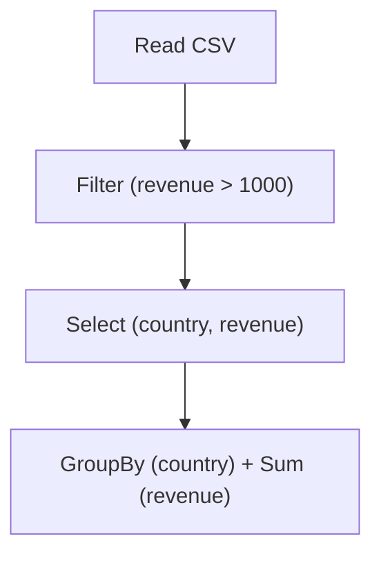
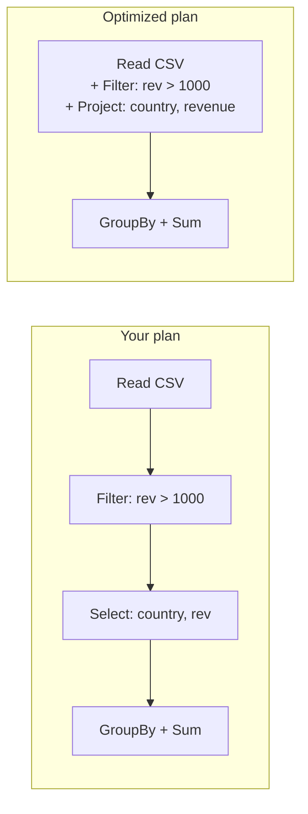
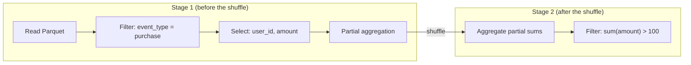

> **This is Pill 2** of a series for junior data engineers and data scientists who can run PySpark jobs but don't understand what happens underneath. Each pill starts from a real question.

Have you ever wondered why nothing happens when you write `spark.read.csv("sales.csv")`? In Pandas, `pd.read_csv()` immediately loads the file into memory. In Spark, that line creates a plan but reads zero bytes from disk. Let me show you why this design choice makes Spark significantly faster.

## Lazy evaluation: building the map before walking

When you write Spark code, each transformation adds a step to a plan. Nothing executes.

```python
df = spark.read.csv("sales.csv", header=True, inferSchema=True)   # Plan: read file
filtered = df.filter(df.revenue > 1000)                            # Plan: add filter
selected = filtered.select("country", "revenue")                   # Plan: add projection
grouped = selected.groupBy("country").agg(sum("revenue"))          # Plan: add aggregation
```

At this point, Spark has built a **Directed Acyclic Graph (DAG)**: a complete map of every operation you want to perform, connected in order, with no cycles. It looks like this:



No data has moved. No file has been opened. The DAG is just a data structure in the Driver's memory.

Only when you call an **action** does Spark execute:

```python
grouped.show()   # NOW Spark reads, filters, selects, groups, and displays
```

This is lazy evaluation. Spark collects the entire recipe before cooking.

## Why is laziness better than eagerness?

Pandas is eager: each line executes immediately, in the order you wrote it.

```python
# Pandas: each line runs immediately
df = pd.read_csv("sales.csv")                    # Reads ALL columns from disk
filtered = df[df["revenue"] > 1000]               # Scans ALL rows
selected = filtered[["country", "revenue"]]        # Picks 2 columns (after reading all of them)
```

Look at the waste. Pandas read every column from disk, then threw most of them away. It scanned every row, then discarded the ones below 1000. Two separate passes over data that could have been one.

Spark, because it sees the complete plan before executing, can do something Pandas cannot: **optimize the plan.**

## The Catalyst optimizer

The Catalyst optimizer is the component that sits between your code and execution. When you call an action, Catalyst takes your DAG and rewrites it into a more efficient version.

Here are two key optimizations it performs:

### Predicate Pushdown

Your code says: read the file, then filter rows where revenue > 1000.

Catalyst rewrites this to: read the file, but skip rows where revenue <= 1000 during the read itself. The filter moves down to the data source. For columnar formats like Parquet, this can skip entire row groups without reading them, saving enormous amounts of disk I/O.



Two fewer stages. Less data read from disk. Same result.

### Projection Pruning

Your table has 50 columns, but you only use `country` and `revenue`. Catalyst tells the data source to read only those 2 columns. With Parquet (a columnar format), this means physically reading 2 out of 50 column chunks. A 96% reduction in disk I/O.

An eager system like Pandas reads all 50 columns first, then discards 48. The wasted I/O already happened.

### Fusing operations

Catalyst can also merge consecutive narrow transformations into a single pass. A `filter()` followed by `select()` followed by `withColumn()` becomes one function applied to each row, instead of three separate iterations over the data.

In an eager system, each step creates a new intermediate DataFrame in memory. Three operations means three passes and three temporary copies. Catalyst fuses them into one.

## The four plan phases

You can see exactly what Catalyst does by calling `.explain(True)` on any DataFrame:

```python
grouped.explain(True)
```

This prints four plans:

### 1. Parsed Logical Plan

What you wrote, translated directly into Spark's internal representation. No optimization yet.

### 2. Analyzed Logical Plan

Spark resolves column names, checks types, and validates that the operations make sense. If you reference a column that does not exist, the error appears here.

### 3. Optimized Logical Plan

Catalyst applies its rules: predicate pushdown, projection pruning, constant folding, filter reordering, and more. This is where the plan shrinks.

### 4. Physical Plan

Catalyst chooses concrete execution strategies. For a join, it picks between BroadcastHashJoin, SortMergeJoin, or ShuffledHashJoin based on data sizes. For an aggregation, it decides whether to use a hash-based or sort-based approach. This is the plan that actually runs.

```python
# Try this in your next Spark session
df = spark.read.parquet("large_table.parquet")
result = (df
    .filter(df.year == 2024)
    .filter(df.revenue > 0)
    .select("country", "revenue", "year")
    .groupBy("country")
    .agg(sum("revenue"))
)

# See all four phases
result.explain(True)
```

Look at the optimized plan. You will see that both filters are pushed down to the Parquet scan, and only 3 columns are read instead of the full schema.

## Actions vs Transformations: the complete picture

In Pill 1 we introduced this distinction briefly. Let's make it precise.

**Transformations** return a new DataFrame. They are lazy. They add a node to the DAG but trigger no computation.

| Transformation | What it adds to the plan |
|---|---|
| `filter()` / `where()` | A selection condition |
| `select()` | A column projection |
| `withColumn()` | A derived column expression |
| `groupBy().agg()` | An aggregation with shuffle boundary |
| `join()` | A join with shuffle boundary |
| `orderBy()` | A sort with shuffle boundary |
| `distinct()` | A deduplication with shuffle boundary |

**Actions** return a result to the Driver or write to an external system. They trigger execution of the entire DAG.

| Action | What it does |
|---|---|
| `show()` | Displays rows in the console |
| `count()` | Returns the number of rows |
| `collect()` | Returns all rows to the Driver as a Python list |
| `first()` / `head()` | Returns the first row(s) |
| `write.parquet()` | Writes the result to disk |
| `toPandas()` | Converts to a Pandas DataFrame on the Driver |

Every action triggers a complete execution cycle: Catalyst optimizes the plan, the plan is split into stages, tasks are distributed to executors, and data flows through the pipeline.

**This means calling `.count()` twice on the same DataFrame executes the entire pipeline twice.** Spark does not cache results automatically. If you need the same intermediate DataFrame multiple times, you should `.cache()` or `.persist()` it explicitly.

## Stages: where the shuffle draws the line

Catalyst produces a physical plan that Spark then splits into **stages**. The rule is simple: every shuffle boundary creates a new stage.

Consider this pipeline:

```python
df = spark.read.parquet("events.parquet")        # Read
filtered = df.filter(df.event_type == "purchase") # Narrow
selected = filtered.select("user_id", "amount")   # Narrow
grouped = selected.groupBy("user_id").agg(sum("amount"))  # Wide (shuffle)
result = grouped.filter(col("sum(amount)") > 100)  # Narrow
```

Spark creates two stages:



Stage 1 runs entirely locally on each executor. All the narrow transformations are fused together. At the end of Stage 1, Spark also performs a **partial aggregation**: each executor sums the amounts per user_id for its local partitions. This reduces the amount of data that needs to cross the network during the shuffle.

Stage 2 receives the partially aggregated data and combines it into final sums, then applies the post-aggregation filter. Because the filter `sum(amount) > 100` depends on the aggregation result, it cannot be pushed before the shuffle. Catalyst knows this.

If your pipeline had two wide transformations (say, a `groupBy` followed by a `join`), you would get three stages. The number of stages equals the number of shuffles plus one.

## A practical example: seeing the plan

Here is a pipeline you can run to see Catalyst in action:

```python
from pyspark.sql import SparkSession
from pyspark.sql.functions import col, sum, year

spark = SparkSession.builder.getOrCreate()

# Imagine a table with 50 columns, including: order_date, country, revenue, status
orders = spark.read.parquet("orders.parquet")

result = (orders
    .filter(year(col("order_date")) == 2024)
    .filter(col("status") == "completed")
    .filter(col("revenue") > 0)
    .select("country", "revenue")
    .groupBy("country")
    .agg(sum("revenue").alias("total_revenue"))
    .orderBy(col("total_revenue").desc())
)

result.explain(True)
```

In the optimized plan, you will see:
- All three filters pushed down to the Parquet scan
- Only `country`, `revenue`, `order_date`, and `status` read from disk (not all 50 columns)
- The three filters merged into a single condition
- Two shuffles: one for the groupBy, one for the orderBy, creating three stages

This is the power of lazy evaluation. Because Spark sees the whole plan, it makes the whole plan better.

## Wrapping up

Spark does not execute your code line by line. It collects every transformation into a DAG, hands it to the Catalyst optimizer, and only executes when an action demands a result. This lazy approach enables optimizations that are impossible in an eager system: pushing filters to the data source, reading only necessary columns, and fusing multiple operations into a single pass.

The key concepts from this pill:
- **Lazy evaluation**: transformations build a plan, actions execute it
- **Catalyst**: rewrites the plan for efficiency (predicate pushdown, projection pruning, operation fusion)
- **Four plan phases**: parsed, analyzed, optimized, physical
- **Stages**: every shuffle boundary creates a new stage. Narrow transforms within a stage are fused

In the next pill, we will zoom into the shuffle itself. What actually happens when Spark writes shuffle data to disk? Why does it accept the cost of disk I/O in an "in-memory" engine? The answer involves TCP sockets, hash functions, and a fundamental trade-off between speed and fault tolerance.

---

> **Test yourself: [Pill 2 Quiz: Lazy Evaluation & the DAG](/pills/quiz-pill-2)**
>
> **Next up: [Pill 3: What Is the Shuffle and Why Does Spark Write to Disk?](/blog/spark-pill-3-the-shuffle)**
>
> **Series: Spark Pills.** Reinforcement notes for data engineers who can run jobs but want to understand the internals. Born from real production questions.
