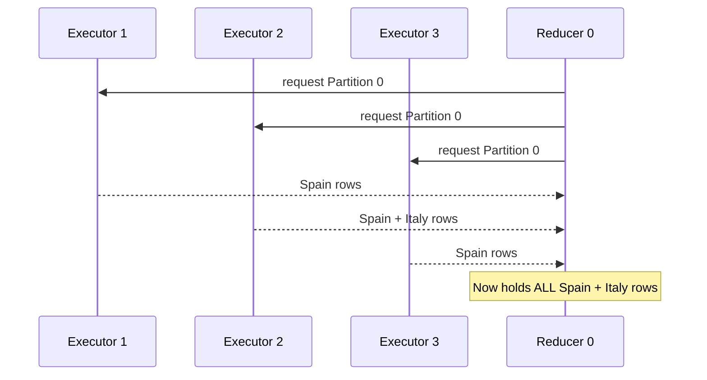
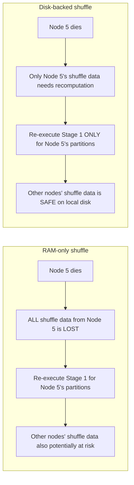
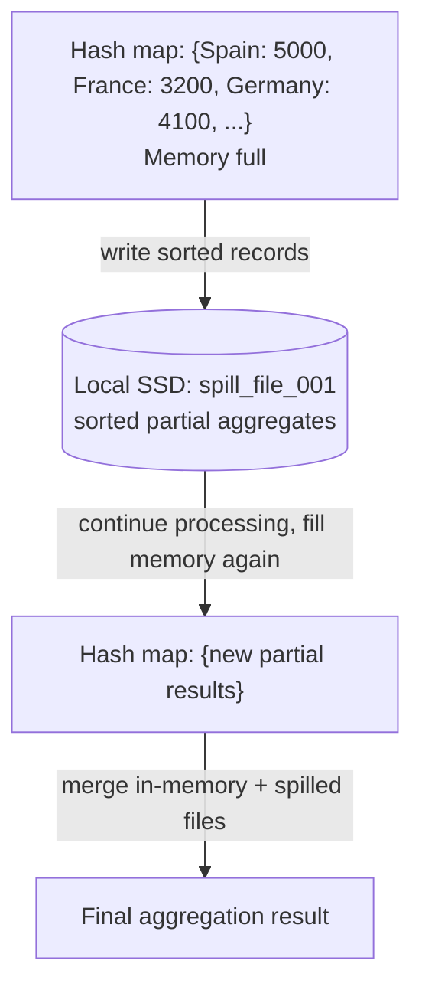

> **This is Pill 3** of a series for junior data engineers and data scientists who can run PySpark jobs but don't understand what happens underneath. Each pill starts from a real question.

Have you wondered what happens physically when you write `groupBy("country").sum("revenue")` and Spark moves data between machines? You know from Pill 1 that this triggers a shuffle. But what does "shuffle" actually mean in terms of bytes, files, and network connections? And if Spark is an "in-memory" engine, why does it write shuffle data to disk? Let me show you what happens step by step.

## The shuffle, step by step

Let's trace a `groupBy("country").agg(sum("revenue"))` operation on a cluster with 3 executors and a target of 3 output partitions.

Before the shuffle, each executor has processed its local partitions (Stage 1). Executor 1 has rows for Spain, France, and Germany. Executor 2 has rows for Spain, Germany, and Italy. Executor 3 has rows for France, Italy, and Spain.

The shuffle needs to reorganize this data so that all rows for the same country end up on the same executor. Here is how it works.

### Step 1: The hash function decides destinations

For each row, Spark computes:

```
destination_partition = hash(key) % num_partitions
```

For example, with 3 output partitions:
- `hash("Spain") % 3 = 0` → Partition 0
- `hash("France") % 3 = 1` → Partition 1
- `hash("Germany") % 3 = 2` → Partition 2
- `hash("Italy") % 3 = 0` → Partition 0

This function is deterministic. The same key always maps to the same partition, every time, on every executor. This is what guarantees all "Spain" rows will end up together.

### Step 2: Mappers write to local shuffle files

Each executor (acting as a mapper in this stage) serializes its rows and writes them to local shuffle files on disk. The key detail: the records are **sorted by destination partition** within the file, and an index records where each partition's data starts and ends.

```
 Executor 1 (mapper)
 ┌─────────────────────────────────────────────┐
 │ Shuffle file:                                │
 │  [Partition 0 data: Spain rows, Italy rows]  │
 │  [Partition 1 data: France rows]             │
 │  [Partition 2 data: Germany rows]            │
 │                                              │
 │ Index file:                                  │
 │  Partition 0: offset 0, length 2048 bytes    │
 │  Partition 1: offset 2048, length 1024 bytes │
 │  Partition 2: offset 3072, length 512 bytes  │
 └─────────────────────────────────────────────┘
```

Each of the 3 executors produces one shuffle file and one index file. So at this point there are 3 shuffle files on 3 different machines.

### Step 3: Reducers pull data via TCP

Now the reducer phase begins. Each reducer is responsible for one output partition. Reducer 0 needs all Partition 0 data from every mapper.

Reducer 0 opens TCP connections to Executor 1, Executor 2, and Executor 3. It sends a request: "Give me the data for Partition 0." Each mapper reads the relevant section of its shuffle file (using the index to find the right offset) and sends the bytes over the network.



The same pattern repeats for Reducer 1 (which pulls every mapper's Partition 1 data, all the France rows) and Reducer 2 (Partition 2, all the Germany rows). Every reducer talks to every mapper.

### Step 4: Reducers deserialize and combine

Reducer 0 receives serialized bytes from three mappers. It deserializes them back into rows, then performs the aggregation: `sum(revenue)` for Spain, `sum(revenue)` for Italy. The final result is one row per country in this partition.

This is the sort-based shuffle, which is Spark's default shuffle manager since Spark 1.2.

## The real bottleneck: network and disk, not CPU

Here is something that surprises many developers. The shuffle's bottleneck is not computation. Summing numbers is trivial for a modern CPU. The bottleneck is **moving data**.

During a shuffle, every mapper must:
1. **Serialize** each record (convert from JVM objects to bytes)
2. **Write** those bytes to local disk
3. **Transfer** those bytes over the network to the requesting reducer

And every reducer must:
1. **Receive** bytes from every mapper over the network
2. **Read** those bytes (possibly from local disk if they spilled)
3. **Deserialize** them back into usable records

The operations that dominate the time are disk I/O and network I/O. Let me show you the numbers:

| Operation | Latency | What limits it |
|---|---|---|
| CPU: sum two numbers | ~1 nanosecond | Nothing. This is free |
| RAM access | ~100 nanoseconds | Electrical charge in capacitors |
| NVMe SSD read | ~10 microseconds | Electrons through floating gate |
| Network transfer (1GB over 10Gbps) | ~800 milliseconds | Wire speed, TCP overhead |
| HDD read | ~10 milliseconds | Mechanical arm movement |

A single shuffle of 10GB across a 10-node cluster means each node receives ~1GB from the other 9 nodes. At 10Gbps network bandwidth, that is about 8 seconds of pure transfer time, plus serialization, disk writes, and TCP overhead.

**Adding more RAM to your cluster does not speed up a shuffle.** What matters is network bandwidth and local disk speed. This is why production Spark clusters use NVMe SSDs for local storage and high-bandwidth networks.

## Narrow transforms: where RAM speed matters

Not every operation pays the shuffle toll. Narrow transformations work exclusively with local data:

```python
df = spark.read.parquet("events.parquet")
filtered = df.filter(df.year == 2024)           # Narrow: local
selected = filtered.select("user_id", "amount") # Narrow: local
computed = selected.withColumn("tax", col("amount") * 0.21)  # Narrow: local
```

Each of these operations reads data from local RAM (or local disk if spilled), processes it, and writes the result to local RAM. No network. No serialization. No TCP connections.

This is where the RAM latency of ~100 nanoseconds matters. The CPU reads a row from the local partition in RAM, applies the filter or transformation, and writes the result. The entire pipeline of narrow transforms is fused into a single pass by Catalyst (as we saw in Pill 2), so each row is touched exactly once.

The cost profile is:

| Transform type | Resources used | Speed determined by |
|---|---|---|
| Narrow (filter, select, map) | Local CPU + local RAM | RAM latency, CPU cache hits |
| Wide (groupBy, join, sort) | CPU + RAM + local disk + network | Network bandwidth, disk I/O |

This is why experienced Spark engineers structure pipelines to minimize shuffles. Every narrow transform you can do before a shuffle reduces the amount of data that needs to cross the network.

## Why does Spark write shuffle data to disk?

This is the question that confuses everyone. Spark is the "in-memory" engine. Writing to disk sounds like a step backward.

Let me show you what would happen if shuffle data were kept only in memory.

**Scenario: shuffle data in RAM only.**
Your pipeline has two stages. Stage 1 produces 50GB of shuffle output spread across 10 executors (5GB each, held in RAM). Stage 2 reducers are pulling that data. Halfway through Stage 2, Executor 5 crashes. Its 5GB of shuffle data in RAM is gone.

Now Spark has a problem. The reducers assigned to pull from Executor 5 cannot get their data. Spark must **re-execute the entire Stage 1** for Executor 5's partitions. That means re-reading source data, re-applying all Map transformations, and re-producing the shuffle output. If Stage 1 took 10 minutes, you just lost 10 minutes of work.

**Scenario: shuffle data on local disk.**
Same pipeline. Executor 5 crashes. But its shuffle files are on the local SSD, and the machine reboots (or another executor on the same machine can read them). More commonly in practice, if the machine is truly gone, only the shuffle output from that specific machine needs recomputation. The other 9 executors' shuffle files are safely on their local disks. The reducers can still pull from those 9 machines while only Executor 5's portion is recomputed.



Spark accepts the latency cost of disk writes during the shuffle to gain fault tolerance. RAM is fast but volatile. Disk is slower but persistent. In a production cluster running jobs that take hours, a single node failure without disk-backed shuffle could cascade into re-executing an enormous amount of work.

## Spill to disk: when even local processing overflows

Even during narrow transformations, Spark may write to disk. This happens when an executor's memory is full and it cannot hold all the data it needs for its current task.

For example, during a sort-based aggregation, the executor builds an in-memory hash map of partial aggregates. If the hash map grows larger than the executor's available memory, Spark **spills** it to local disk: it writes the current hash map contents to a sorted file, frees the memory, and continues building a new hash map. At the end, it merges the in-memory hash map with the spilled files on disk.



Spilling is a safety valve, not a failure. It means Spark handled data that did not fit in memory without crashing. But it is a performance signal. If you see heavy spill in the Spark UI, it means executors need more memory or partitions should be smaller.

## The connection to data skew

Remember the hash function: `hash(key) % num_partitions`. It is deterministic. Same key, same partition, every time. This is necessary for correctness. All rows for "Spain" must land on the same reducer.

But what happens when one key dominates the dataset? Imagine 80% of your rows have `country = "Spain"`. The hash function sends all 80% to a single partition, assigned to a single reducer. That reducer gets 80% of the total shuffle data. The other reducers finish quickly and wait.

```
 Partition 0 (Spain): ████████████████████████████████████████ 80%
 Partition 1 (France): ████ 8%
 Partition 2 (Germany): ███ 6%
 Partition 3 (Italy): ███ 6%
```

This is **data skew**. The shuffle did its job correctly. The problem is in the data distribution. One reducer becomes a bottleneck while the rest of the cluster sits idle.

Data skew is one of the most common performance problems in production Spark jobs. There are techniques to mitigate it: salting keys, using Adaptive Query Execution (AQE) with skew join hints, or repartitioning with a custom partitioner. We will cover these in Pill 5.

## What triggers a shuffle: the complete list

For reference, here are the operations that trigger a shuffle:

| Operation | Why it needs a shuffle |
|---|---|
| `groupBy().agg()` | All rows for the same key must be on one partition |
| `join()` (both sides large) | Matching keys from two datasets must meet |
| `distinct()` | Must compare all identical values to deduplicate |
| `orderBy()` / `sort()` | Global ordering requires range partitioning |
| `repartition(n)` | Explicitly redistributes data to n partitions |
| `coalesce(n)` (when n > current) | If increasing partitions, needs redistribution |

Operations that do NOT trigger a shuffle: `filter`, `select`, `withColumn`, `map`, `flatMap`, `coalesce(n)` when reducing partitions (just merges adjacent partitions on the same node).

## Wrapping up

The shuffle is the most expensive operation in distributed computing. It involves serialization, local disk writes, network transfer via TCP, deserialization, and combination. The bottleneck is I/O, not CPU.

Spark writes shuffle data to local disk as a deliberate trade-off: it sacrifices some speed for fault tolerance. In a production environment where nodes can fail, this prevents catastrophic re-execution of entire pipeline stages.

The key concepts from this pill:
- **Sort-based shuffle**: mappers write sorted shuffle files, reducers pull via TCP
- **hash(key) % num_partitions**: deterministic routing that guarantees correctness but enables skew
- **Narrow transforms cost RAM. Wide transforms cost RAM + disk + network.**
- **Fault tolerance**: disk-backed shuffle means only the failed node's work is recomputed
- **Spill to disk**: safety valve when memory runs short during any operation

In the next pill, we will look at how Spark executes joins: broadcast hash join vs sort-merge join, when Spark picks each strategy, and why a bad join strategy can make a 2-minute job take 2 hours.

---

> **Test yourself: [Pill 3 Quiz: The Shuffle](/pills/quiz-pill-3)**
>
> **Next up: Pill 4: How Does Spark Join Two Tables? (coming soon)**
>
> **Series: Spark Pills.** Reinforcement notes for data engineers who can run jobs but want to understand the internals. Born from real production questions.
