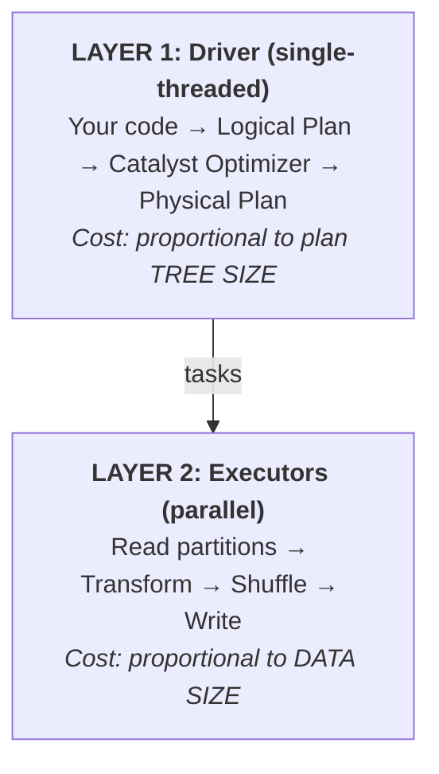

> **This is Pill 6** of a series for junior data engineers and data scientists who can run PySpark jobs but don't understand what happens underneath. Each pill starts from a real question.

Have you ever added `persist()` to a slow pipeline and seen zero improvement? Or worse, added it to three places and caused an OOM that was not there before? Caching in Spark is one of those features that seems straightforward until you realize it operates on a different layer than most people think.

To understand why `persist()` sometimes helps and sometimes does nothing, you need to separate the two layers of a Spark job.

## Two layers: Planning vs. Execution

Every Spark job runs through two distinct layers:

### Layer 1: Planning (the Driver)

A single-threaded process on the Driver. Catalyst, the query optimizer, takes your DataFrame transformations and builds a **logical plan tree**. It resolves column references, pushes down predicates, optimizes join order, and produces a physical plan.

This happens on the Driver, in a single thread, before any executor touches any data.

### Layer 2: Execution (the Executors)

The physical plan gets split into tasks and distributed to executors. This is where the actual data processing happens: reading partitions, applying filters, shuffling, joining, aggregating.



Most performance tuning focuses on Layer 2: partition counts, shuffle optimization, broadcast joins. But sometimes Layer 1 is the bottleneck, and that is where the lineage trap hides.

## What persist() really is

`persist()` (and its alias `cache()`, which is just `persist(MEMORY_AND_DISK)`) is **not an action**. It does not trigger the DAG. It does not cause any computation to happen.

`persist()` is a **flag**. It tells the executors: "When you compute this DataFrame for the first time, save the result so you can reuse it later."

```python
df = spark.table("events").filter(F.col("year") == 2026)
aggregated = df.groupBy("country").agg(F.sum("revenue"))

aggregated.persist()   # Nothing happens here. No computation.

aggregated.show()      # NOW Spark computes and caches the result.
aggregated.write.parquet("output/")  # Reuses the cached result.
```

The persist flag only takes effect during execution (Layer 2). Executors see it and store the materialized partitions. On subsequent actions that reference the same DataFrame, executors serve the cached data instead of recomputing from source.

## Storage levels

When you call `persist()`, you choose a storage level that determines where and how the data is stored:

| Storage Level | Behavior |
|--------------|----------|
| `MEMORY_ONLY` | Store partitions in executor heap as deserialized Java objects. Partitions that do not fit are **discarded** and recomputed from the DAG on next access. |
| `MEMORY_AND_DISK` | Default for `cache()`. Partitions that do not fit in memory spill to the executor's local disk. Nothing is discarded. |
| `MEMORY_ONLY_SER` | Store as serialized byte arrays. Uses less memory (no object overhead) but adds CPU cost for serialization/deserialization on every access. |
| `DISK_ONLY` | Store everything on the executor's local disk. No memory usage, but every access reads from disk. |

```python
from pyspark import StorageLevel

# Explicit storage level
df.persist(StorageLevel.MEMORY_AND_DISK)

# cache() is shorthand for:
df.persist(StorageLevel.MEMORY_AND_DISK)
```

The choice matters. `MEMORY_ONLY` looks fast, but if the data does not fit, partitions get silently dropped and recomputed. You pay the computation cost again without realizing it. For most production workloads, `MEMORY_AND_DISK` is the safe default.

## Why persist() does not fix the lineage trap

Here is the scenario that confuses most engineers.

You have a pipeline that reads from an Iceberg table with months of snapshot history. You transform the data and write multiple outputs:

```python
source = spark.table("bronze.events_iceberg")
transformed = source.filter(...).withColumn(...).groupBy(...).agg(...)

transformed.persist()

transformed.write.mode("overwrite").saveAsTable("gold.summary_daily")
transformed.write.mode("overwrite").saveAsTable("gold.summary_weekly")
transformed.write.mode("overwrite").saveAsTable("gold.summary_monthly")
```

You expect `persist()` to help: compute once, write three times. And in Layer 2, it does. The executors compute `transformed` once and serve it from cache for the second and third writes.

But the job still takes 80 minutes. The Spark UI shows that individual tasks finish in sub-seconds. The actual data processing is fast. Where does the time go?

**Layer 1.** For each `.write()` call, Catalyst processes the entire logical plan tree from scratch. `persist()` is invisible to Catalyst. It is a Layer 2 concept. Catalyst sees the full tree every time: the Iceberg source with its metadata, all the transformations, all the column references.

If the Iceberg table has months of snapshots, its metadata tree is deep. Catalyst must resolve, validate, and optimize through that entire tree for every write action. In the Driver. Single-threaded.

**Result: 66 minutes of planning, 26 seconds of execution.**

Adding executors does not help. Adding memory does not help. The bottleneck is the Driver's single-threaded planning pass.

## Why checkpoint() fixes it

`checkpoint()` operates on both layers. It materializes the DataFrame to a reliable storage location (S3, HDFS) and returns a **new DataFrame** whose logical plan starts from the checkpoint files. The upstream tree is severed.

```python
spark.sparkContext.setCheckpointDir("s3://bucket/checkpoints/")

source = spark.table("bronze.events_iceberg")
transformed = source.filter(...).withColumn(...).groupBy(...).agg(...)

# Checkpoint: materializes to S3, returns new DataFrame with clean plan
transformed_cp = transformed.checkpoint()

transformed_cp.write.mode("overwrite").saveAsTable("gold.summary_daily")
transformed_cp.write.mode("overwrite").saveAsTable("gold.summary_weekly")
transformed_cp.write.mode("overwrite").saveAsTable("gold.summary_monthly")
```

After `checkpoint()`, Catalyst sees `transformed_cp` as a simple scan of Parquet files on S3. The Iceberg metadata tree, all the transformations, everything upstream is gone from the plan. Each `.write()` call plans instantly.

```
Before checkpoint:
  Catalyst sees: Iceberg(months of snapshots) → Filter → GroupBy → Agg
  Planning cost: 22 minutes per write × 3 = 66 minutes

After checkpoint:
  Catalyst sees: Scan(s3://bucket/checkpoints/...)
  Planning cost: ~2 seconds per write × 3 = 6 seconds
```

**Total job time: from 80 minutes to 5 minutes.** Same data, same transformations, same output. The only change is where Catalyst's plan tree starts.

## Three anti-patterns with persist()

### Anti-pattern 1: Phantom cache (lazy persist with no action between persist and unpersist)

```python
df = spark.table("events").filter(...)
df.persist()
# ... some transformations that build on df but no action is called ...
df.unpersist()

df.show()  # Recomputes from scratch. The cache was never populated.
```

Because `persist()` is not an action, the cache only gets populated when an action triggers computation. If you call `unpersist()` before any action, the cache flag is removed and nothing was ever stored. The persist/unpersist pair was a no-op.

**Fix:** Always trigger an action (like `.count()`) between `persist()` and `unpersist()` to ensure the cache is populated.

### Anti-pattern 2: Wrong unpersist order causing OOM on multiple writes

```python
df_a = spark.table("table_a").persist()
df_b = spark.table("table_b").persist()
df_c = df_a.join(df_b, on="key").persist()

# Write results
df_c.write.saveAsTable("output_1")

# WRONG: unpersist c first, then write again needing a and b
df_c.unpersist()
df_a.unpersist()  # Still needed if you recompute c

df_c.write.saveAsTable("output_2")  # Must recompute c AND a AND b
```

When you unpersist DataFrames in the wrong order, subsequent writes must recompute everything from scratch. If the recomputation peaks coincide with data still held in memory by other cached DataFrames, you run out of heap.

**Fix:** Unpersist in reverse dependency order, and only after all writes that need the cached data are complete.

### Anti-pattern 3: Persist before the expensive computation instead of after

```python
raw = spark.table("events")
raw.persist()  # Caching raw data: expensive to store, cheap to re-read

expensive = raw.groupBy("user_id").agg(
    F.approx_count_distinct("session_id"),
    F.sum("revenue"),
    F.collect_list("event_type")
)

# expensive is NOT cached. Every write recomputes the aggregation.
expensive.write.saveAsTable("output_1")
expensive.write.saveAsTable("output_2")
```

Persisting the raw data caches the cheap part (reading from Parquet/Iceberg is fast) and forces re-execution of the expensive part (the aggregation) on every write. You want to cache the result of the expensive computation, not its input.

**Fix:** `expensive.persist()` instead of `raw.persist()`.

## Diagnostic signals: is your problem in Layer 1 or Layer 2?

| Signal | Layer 1 (Planning) | Layer 2 (Execution) |
|--------|-------------------|---------------------|
| Individual tasks | Finish in sub-seconds | Some tasks take minutes |
| Adding executors/RAM | No improvement | Improvement |
| Spark UI bottleneck | Long gaps between stages | Long-running tasks within stages |
| Data source | Iceberg/Delta with extensive snapshot history | Any source |
| Solution | `checkpoint()` | `persist()`, repartition, broadcast |

The clearest signal: if you open the Spark UI and see that all tasks complete in under a second but the total stage time is minutes or hours, the bottleneck is not in data processing. Look at the Driver logs for planning time, and consider `checkpoint()` to cut the logical plan.

## Summary

- `persist()` / `cache()` is a Layer 2 optimization. It tells executors to store computed partitions for reuse. It does not affect Catalyst's planning.
- `checkpoint()` operates on both layers. It materializes data to storage and gives Catalyst a fresh, shallow plan. Use it when the logical plan tree is deep (Iceberg/Delta with extensive history, long chains of transformations).
- Always trigger an action after `persist()` to populate the cache.
- Unpersist in reverse dependency order, after all dependent writes are complete.
- Cache the output of expensive computations, not their inputs.

---

> **Next: [Pill 6 Quiz: Cache, Persist, and Checkpoint](/pills/quiz-pill-6)**
>
> **Series: Spark Pills.** Reinforcement notes for data engineers who can run jobs but want to understand the internals. Born from real production questions.
