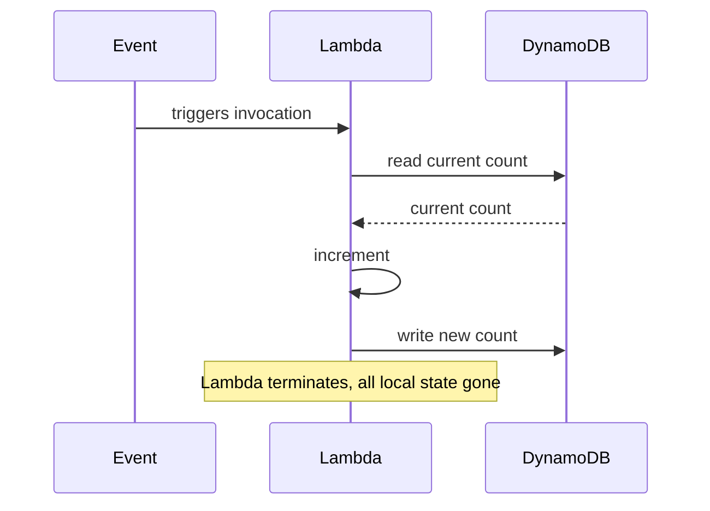
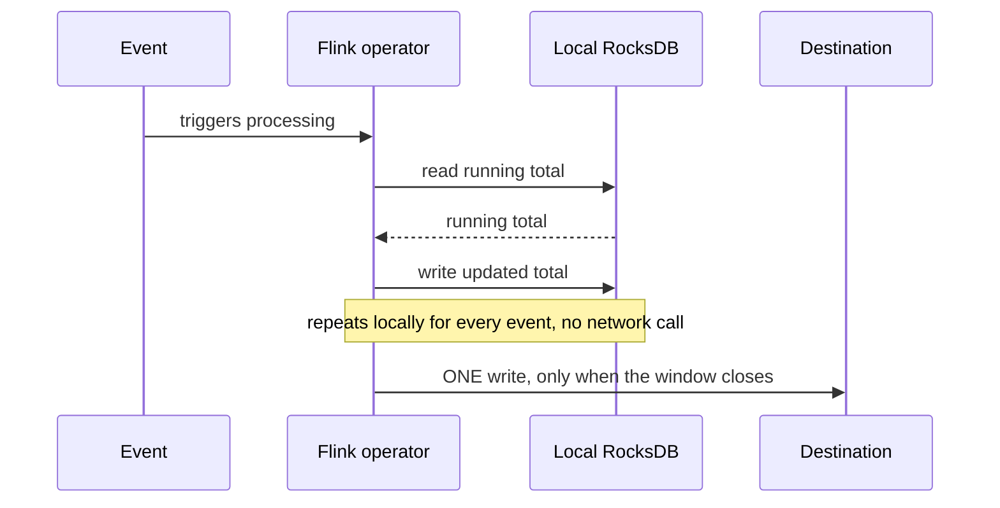
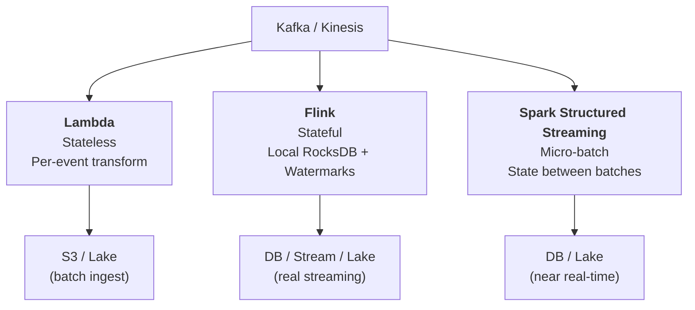

> **This is Pill 9**, the final pill in a series for junior data engineers who can run PySpark jobs but don't understand what happens underneath. Each pill starts from a real question.

Have you ever wondered why a serverless function like AWS Lambda, which can scale to thousands of parallel invocations, falls apart when you try to use it for real-time stream processing?

Lambda can process a single event in 50 milliseconds. It can scale to 10,000 concurrent executions. On paper, it sounds perfect for streaming. Let me show you why it is not.

## Lambda is stateless and ephemeral

When a Lambda function processes an event, it starts, does its work, and terminates. It has no memory of what happened before. Each invocation is independent.

For simple event-by-event transformations (validate a JSON payload, convert a format, route a message), this is fine. Each event is self-contained.

But streaming use cases are rarely event-by-event. Consider these common requirements:

- "Count the number of login attempts per user in the last 5 minutes" (requires remembering previous events)
- "Alert if a user's transaction total exceeds $10,000 in a rolling hour" (requires accumulating state)
- "Compute the average response time per service over a 1-minute window" (requires collecting events before producing output)

All of these need **state**: the ability to remember what happened in previous events while processing the current one.

Lambda cannot do this on its own. Each invocation starts fresh. To keep state, you must query an external database:



At 10,000 events per second, this means 10,000 reads and 10,000 writes per second to DynamoDB. You are now bottlenecked by the database. DynamoDB can handle this with enough provisioned capacity, but the cost scales linearly with throughput, and the latency of each event now includes two network round-trips to the database.

At 100,000 events per second? The database becomes the weakest link. You spend more time and money on the state store than on the actual computation.

## Stateful stream processing: keeping state local

Frameworks like Apache Flink and Kafka Streams solve this differently. Instead of storing state in an external database, they maintain **local state** on the processing node itself.

Flink uses an embedded key-value store called RocksDB, which runs inside the same process as your streaming application. When you define a 1-hour tumbling window for "transaction total per user," Flink stores the running total in RocksDB on the local disk.

The flow looks like this:



During a 1-hour window with 100,000 events per second, Flink processes 360 million events. For each event, it reads and writes to local storage (microseconds, not milliseconds). When the window closes, it makes **one** write to the destination with the final result.

Compare the two approaches for a 1-hour window at 100,000 events/second:

```
Lambda + DynamoDB:
  360,000,000 reads from DynamoDB
  360,000,000 writes to DynamoDB
  Cost: substantial (DynamoDB charges per request)

Flink + RocksDB:
  360,000,000 local reads (microseconds each)
  360,000,000 local writes (microseconds each)
  1 write to destination when window closes
  Cost: the compute nodes only
```

The difference is not just performance. It is architectural. Flink was designed around the idea that state belongs with the computation, not in a separate service across the network.

## Time windows as design decisions

Martin Kleppmann, in *Designing Data-Intensive Applications*, makes a point worth remembering: windows do not exist in the data. They are an abstraction you impose to make sense of a continuous stream.

Choosing the right window type is a design decision, not a technical detail:

### Tumbling windows

Fixed, non-overlapping blocks of time. Every event belongs to exactly one window.

```
|  Window 1  |  Window 2  |  Window 3  |
|  00:00-01:00  |  01:00-02:00  |  02:00-03:00  |
```

Good for: Hourly reports, daily aggregations, billing cycles.

Limitation: Edge effects. An event at 00:59:59 and an event at 01:00:01 are in different windows, even though they are 2 seconds apart. A spike that straddles the window boundary gets split between two counts.

### Hopping (sliding) windows

Overlapping windows. A 1-hour window that advances every 15 minutes means each event belongs to 4 windows.

```
|  Window A: 00:00 - 01:00          |
      |  Window B: 00:15 - 01:15          |
            |  Window C: 00:30 - 01:30          |
```

Good for: Smoothing out the edge effects of tumbling windows. Better for monitoring dashboards where you want a rolling view.

Limitation: Higher memory usage. Each event is stored in multiple windows simultaneously.

### Session windows

Defined by user activity, not by fixed time. A session starts when a user's first event arrives and ends after a configurable gap of inactivity (say, 30 minutes with no events).

```
User A: [click, click, click, ---- 30 min gap ----] [click, click]
         \___________ Session 1 __________/          \_ Session 2 _/
```

Good for: User behavior analysis, web sessions, app usage patterns. Sessions map naturally to how humans interact with systems.

Limitation: Unpredictable memory usage. A user who never goes inactive keeps the session window open indefinitely.

### Global windows with triggers

An infinite window that never closes on its own. You define explicit triggers for when to emit results (every 1,000 events, every 5 minutes, on a specific condition).

Good for: Lifetime counters ("total purchases per customer since account creation"), leaderboards, accumulating metrics that have no natural time boundary.

## Late events: the real-world complication

In a distributed system, events do not always arrive in order. An event that happened at 14:00:00 might arrive at your processing system at 14:00:45 due to network delays, retries, or buffering.

If you are computing a tumbling window for 14:00 to 15:00, and this late event arrives after you have already closed the 14:00 window and emitted its result, what do you do?

Two strategies:

**Drop the event:** Simple. The window is closed, the result is final. Late events are lost. Acceptable when approximate results are fine (monitoring dashboards, general analytics).

**Update/Correct:** Reopen the window, incorporate the late event, and emit a corrected result. More accurate but more complex. The downstream system must handle updates to previously emitted results.

Flink uses **watermarks** to manage this. A watermark is a timestamp that says: "I believe all events up to this time have arrived." It is a threshold for "how late is too late."

```
Watermark = current event time - allowed lateness

If event_time < watermark → drop (too late)
If event_time >= watermark → process normally
```

Setting the allowed lateness is a trade-off. Too short, and you lose valid events. Too long, and you hold windows open in memory longer, consuming more resources and delaying results.

Lambda has no concept of watermarks. Each invocation is independent, so there is no framework to decide "this event is late relative to the window." You would have to build all this logic yourself, on top of the external state store you are already managing.

## Architecture summary: choosing the right tool

Here is how these pieces fit together for common scenarios:

**Kinesis/Kafka → Lambda → S3 (Data Lake pattern)**

Excellent for batch-oriented ingestion. Lambda reads events from the stream, transforms them, and writes Parquet files to S3. No state needed per event. Each Lambda invocation processes a batch of records independently. This is a proven, cost-effective pattern for data lakes.

**Kinesis/Kafka → Flink → Destination (Real streaming pattern)**

The right choice when you need stateful processing: windowed aggregations, sessionization, complex event processing, exactly-once semantics. Flink maintains local state, handles late events with watermarks, and checkpoints state for fault tolerance.

**Spark Structured Streaming (Middle ground)**

Spark's streaming module processes data in micro-batches (small batch jobs triggered every few seconds). It supports windowed aggregations and maintains state between micro-batches. It is a good fit for teams already invested in Spark who need near-real-time (latency of seconds, not milliseconds) without adopting Flink.



The decision is straightforward:
- **No state needed?** Lambda is simple, cheap, and scales automatically.
- **State needed, millisecond latency?** Flink (or Kafka Streams for lighter workloads).
- **State needed, seconds of latency acceptable?** Spark Structured Streaming if you already run Spark.

Lambda is an excellent tool. It just was not designed for stateful stream processing. Using it for that means rebuilding (poorly) what Flink and Kafka Streams provide out of the box.

## Wrapping up the series

This is the last Spark Pill. Over 10 pills, we covered the mental model behind Spark: from why distributed computing exists (Pill 0), through the execution engine (DAGs, shuffles, partitions), to practical production concerns (skew, caching, Iceberg, streaming).

The goal was never to memorize syntax. It was to build the reasoning that lets you diagnose problems, make architecture decisions, and understand why things break.

If you take one thing from this series: **always know which component is the bottleneck.** Is it the Driver? An executor? The network? One partition? The metadata? Once you can identify the bottleneck, the fix usually becomes obvious.

---

> **Test yourself: [Pill 9 Quiz: Streaming and State](/pills/quiz-pill-9)**
>
> **Back to the beginning: [Pill 0: Why Not Just Pandas?](/blog/spark-pill-0-why-not-pandas)**
>
> **Series: Spark Pills.** Reinforcement notes for data engineers who can run jobs but want to understand the internals. Born from real production questions. Thanks for reading.
