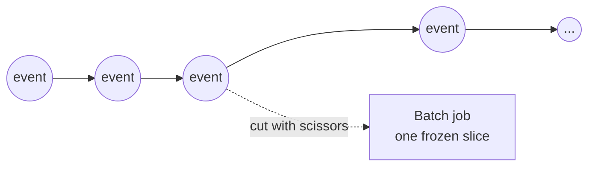

> **This is Pill 0** of a series that turns Martin Kleppmann's streaming chapter in *Designing Data-Intensive Applications* into short, practical lessons, backed by two production write-ups on stream processing. Each pill answers one question a junior data engineer runs into on the job.

Have you ever run a daily batch job and thought of it as the normal way to process data, with streaming as the harder version you reach for only in special cases? That model is backwards, and it leads to broken designs later in this series.

## Data does not stop

Users do not stop clicking at midnight. Servers do not stop emitting logs between batch runs. A payment can happen at any second of the day. The real world produces an unbounded, continuous flow of events.

A batch job is not a natural unit of work. It is a choice: take that continuous flow and cut it with scissors at a fixed point in time, "yesterday", "the last hour", and process the resulting slice as if it were the whole story.

That is the inversion Kleppmann makes explicit: **batch is a special case of streaming**, not the other way around. Streaming is the default shape of data. Batch is one specific way of consuming it, on a schedule, in fixed-size chunks.

## Why this matters before you write any code

If you think of streaming as fast batch, you will try to solve streaming problems with batch tools: a SQL script that runs every 10 minutes, a function that queries a database for state on every event. Pill 4 and Pill 5 show exactly why that breaks.

If you instead think of batch as a slice of a stream, a few things click into place right away:

- A stream has no natural end, so any window you compute over it (an hour, a day) is a decision you make, not a property of the data (Pill 6).
- Two clocks matter for correctness: when something happened, and when your system found out about it (Pill 2).
- Once an event happened, it cannot be undone. It is a fact, not an instruction (Pill 1).

## What this series covers

Ten pills, each answering a question that comes up when you build or operate a streaming pipeline:

0. Batch is a special case of streaming (this pill)
1. Why an event is not the same thing as a message
2. Why event time and processing time are different clocks
3. Why a Kafka topic behaves nothing like a queue
4. Why a script that runs every 10 minutes is not streaming
5. Why serverless functions struggle with state, and what stateful engines do instead
6. Why a window is a design decision, not something you find in the data
7. What to do when an event shows up late
8. Why a join in streaming is really a memory budget
9. Three questions to ask before you commit to a streaming architecture

Each pill stands on its own, but they build on each other in this order. Start here, and by Pill 9 you will have a checklist you can run against any "should this be a stream?" question that lands on your desk.

---

> **Test yourself: [Pill 0 Quiz: Batch vs Streaming](/pills/streaming-quiz-0)**
>
> **Next up: [Pill 1: Events Are Not Messages](/blog/streaming-pill-1-events-vs-messages)**
>
> **Series: Streaming Pills.** Built from Martin Kleppmann's *Designing Data-Intensive Applications*, plus two production write-ups: [Why Serverless Fails at Stream Processing](https://medium.com/@moradabaz/why-serverless-fails-at-stream-processing-and-what-to-use-instead-cf6935a945c4) and [Streaming Is Not Fast Batch](https://medium.com/@moradabaz/streaming-is-not-fast-batch-here-are-five-principles-that-prove-it-4b917f7c7e42).
