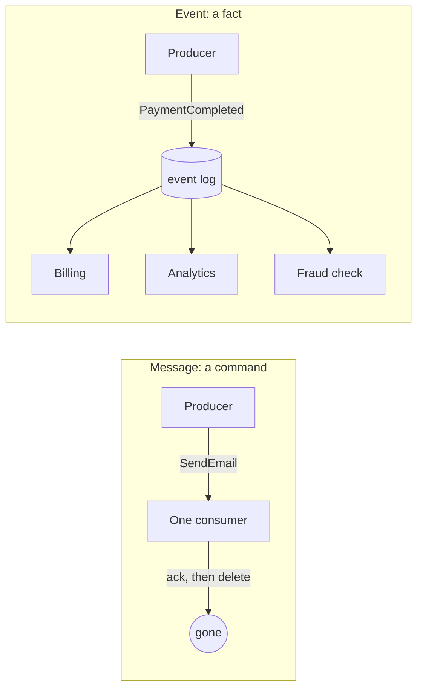

> **This is Pill 1** of the Streaming Pills series. Each pill answers one question about how streaming systems actually work.

Have you ever named something `SendInvoice` or `GenerateReport` and called it an event? If so, you built a message, not an event, and the difference changes how the whole system behaves.

## What a message is

A message belongs to the traditional queue paradigm (think RabbitMQ or ActiveMQ). It is a command with a direct intent, addressed to a specific consumer that is expected to execute an action: `GenerateInvoice`, `SendEmail`. The sender expects the receiver to process it and then delete it. A message needs confirmation.

## What an event is

An event is an immutable, self-contained record of a fact: something that already happened, at a specific instant, marked with a timestamp. Because it describes history, it cannot be changed or deleted afterward.

The producer publishes an event without knowing, or caring, who will read it: `PaymentCompleted`. Billing can generate a receipt from it. Analytics can update revenue from it. Fraud detection can check the pattern. None of those consumers need to exist yet when the event is published.

## Why the difference matters

Messages create point-to-point dependencies: the sender knows exactly who has to act, and expects a result. Events create broadcast, decoupled architectures: the producer publishes a fact and moves on, and any number of independent systems can react to it later.

This has a direct, practical consequence. Adding a new consumer to a message-based system means changing the sender, because the sender has to know who to address the command to. Adding a new consumer to an event-based system means pointing a new reader at the existing topic. Nothing upstream has to change.

## A quick test for your own events

Look at the name of the thing you are publishing. If it reads like a verb aimed at a specific system, `GenerateInvoice`, `ChargeCard`, you have built a message, and probably a distributed RPC call in disguise. If it reads like a fact that already happened, `PaymentCompleted`, `OrderShipped`, you have built an event.

This is not a naming nitpick. A system full of commands disguised as events will have hidden point-to-point coupling that only shows up when you try to add a second consumer and discover the first one breaks.

---

> **Test yourself: [Pill 1 Quiz: Events vs Messages](/pills/streaming-quiz-1)**
>
> **Next up: [Pill 2: Event Time and Processing Time](/blog/streaming-pill-2-event-time-vs-processing-time)**
>
> **Series: Streaming Pills.** Built from Martin Kleppmann's *Designing Data-Intensive Applications*, plus two production write-ups: [Why Serverless Fails at Stream Processing](https://medium.com/@moradabaz/why-serverless-fails-at-stream-processing-and-what-to-use-instead-cf6935a945c4) and [Streaming Is Not Fast Batch](https://medium.com/@moradabaz/streaming-is-not-fast-batch-here-are-five-principles-that-prove-it-4b917f7c7e42).
