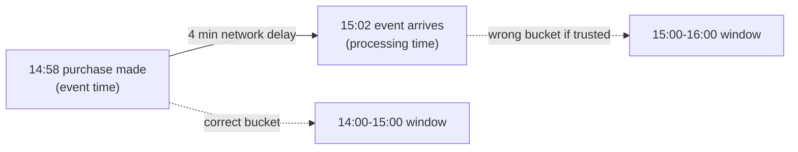

> **This is Pill 2** of the Streaming Pills series. Each pill answers one question about how streaming systems actually work.

A user makes a purchase at 14:58, standing in the subway with no signal. The event reaches your server at 15:02. Which of those two timestamps should decide what "hour" this purchase belongs to?

## Two clocks, one event

**Event time** is the moment something actually happened in the real world: when the user tapped the button on their phone. It lives inside the event as a field, and it does not move.

**Processing time** is the moment your infrastructure observed and handled the event: when the server received it. It depends on the network, and it moves with every delay.



In a perfect network these two would match. Networks are not perfect. If your pipeline uses processing time to compute "sales per hour", that purchase lands in the 15:00-16:00 window instead of the 14:00-15:00 window where it belongs. If the business needs an exact cutoff, for a promotion or a daily report, the number is wrong.

## This is not an edge case

Distributed systems run on unstable networks by default. Events arrive late. Events arrive out of order. A pipeline that relies on processing time for analytics is standing on ground that shifts under normal conditions, not exceptional ones.

This is also why simulating streaming with a script that runs every 10 minutes does not work, even if the interval is short. If that script buckets events by the time they arrived at the server, every delayed event lands in the wrong bucket, and running the script more often does not fix the problem. It is not a speed problem. It is a clock problem. Pill 4 goes deeper into this.

## When you cannot trust the clock either

Device clocks drift, and mobile timestamps are notoriously unreliable, so trusting the event time field blindly is not always safe. One practical fix is to calculate the offset between when the server received the event and when the device says it sent it, and use that offset to calibrate:

```
Calibrated Event Time = Device Event Time + (Server Receive Time - Device Send Time)
```

If that offset is bigger than the tolerance your windows can absorb, your event-time windows will produce wrong aggregates no matter how well the rest of the pipeline is built. Pill 9 comes back to this as one of the three questions to ask before you design a streaming system.

## What to remember

Pick event time for correctness. Use processing time only for operational metrics like pipeline lag, never for business aggregates. This choice sets up two later pills directly: how you define a window (Pill 6) and what you do with an event that arrives after its window already closed (Pill 7).

---

> **Test yourself: [Pill 2 Quiz: Event Time vs Processing Time](/pills/streaming-quiz-2)**
>
> **Next up: [Pill 3: A Topic Is Not a Queue](/blog/streaming-pill-3-topics-are-not-queues)**
>
> **Series: Streaming Pills.** Built from Martin Kleppmann's *Designing Data-Intensive Applications*, plus two production write-ups: [Why Serverless Fails at Stream Processing](https://medium.com/@moradabaz/why-serverless-fails-at-stream-processing-and-what-to-use-instead-cf6935a945c4) and [Streaming Is Not Fast Batch](https://medium.com/@moradabaz/streaming-is-not-fast-batch-here-are-five-principles-that-prove-it-4b917f7c7e42).
