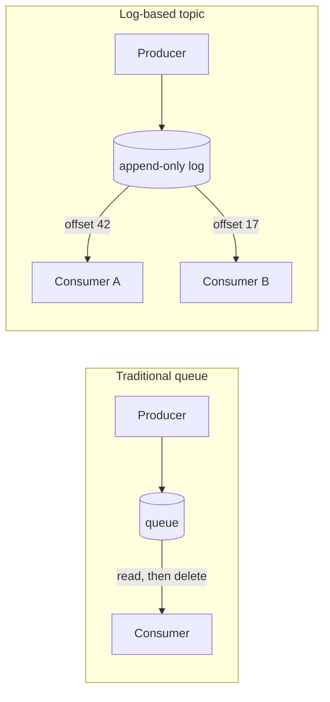

> **This is Pill 3** of the Streaming Pills series. Each pill answers one question about how streaming systems actually work.

A topic is a named channel in a message broker where related events get grouped: transactions, user clicks, and so on. That much sounds like a queue. The real difference is what happens to an event after a consumer reads it.

## Read and delete

A traditional queue, RabbitMQ or ActiveMQ, works like a bakery with one cake left. Once a consumer reads a message and acknowledges it, the broker deletes it from disk or memory. Nobody else can read that message again. There is no history, only what has not been picked up yet.

## Read and keep

A log-based system, Kafka or Kinesis, works differently. It is an immutable, append-only file on disk. Producers only ever write at the end. When a consumer reads an event, that event is not deleted. The only thing that moves is the offset, a bookmark that tracks where that specific consumer left off. A topic can also be split into partitions for parallelism.

## Why this makes multi-consumer architectures possible

Because the log is never destroyed, several independent consumers can read the exact same sequence of events without stepping on each other. An Elasticsearch pipeline building a search index and a Spark job loading the data lake can both read the same topic from the beginning of time, each tracking its own offset. One consumer's progress never affects the other's.

Try that with a traditional queue and the first consumer to read a message removes it for everyone else.

## The same idea already exists in your database

Kleppmann draws a direct line between a log like Kafka's and the write-ahead log, or WAL, that relational databases like PostgreSQL already use. A WAL is an immutable, append-only record where every change is written before it touches the actual tables. Replica nodes do not query the primary's tables directly. They read the WAL sequentially from the last point they remember, and rebuild state locally from it.

Streaming consumers behave the same way: they read the log in order and build their own materialized views or local state from it. The shared idea is durability over volatility. A traditional queue treats storage as a temporary buffer that should ideally be empty. A log treats disk as the source of truth: permanent, and able to rebuild any downstream state from scratch after a failure. That is also why Kafka was built around disk persistence as its main design goal, not in-memory speed. The log is the system of record. Everything else, consumers, materialized views, derived tables, is a projection built by reading it.

---

> **Test yourself: [Pill 3 Quiz: Topics vs Queues](/pills/streaming-quiz-3)**
>
> **Next up: [Pill 4: Micro-Batching Is Not Streaming](/blog/streaming-pill-4-micro-batching-is-not-streaming)**
>
> **Series: Streaming Pills.** Built from Martin Kleppmann's *Designing Data-Intensive Applications*, plus two production write-ups: [Why Serverless Fails at Stream Processing](https://medium.com/@moradabaz/why-serverless-fails-at-stream-processing-and-what-to-use-instead-cf6935a945c4) and [Streaming Is Not Fast Batch](https://medium.com/@moradabaz/streaming-is-not-fast-batch-here-are-five-principles-that-prove-it-4b917f7c7e42).
