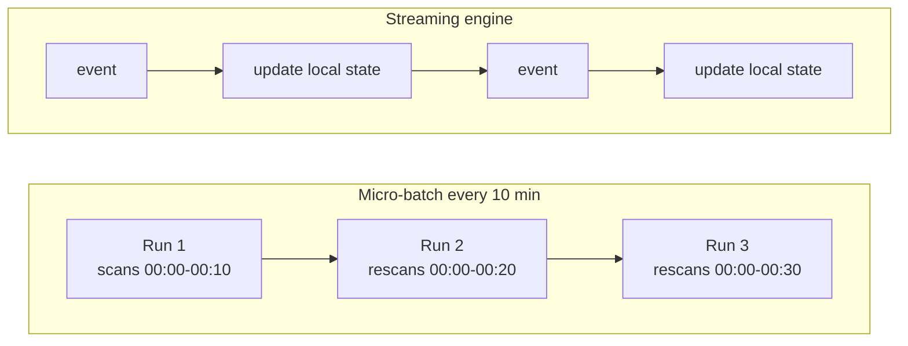

> **This is Pill 4** of the Streaming Pills series. Each pill answers one question about how streaming systems actually work.

Have you ever pitched a script that runs every 10 minutes as basically streaming? It is a fair instinct, the data does show up faster than a nightly job. But three concrete problems separate a scheduled script from real stream processing.

## Problem 1: which events belong to this run

A script that processes "10:00 to 10:10" has to decide, using some timestamp, which events fall in that range. If it uses processing time (Pill 2), every event delayed by the network lands in the wrong bucket, no matter how short the interval is. If it uses event time instead, it now has to reopen and recompute previous runs whenever a late event shows up, which means it is no longer a simple "process the last 10 minutes" job. It is fighting its own architecture.

## Problem 2: the cost of state keeps growing

For a cumulative metric, unique users today, a running total, a script that runs every 10 minutes has to re-read everything from midnight to now, every single time. By the end of the day it is recalculating millions of records just to add the last 10 minutes of data.

A streaming engine avoids this by keeping live intermediate state in local memory or disk, and updating it incrementally, one event at a time, instead of recomputing the whole day from scratch.

## Problem 3: latency and idempotency

For anything time-sensitive, a fraud alert, a temperature alarm, real-time pricing, waiting for the next scheduled run can mean the reaction arrives too late to matter. On top of that, writing the same data repeatedly to a data lake through a script means you have to handle deduplication and retries by hand. Streaming frameworks build exactly-once processing and state management in as a default, not as something you bolt on later.

## What to take from this

None of these three problems get smaller by shortening the interval to 1 minute. They are architectural, not a matter of speed. A pipeline needs event time semantics, incremental state, and built-in correctness guarantees to actually behave like a stream. Pill 5 looks at what an engine built for this, instead of a script, actually does differently.

---

> **Test yourself: [Pill 4 Quiz: Micro-Batching](/pills/streaming-quiz-4)**
>
> **Next up: [Pill 5: State Is the Real Bottleneck](/blog/streaming-pill-5-state-is-the-bottleneck)**
>
> **Series: Streaming Pills.** Built from Martin Kleppmann's *Designing Data-Intensive Applications*, plus two production write-ups: [Why Serverless Fails at Stream Processing](https://medium.com/@moradabaz/why-serverless-fails-at-stream-processing-and-what-to-use-instead-cf6935a945c4) and [Streaming Is Not Fast Batch](https://medium.com/@moradabaz/streaming-is-not-fast-batch-here-are-five-principles-that-prove-it-4b917f7c7e42).
