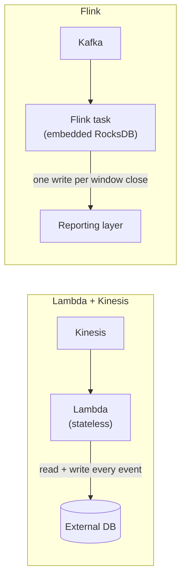

> **This is Pill 5** of the Streaming Pills series. Each pill answers one question about how streaming systems actually work.

Kinesis captures events, Lambda processes them, S3 stores them, Glue transforms them, Athena queries them. It is cheap, it scales, and it needs almost no infrastructure management. Then someone asks for "average order value per hour" or "alert me when CPU stays above 90% for 10 minutes", and this same architecture cannot do the job at all. The reason is state.

## Why serverless struggles with state

To compute anything over time, a moving average, a session length, a windowed count, the system needs memory of what already happened in the last 5 minutes, the last hour, the last session. Lambda functions are stateless and short-lived. They start, process a small batch of events, and shut down, with no shared memory between one invocation and the next.

That leaves a Lambda that needs a 10-minute window with two bad options: write every raw event to an external database and query it back on every invocation, or read the full historical state from the database, add the new events, recompute, and write it back. At 10,000 events per second, either option overwhelms the database. You end up paying network latency, CPU time, and database locks just to remember what happened five minutes ago.

## How a stateful engine solves it

Dedicated streaming engines, Apache Flink or Kafka Streams, flip the model. Instead of moving data to an external database on every event, they keep the computation static and let the data flow through it, with a high-performance key-value store, typically RocksDB, embedded directly inside the processing node.

During a 1-hour tumbling window (Pill 6 covers window types in detail), Flink increments a local counter in RocksDB for every incoming event. There are zero network calls to an external database while the window is open. Only when the window closes does it make a single consolidated write to the reporting layer. The external database is protected because the heavy lifting happens in local state, not in remote queries.

## The takeaway

Serverless is a great fit for stateless, short-lived, request-response work: ingestion, API backends, file-processing triggers. The moment a use case needs memory across events, the fix is not to add more Lambda invocations or a bigger external database. It is to move the computation to an engine that keeps state locally, next to the data, instead of round-tripping to fetch it.

---

> **Test yourself: [Pill 5 Quiz: State & Stateful Engines](/pills/streaming-quiz-5)**
>
> **Next up: [Pill 6: Windows Are a Design Decision](/blog/streaming-pill-6-windows-are-a-design-decision)**
>
> **Series: Streaming Pills.** Built from Martin Kleppmann's *Designing Data-Intensive Applications*, plus two production write-ups: [Why Serverless Fails at Stream Processing](https://medium.com/@moradabaz/why-serverless-fails-at-stream-processing-and-what-to-use-instead-cf6935a945c4) and [Streaming Is Not Fast Batch](https://medium.com/@moradabaz/streaming-is-not-fast-batch-here-are-five-principles-that-prove-it-4b917f7c7e42).
