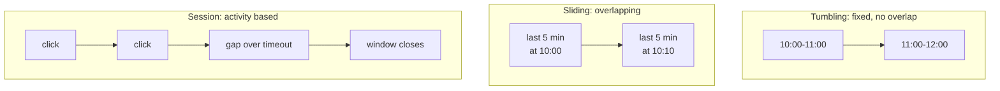

> **This is Pill 6** of the Streaming Pills series. Each pill answers one question about how streaming systems actually work.

Remember Pill 0: events are a continuous, unbounded flow. Nothing in that flow says "here is where an hour starts". A window is an abstraction the engineer picks, and that pick decides how much memory the job uses, how accurate the edges are, and how quickly you get an answer.

## Tumbling windows

Fixed, non-overlapping intervals, every hour from 10:00 to 11:00, for example. They are simple and predictable, and a good fit for business metrics like hourly sales reports. The trade-off shows up at the edges: a user who acts at 10:59:59 and again at 11:00:01 gets split across two windows, which weakens the link between those two actions.

## Sliding windows

These move continuously, "the last 5 minutes, updated every 10 seconds". They fit monitoring and alerting well, for example triggering an alarm if CPU stays above 90% over the last 10 minutes. The trade-off is memory: because windows overlap, a single event belongs to several active windows at once, so the engine has to store and process it multiple times.

## Session windows

These are defined by user activity, not by a fixed clock. A session opens on the first event and closes after a configurable gap of inactivity. This fits user-behavior analysis well: cart abandonment, session length, engagement. The trade-off is that a session can only be closed in hindsight, once the timeout has passed, so the system has to keep state open for every active user for potentially a long time.

## The one question behind all three

Each window type answers the same underlying question in a different way: how much memory are you willing to spend, and how much accuracy at the edges are you willing to give up? Tumbling spends the least memory and accepts edge splitting. Sliding spends more memory to catch every moving pattern. Session spends the most, and the longest, to match real user behavior instead of the clock.

Picking a window is picking an answer to that trade-off for your specific use case, not discovering a fact about the stream. Pill 7 covers the other half of this problem: what happens when an event shows up after its window has already closed.

---

> **Test yourself: [Pill 6 Quiz: Windows](/pills/streaming-quiz-6)**
>
> **Next up: [Pill 7: What to Do With a Late Event](/blog/streaming-pill-7-late-events)**
>
> **Series: Streaming Pills.** Built from Martin Kleppmann's *Designing Data-Intensive Applications*, plus two production write-ups: [Why Serverless Fails at Stream Processing](https://medium.com/@moradabaz/why-serverless-fails-at-stream-processing-and-what-to-use-instead-cf6935a945c4) and [Streaming Is Not Fast Batch](https://medium.com/@moradabaz/streaming-is-not-fast-batch-here-are-five-principles-that-prove-it-4b917f7c7e42).
