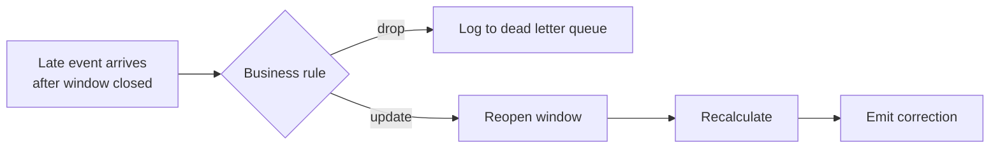

> **This is Pill 7** of the Streaming Pills series. Each pill answers one question about how streaming systems actually work.

A purchase happens at 15:00 while the user is in the subway with no signal. It reaches your server at 15:30, well after the 15:00-16:00 window that should contain it has probably already closed and reported its result. This is a straggler event, and every streaming system needs a policy for it.

## Option 1: drop it

The late event is excluded from the window calculation, but logged to a dead letter queue for monitoring and offline reconciliation. This fits non-critical analytical metrics, page view counts, click aggregations, where a small margin of error is acceptable, and reopening a closed window is not worth the cost.

## Option 2: update it

The system reopens the closed window, recalculates the aggregate including the late event, and emits a correction downstream. This is required for anything where accuracy is not negotiable: payment processing, driver payouts, billing reconciliation. It comes at a real cost, because the system has to be able to reopen any window within an allowed lateness period, which increases the amount of state it keeps and adds complexity downstream.

## Who decides

This is not a technical call, it is a business requirement. The engineer's job is to make the cost of each option visible: dropping means occasional undercounts that never get fixed, updating means holding more state for longer and having to support recalculation everywhere downstream. Once the business picks a tolerance for late data, Pill 6's window choice and this pill's lateness policy work together to define exactly how "correct" your numbers can be.

---

> **Test yourself: [Pill 7 Quiz: Late Events](/pills/streaming-quiz-7)**
>
> **Next up: [Pill 8: Streaming Joins Are a Memory Problem](/blog/streaming-pill-8-streaming-joins)**
>
> **Series: Streaming Pills.** Built from Martin Kleppmann's *Designing Data-Intensive Applications*, plus two production write-ups: [Why Serverless Fails at Stream Processing](https://medium.com/@moradabaz/why-serverless-fails-at-stream-processing-and-what-to-use-instead-cf6935a945c4) and [Streaming Is Not Fast Batch](https://medium.com/@moradabaz/streaming-is-not-fast-batch-here-are-five-principles-that-prove-it-4b917f7c7e42).
