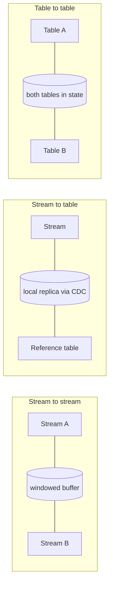

> **This is Pill 8** of the Streaming Pills series. Each pill answers one question about how streaming systems actually work.

In batch, a join is a line of SQL, and the tables involved are finite, so the engine can just read all of both sides and match them. In streaming, both sides can be infinite, so you cannot join "everything". You have to decide how much of each side to keep in memory, and for how long.

## Stream to stream

Two infinite flows of events get correlated within a time window, say 30 minutes. The engine keeps events from both streams in a buffer for that window and matches them there. Once the window passes, unmatched events are dropped. A concrete example: matching ad impressions with the clicks that follow them to calculate a conversion rate. The memory cost scales with the window size and the volume of both streams.

## Stream to table

An infinite stream gets enriched with reference data that changes slowly. Instead of querying an external database on every single event, which recreates the exact bottleneck from Pill 5, the engine subscribes to the table's change log (via CDC) and keeps a local replica in memory. Every lookup is then local, at microsecond latency. Example: enriching a live transaction stream with user risk profiles. The memory cost is the full size of the reference table, but the latency cost is close to zero.

## Table to table

Two changing datasets are kept fully in state as a materialized view. A change on either side triggers an immediate recalculation of the joined result. Example: maintaining a user's feed by joining a posts table with a followers table. The memory cost is the combined size of both tables, which makes this the most expensive of the three.

## The pattern across all three

Every streaming join trades memory for latency. A wider window or a bigger reference table means more state to hold, in exchange for matching more events correctly or answering faster. Picking the right join type means matching it to what the business actually needs, while keeping the resulting state size inside what your infrastructure can hold.

---

> **Test yourself: [Pill 8 Quiz: Streaming Joins](/pills/streaming-quiz-8)**
>
> **Next up: [Pill 9: Three Questions Before You Design a Streaming System](/blog/streaming-pill-9-three-questions)**
>
> **Series: Streaming Pills.** Built from Martin Kleppmann's *Designing Data-Intensive Applications*, plus two production write-ups: [Why Serverless Fails at Stream Processing](https://medium.com/@moradabaz/why-serverless-fails-at-stream-processing-and-what-to-use-instead-cf6935a945c4) and [Streaming Is Not Fast Batch](https://medium.com/@moradabaz/streaming-is-not-fast-batch-here-are-five-principles-that-prove-it-4b917f7c7e42).
