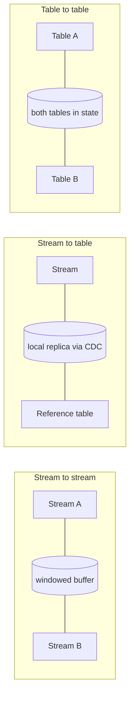

> **This is Pill 8** of the Streaming Pills series. Each pill answers one question about how streaming systems actually work.

In batch, a join is a line of SQL, and the tables involved are finite, so the engine can just read all of both sides and match them. In streaming, both sides can be infinite, so you cannot join "everything". You have to decide how much of each side to keep in memory, and for how long.

## Stream to stream

Two infinite flows of events get correlated within a time window, say 30 minutes. The engine keeps events from both streams in a buffer for that window and matches them there. Once the window passes, unmatched events are dropped.

**Advantages**
- Correlates two live, independent streams directly, with no need to wait for either side to land in a table first.
- The window bounds the state up front, so you know the maximum memory the join can use before it runs.
- Fits time-sensitive correlations well, since matches are produced as soon as both sides arrive.

**Disadvantages**
- Any event that does not find its match before the window closes gets dropped, or has to go through the late-event policy from Pill 7.
- Widening the window to catch more matches grows memory directly, and you pay for both streams' buffers at once.
- A burst of traffic on one side can inflate the buffer even while the other side is quiet.

**When to use it**
- Both sides are genuinely streams of independent facts, not slowly changing reference data.
- The two related events are expected to arrive within a bounded, predictable amount of time of each other.

**When not to use it**
- One side is really a small, mostly static dataset. That is cheaper as a stream-to-table join instead.
- The two events can be arbitrarily far apart in time, since the window cannot grow without bound.

**Real-world examples**
- Matching ad impressions with the clicks that follow them to compute conversion rate.
- Matching a card swipe with its authorization response to catch a stuck or duplicate transaction.
- Matching a package scan with its expected delivery confirmation to flag a late shipment in real time.

## Stream to table

An infinite stream gets enriched with reference data that changes slowly. Instead of querying an external database on every single event, which recreates the exact bottleneck from Pill 5, the engine subscribes to the table's change log (via CDC) and keeps a local replica in memory.

**Advantages**
- Lookups are local, at microsecond latency, instead of a network round trip per event.
- Removes the per-event database bottleneck described in Pill 5 entirely.
- Reference data changes propagate into the join automatically through CDC, so enrichment stays current without extra orchestration.

**Disadvantages**
- The engine needs enough memory to hold a full local replica of the reference table, so this does not scale to arbitrarily large tables.
- If CDC falls behind or breaks, the join keeps enriching with stale data until it catches up or someone notices.
- The local replica needs to be bootstrapped from a full snapshot before the join is accurate, which adds startup time and complexity.

**When to use it**
- One side is a stream and the other is reference data that changes slowly relative to event volume: users, products, risk profiles.
- You need enrichment at very low latency.

**When not to use it**
- The "table" side is actually another high-volume stream of independent events. Use stream-to-stream instead.
- The reference table is too large to fit comfortably in the engine's local state.

**Real-world examples**
- Enriching a live credit card transaction stream with user risk profiles for real-time fraud scoring.
- Enriching clickstream events with a product catalog to attach price and category before writing to analytics.
- Enriching a live order stream with current shipping-zone rules to route each order to the right warehouse.

## Table to table

Two changing datasets are kept fully in state as a materialized view. A change on either side triggers an immediate recalculation of the joined result.

**Advantages**
- Produces a live, continuously updated view of both inputs, with no periodic batch refresh needed.
- Any change on either side is reflected in the joined result right away, so downstream consumers always see current data.

**Disadvantages**
- Both tables have to be kept fully in state, so the memory footprint is the combined size of both, the most expensive of the three join types.
- A table with frequent inserts or updates triggers frequent recomputation of the joined result, adding processing load.
- Harder to reason about a single "point in time" for the result, since either side can change independently at any moment.

**When to use it**
- Both inputs are naturally table-like, mutable, keyed state, and you need a continuously current joined view rather than a point-in-time snapshot.

**When not to use it**
- Either input is really a stream of independent facts rather than mutable state. Use stream-to-stream or stream-to-table instead.
- The combined size of both tables does not fit comfortably in state, or one side changes so often that recomputation becomes the bottleneck.

**Real-world examples**
- Maintaining a user's social feed by joining a posts table with a followers table.
- Maintaining a live product search index by joining a products table with an inventory table, so out-of-stock items disappear immediately.
- Maintaining a customer 360 view by joining a CRM contacts table with a subscriptions table.

## The pattern across all three

Every streaming join trades memory for latency. A wider window or a bigger reference table means more state to hold, in exchange for matching more events correctly or answering faster. Picking the right join type means matching it to what the business actually needs, while keeping the resulting state size inside what your infrastructure can hold.

---

> **Test yourself: [Pill 8 Quiz: Streaming Joins](/pills/streaming-quiz-8)**
>
> **Next up: [Pill 9: Three Questions Before You Design a Streaming System](/blog/streaming-pill-9-three-questions)**
>
> **Series: Streaming Pills.** Built from Martin Kleppmann's *Designing Data-Intensive Applications*, plus two production write-ups: [Why Serverless Fails at Stream Processing](https://medium.com/@moradabaz/why-serverless-fails-at-stream-processing-and-what-to-use-instead-cf6935a945c4) and [Streaming Is Not Fast Batch](https://medium.com/@moradabaz/streaming-is-not-fast-batch-here-are-five-principles-that-prove-it-4b917f7c7e42).
