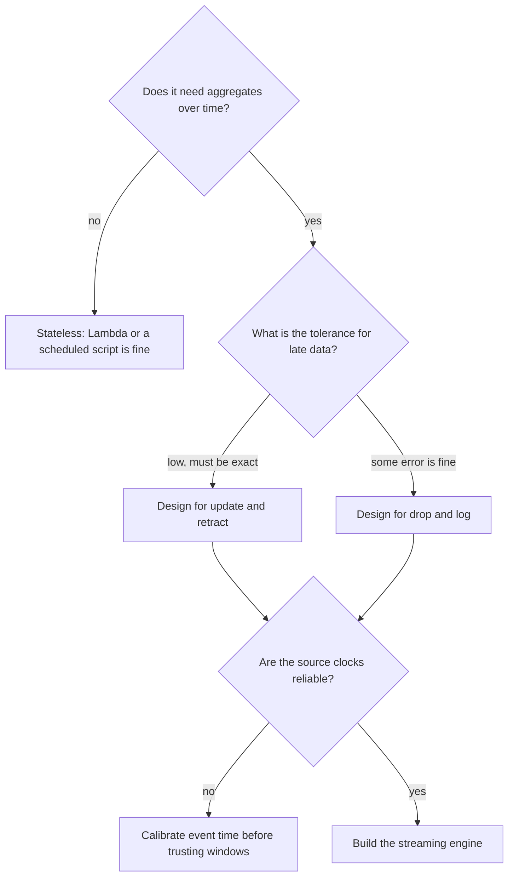

> **This is Pill 9**, the last of the Streaming Pills series. It ties the previous nine pills into a checklist you can run against any "should this be a stream?" question.

## Question 1: does this pipeline need state?

If the use case needs aggregates over time, moving averages, session lengths, windowed counts, a stateless setup like Lambda or a scheduled script will end up depending on an external database just to remember what happened a few minutes ago (Pill 5). That dependency melts under real load. A streaming engine with local state is the right tool here.

If the use case is stateless, one event in, one independent action out, a simple serverless setup is genuinely fine, and reaching for Flink would be overkill.

## Question 2: what is the tolerance for late data?

This decides whether a simple drop-and-log policy is enough, or whether you need the more expensive reopen-and-correct approach (Pill 7). The answer has to come from the business, not from engineering preference, because it is the business that knows whether an undercounted metric is acceptable or not.

## Question 3: how reliable are the source clocks?

Device clocks drift, and mobile timestamps are not to be trusted blindly (Pill 2). Before relying on event-time windows, check the gap between when the server received an event and when the device says it was sent:

```
Calibrated Event Time = Device Event Time + (Server Receive Time - Device Send Time)
```

If that gap is bigger than what your windows can absorb, the aggregates will be wrong regardless of how well everything else in the pipeline is built.



## The boundary between the two worlds

Serverless is built for stateless, short-lived, request-response work: data lake ingestion, API backends, file-processing triggers. Stateful streaming needs the opposite: persistent local memory, continuous processing, and explicit handling of time, windows, and late arrivals. Using a serverless setup for a job that actually needs state does not just run a bit slower. It produces incorrect numbers, quietly, one database query at a time, until someone downstream notices the totals do not add up.

The useful skill here is not knowing how to build either kind of system. It is knowing, for a specific use case, which side of that boundary it falls on, and being able to explain why to whoever is asking.

## Recap of the series

- Pill 0: batch is a slice of a stream, not the other way around
- Pill 1: an event is a fact, a message is a command
- Pill 2: event time and processing time are different clocks
- Pill 3: a topic keeps history, a queue deletes it
- Pill 4: a scheduled script fights the event-time and state problems, it does not solve them
- Pill 5: stateful engines keep memory local instead of round-tripping to a database
- Pill 6: a window is a trade-off you choose, not a fact in the data
- Pill 7: late data needs an explicit drop-or-update policy, set by the business
- Pill 8: a streaming join is a memory budget with a latency trade-off
- Pill 9: three questions decide whether you need any of this at all

If you are catching up, start from [Pill 0](/blog/streaming-pill-0-batch-is-a-special-case) or browse the [full series](/blog/streaming-pills).

---

> **Test yourself: [Pill 9 Quiz: Three Questions](/pills/streaming-quiz-9)**
>
> **Back to the beginning: [Pill 0: Batch Is a Special Case of Streaming](/blog/streaming-pill-0-batch-is-a-special-case)**
>
> **Series: Streaming Pills.** Built from Martin Kleppmann's *Designing Data-Intensive Applications*, plus two production write-ups: [Why Serverless Fails at Stream Processing](https://medium.com/@moradabaz/why-serverless-fails-at-stream-processing-and-what-to-use-instead-cf6935a945c4) and [Streaming Is Not Fast Batch](https://medium.com/@moradabaz/streaming-is-not-fast-batch-here-are-five-principles-that-prove-it-4b917f7c7e42).
