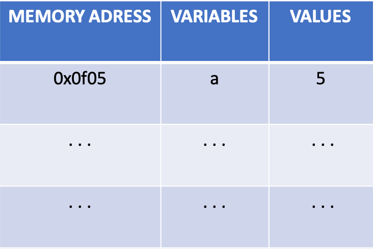
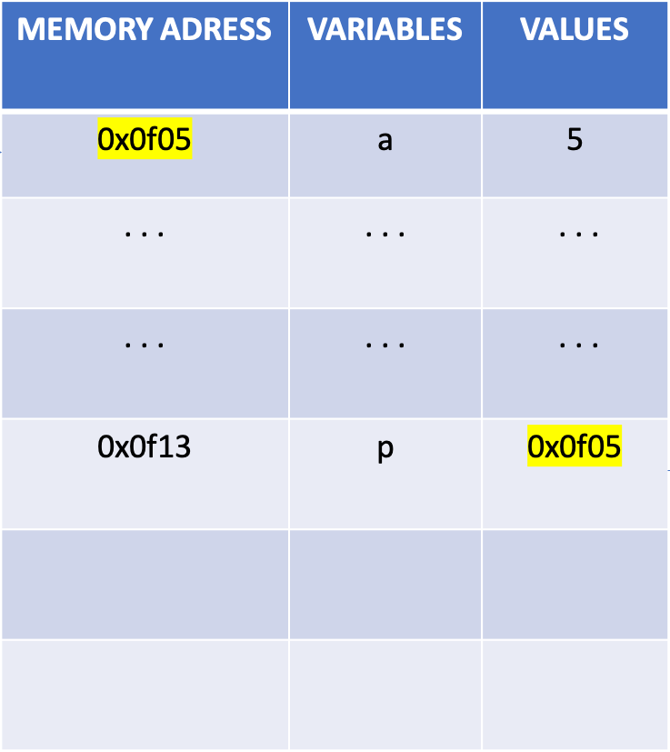
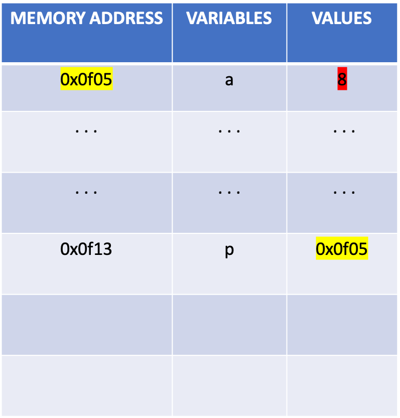
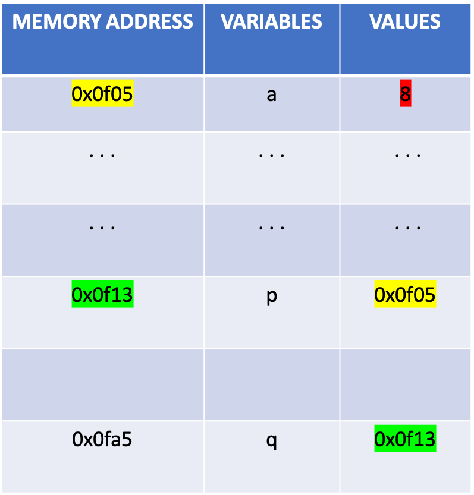
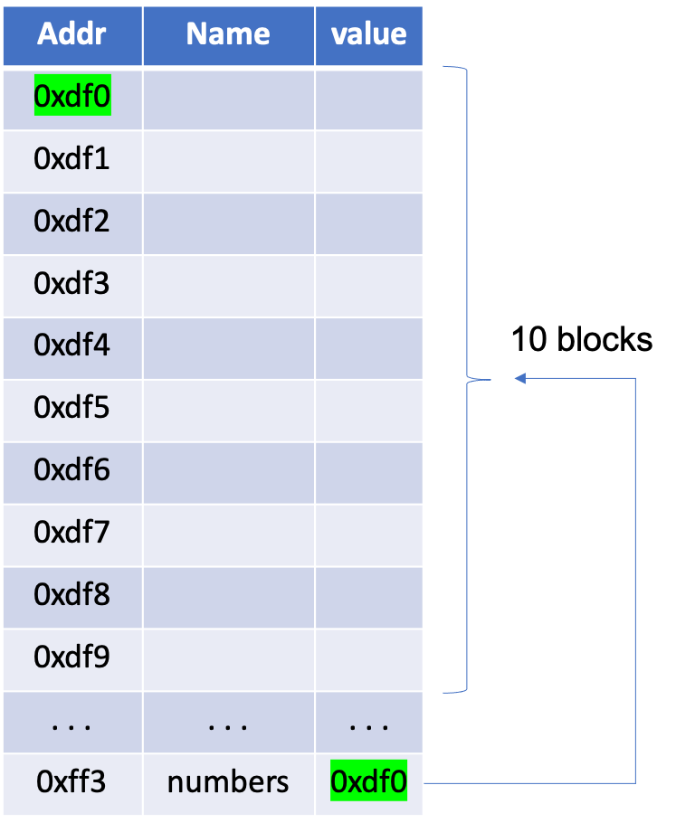
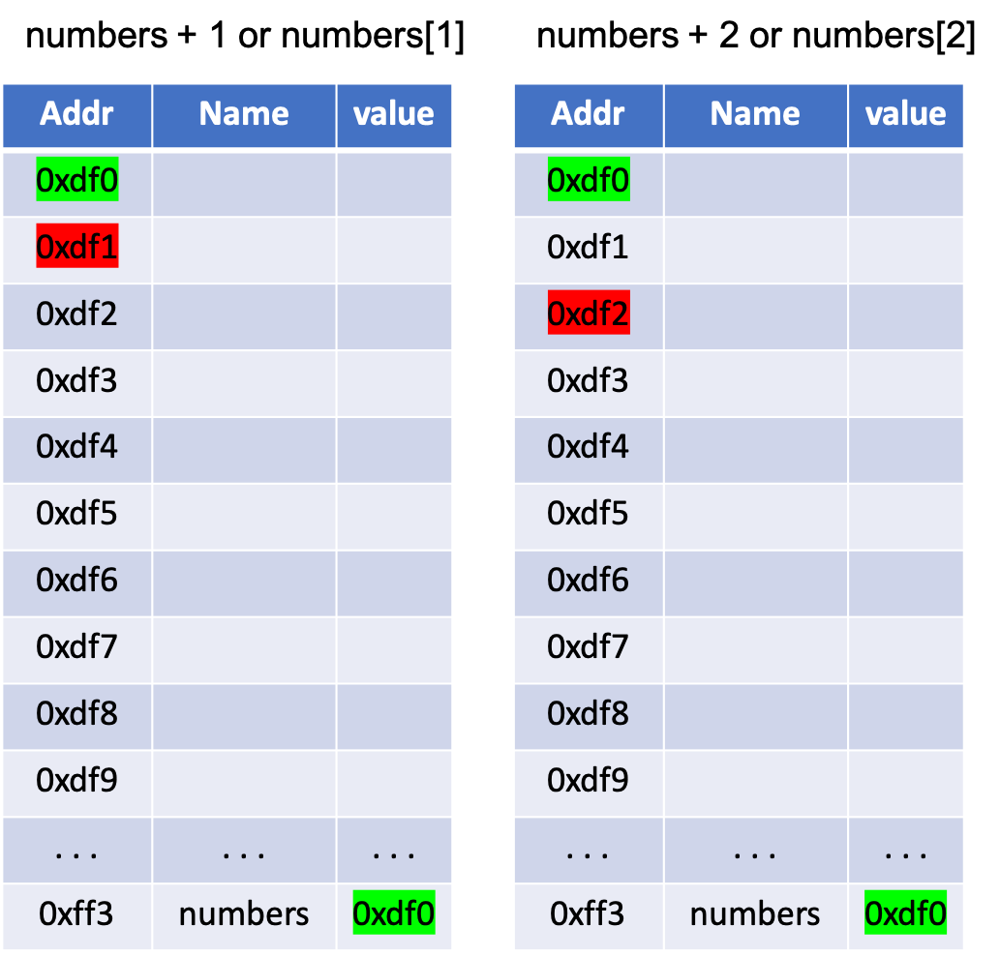

# Basic Introduction to C: Structs, Pointers and Dynamic Memory


In this post we are going to take a look at some of the main particularities C language offers and often make developers run away, escape, shut down their computers and go to see the sunset. In a previous [post](./2021-04-01-introduction-to-c) I made, we saw some of the basics in C language, but now we are going to move on and have a look at the main properties of C. Let's keep in mind this is mid-level language, so there sometimes interactions with hardware, such as the stack. 


## Structs

This is a simple property of C Language. Let's imagine we want to represent a point. We need a *x* variable and an *y* variable, but how do we combine these two variables to represent a point? Well, it's pretty simple. We create a **struct**, which is a way to combine several variables in one data type. Let's represent a point.

```c
struct Point {
  int x;
  int y;
}
```

To declare a struct type, i.e. a point, we type this:

```c
int main() {
  struct Point point;

  return 0;
}
```

What if we want to initialize a struct during declaration? Simple, we just have to write the ordered list of values between brackets.

```c
int main() {
  struct Point point = {3, 4};

  return 0;
}
```

Alright, if we want to print each attribute of the struct type or give them another value, we type this:

```c
printf("P = (%d, %d)", point.x, point.y);
```

Always `[struct type].[property]` to access an attribute of a struct type.  

Now, you've seen that we have to declare `struct Variable variable` to declare a variable, but if we just want remove the `struct`, we can add a `typedef` at the begining. 

```c
typedef struct Point {
  int x:
  int y:
} Point;
```

```c
int main() {
  Point point = {5, 8};
  return 0;
}
```

Let's have another example, let's create a struct type Person. A Person is identified by a name, an age, the weight and tallness.

```c
typedef struct Person {
  char[50] name;
  int age;
  float weight;
  float tallness;

} Person;

```

Let's create a person:

```c
int main() {

  Person person = {"Mike", 30, 78, 1.77};
  return 0;
}
```

Now, let's imagine this person has lost some weight.

```c
int main() {
  Person person = {"Mike", 30, 78, 1.77};

  person.weight -= 5.0;

  printf(" %s is now %f kg heavy after losing some weight\n", person.name, person.weight);

  return 0;
}
```

You see? Structs are pretty simple. Let's have another example, let's talk about dates.

```c
typedef struct Date {
    int day;
    int month;
    int year;
} Date;
```
If we want to create a date which value is 24/03/2020:
```c 
Date date = {24, 3, 2020};
```
If we want to add a day:
```c
date.day++;
```
or
```c
date.day = date.day + 1;
```

**EXERCISE.** *Could you create a program where, given a date, you print the date of the next day? Keep in mind there are month that have 31 days, and February might have 28 days or 29, according to the year. Also keep in mind the last day of the year.* 

Try to do ;)

# Pointers

This is probably the most hated thing when it comes to a programming language. I haven't met any developer who has a good opinion of pointers. Pointers are the main cause of headaches, frustration and hating current society. That's why a lot of programmers escape to Java or Python, because they don't have to face pointers in their everyday life. Managing pointers is a very critical thing because you are interacting directly with the memory stack. Alright, but what is a pointer? The pointer somebody pointing always at someone else.... Nah, I'm joking XD. Pointers are variables that contain a memory adresss instead of a value. Let's have a brief introduction of what variables contain if you might not know what I'm talking about.


Variables are allocated in the stack. The Stack is like a large array containing values and references. Each cell of the stack has a memory address. When you declare the variable and give it a value, that variable will be allocated in a memory address. Memory addresses are usually writen in hexadecimal.

So, when you declare a variable `int a = 5`, what you are actually doing is this:



The variable `a` will be allocated in the memory address `0x0f05` (hexadecimal) and will contain the value `5`. That's what we do when we declare variables and assign values. Now, **what if instead of assigning a value to a variable, we assign a memory address?** That's what a pointer is. A pointer is a variable that stores a memory address. A pointer is declared with an asterisk followed by the name you want to assign.

```c
int *p;
```

You can also declare it like this:

```c
int* p;
```

or like this:

```c
int * p;
```

Before we continue, Did you remember that in the [previous post](./2021-04-01-introduction-to-c.md) about Basic C Language we used to add and `&` to scan a value we type and store it into the variable we want?

```c
int a;
scanf("%s" &a);
```

The `&a` returns the memory address of `a`, that is, we add `&` at the begining of a variable to get the its memory address.  
So, Imagine we have a variable `a` and we assign a value to it.
```c
int a = 5;
```

If we want to print `a` and `&a`:

```c
printf("Value of a is: %d\n", a);
printf("Value of &a is: %d\n", &a);
```

we will have this output
```
Value of a is: 5
Value of &a is: 23568412
```

The first output corresponds to the value of `a` and the second one corresponds to the value of the memory address.  

Back to pointers, if we want to declare a pointer that points to the memory adress of `a`, we type:

```c
int a = 5;
int *p = &a;
```

Let me remind you that `p` is not a normal variable, it can only store memory address, so we must assign a memory address. What we have is something like this




The value of `p` is the memory address of the variable `a`. But let's not forget `p` is also a variable, so it's contained in another memory address. 

Now, `&a` and `p` have the value but, what if I want to access the value of `a` through `p`? You just have to add a `*` before the name of the variable, that is you have to type `*p`;

```c
printf("Value of a: %d\n", *p);
```
```
Value of a: 5
```

What if I change the value of `*p`? Will `a` be modified? If you change what's contained in `*p`, as `p` points to the same memory address of `a`, if you change anything contained in that memory address, the variable containde in that memory address will be also modified. Keep in mind that a variable is only an identifier which help us write understandable code for humans, but what we are actually doing is changing the value contained in a memory address.

```
<Memory address, value>
```

```c
int a = 5;  
int *p = &a;  // remember p must store a memory address
*p = 8;       // *p will access the value contained in that memory address
printf("Value of a: %d\n", a);
```

```
Value of a: 8
```



### Arithmetics of Pointers

Let's get back to our example:

```c
int a = 5;
int *p = &a;
```

What if we print `p+1`?

```c
printf("value of p: %d\n", p);
printf("value of (p): %d\n", (p+1));
```

```
value of p: 2406580
value of p: 2406584
```

The first output shows us the memory address of `p` which is `2406580`, but `p+1` adds a `4` to the previous value, why? Because the size of an integer to be store in the stack is 4 bytes. Alright, if the memory address `p+1` is `2406584`, what will be the value contained in `p+1`.

```c
printf("The value contained in p+1 is %d\n", *(p+1));
```
```
The value contained in p+1 is -6846
```

The output returned a random value. You might wonder why. Well, it's because the memory address contains no initialized value. If we go back to our image:


We'll see that there's no initialized value after the memory address in the `0x0f14` and the program return the a random value contained there which is `the garbage` remaining in the stack. Tha's why we must be strictly careful with pointers because, as we are interacting with the stack, we might be manipulating the memory address of a restricted zone of the stack or, as we saw, access place that hasn't been initialized. 

Well, what if we want to declare a pointer which points to another pointer? If that's the case, we need to add a double asterisk to our new pointer variable. 

```c
int *p;
int **q = &p
```
The variable `q` will contain a the memory address of the pointer `p`. Watch this image below.



And what if we want to add another pointer `r` that points to `q`? We add another asterisk.

```c
int ***r = &q;
```

Each time we want do declare a pointer variable that points to another previous pointer, we add an asterisk. 

### Types and Sizes

You might realize that pointers are typed, that is, we declare the type of the pointer. You might wonder why if it's only storing a memory address but we must use strong types to be able to change the value contained in it. This because the size we need to store an integer is not the same as the size we need to store a character. Integers and floats use 4 bytes and characters 1 byte. 

And that's pretty much the basics of pointers, now let's move on to another important thing related to this.

# Dynamic Memory allocation and pointers for arrays


In the previous post about Basic C Language, we used to give a fix size to an array but this is actually incorrect, why? Because you are reserving a bunch of memory that in the end you may not need or you might need more space in the future, but that fix memory you've just reserved won't be available untill you finish your execution. That's why we need dynamic memory. Dynamic memory will allow us to reserve, allocate, reallocate and free memory we need. It is the best way to manage the resources and have the program maximize its performance. That's why C is a very efficient language when it comes to resource management, especially when we don't know how much amount of memory would be needed beforehand. And using dynamic memory is mandatory if we want to create data structures. The bad thing is that the programmer is the one responsible for assigning memory, which is very critical and tedious, but if you are a good one, your program will be very fluid.  
Alright, let's imagine we want to declare a variable called `numbers` that will be an array of integers and has a size of 10. 

```c
int numbers[10];
```

Let's suppose we want to create a function that returns the largest element of the array. 

```c
int find_largest_element(int[] array) {
  int max_number = -50;
  for (int i = 0; i < 10; i++) {
    if (max_number < array[i]) {
      max_number = array[i];
    }
  }
  return max_number;
}
```

In this case, we knew the size of the array, because it was a fix number. Now, let's imagine we want to create an array of a random size and a random value of each of its elements. To generate a random number, we must import the libraries `time.h` and `stdlib.h`

```c
#include <time.h>
#include <stdlib.h>

int main() {
srand(time(NULL));   // Initialization, should only be called once.
int r = rand(); 
}
```

If we want to generate random numbers between 0 and 10:
```c
#include <time.h>
#include <stdlib.h>

int main() {
srand(time(NULL));   // Initialization, should only be called once.
int r = rand() % 10;  
}
```

Let's imagine we want to create an array of an *N* size, being *N* a number between 5 and 15, and fill the array with numbers between 0 and 20. How could we do it? Well, we can't declare an array of a fix size anymore, we will have to use dynamic memory. Let's imagine we have a variable `array_size` that's been generated randomly. We want to declare an array of integers `number` using pointers


```c
int * numbers;
```

Now you might just wonder, *"What do pointers have to do with this if we are not storing any memory address?".* Well, pointers do not only store one memory address but several memory addresses if you reserve enough space. How?

```c
number = (int*) malloc(10 * sizeof(int));
```

What we've done here is telling the program to reserve 10 blocks of memory, each one with a size to store an integer. The function `malloc()` is one of the flagships of C. It reserves memory of a specified number of bytes and returns pointer of `void` which can be casted into pointers of any form, in this case we casted it into a pointer of integers `(int *)`. To have a graphic explanation of what we've done.




Then, how do we access the elements? Just like accessing the elements of an array. Keep in mind our pointer `numbers` points at the first the memory address, which is `*numbers[0]` or just `*numbers` and if we want to access the next one we just have to type `*(numbers + 1)` or `numbers[1]`, and so on. 




Now, back to our exercise, we want to create an array of a random size and initialize its elements with random values. We want to create an array of an N size, being N a number between 5 and 15, and fill the array with numbers between 0 and 20.

```c
#include<stdio.h>
#include<stdlib.h>
#include<time.h>


int main() {
  srand(time(NULL));
  int array_size = (rand() % 10) + 5;  // creates a number between 0 and 10, we just add 5
  int * numbers = (int*) malloc(array_size * sizeof(int));
  for(int i = 0; i < numbers; i++) {
      numbers[i] = rand() % 20;
  }
  return 0;
}
```

We can gather this code into a function that returns a pointer to integers.

```c
#include<stdio.h>
#include<stdlib.h>
#include<time.h>


int * create_random_array() {
  int array_size = (rand() % 10) + 5;  // creates a number between 0 and 10, we just add 5
  int * numbers = (int*) malloc(array_size * sizeof(int));
  for(int i = 0; i < numbers; i++) {
      numbers[i] = rand() % 20;
  }
  return numbers;
}

int main() {
  srand(time(NULL));
  int * numbers = create_random_array();
  return 0;
}
```

Now, we want to calculate the largest number of the array:

```c
#include<stdio.h>
#include<stdlib.h>
#include<time.h>


int * create_random_array() {
  int array_size = (rand() % 10) + 5;  // creates a number between 0 and 10, we just add 5
  int * numbers = (int*) malloc(array_size * sizeof(int));
  for(int i = 0; i < numbers; i++) {
      numbers[i] = rand() % 20;
  }
  return numbers;
}

int find_largest_element(int * array) {
  int max_number = -50;
  for (int i = 0; i < 10; i++) {
    if (max_number < array[i]) {
      max_number = array[i];
    }
  }
  return max_number;
}

int main() {
  srand(time(NULL));
  int * numbers = create_random_array();
  int largest_number = find_largest_element(numbers);
  return 0;
}
```

OK, now it's great but unfinished. Once we reserved memory and done what we had to do, we must release it. The function `free()` will release the memory previously allocated in a pointer.


```c
#include<stdio.h>
#include<stdlib.h>
#include<time.h>


int * create_random_array() {
  int array_size = (rand() % 10) + 5;  // creates a number between 0 and 10, we just add 5
  int * numbers = (int*) malloc(array_size * sizeof(int));
  for(int i = 0; i < numbers; i++) {
      numbers[i] = rand() % 20;
  }
  return numbers;
}

int find_largest_element(int * array) {
  int max_number = -50;
  for (int i = 0; i < 10; i++) {
    if (max_number < array[i]) {
      max_number = array[i];
    }
  }
  return max_number;
}

int main() {
  srand(time(NULL));
  int * numbers = create_random_array();
  int largest_number = find_largest_element(numbers);
  free(numbers);
  return 0;
}
```

Now that's perfect. We reserved the space we needed, performed our job and released the memory we reserved so that another process can use that memory if needed. Another thing we should know is, *What if I realize I'll need more memory than the amount I reserved previously?.* Well, if we reserved memory with `malloc` we can reserve more or less memory with the function `realloc`.

```c
  int array_size = (rand() % 10) + 5;  // creates a number between 0 and 10, we just add 5
  int * array = (int*) malloc(array_size * sizeof(int));

  ...

  array = (int*) realloc(array_size * sizeof(int));
  ...

  free(array);
```

Dynamic memory is a very important thing, especially when it comes to data structures where we have to reserve memory for pointers to other data structures and release memory.

But we are not done yet, what about Strings?. Strings are array of characters, so instead of creating a string with a fix size, we can use pointers.

```c
#include<string.h>
#include<stdio.h>

int main() {
  char * name = (char*) * malloc(5 * sizeof(char));
  strcpy(name, "Morad");
  printf("My name is %s\n", name);
  free(name);
  return 0;
}
```
```
My name is Morad
```

Now I reserved only the exact amount of memory for my name. Let's imagine we want to store another person's name, for example, "Leonardo". We just have to reallocate memory:

```c
#include<string.h>
#include<stdio.h>

int main() {
  char * name = (char*) * malloc(5 * sizeof(char));
  strcpy(name, "Morad");
  printf("My name is %s\n", name);
  name = (char*) * malloc(15 * sizeof(char));
  strcpy(name, "Leonardo");
  printf("Now my name is %s\n", name);
  free(name);
  return 0;
}
```

```
My name is Morad
Now my name is Leonardo
```

Much better and much more efficient.


**Did you learn with this post?**
**Did you like it?**  **Do you want to explore more about this issue?** 

If you want to continue learning about pointers and dynamic memory, I strictly recommend the book [Understanding and Usinc C Pointers](https://www.oreilly.com/library/view/understanding-and-using/9781449344535/) of Richard M. Reese. I also recommend watching this great [youtube video](https://www.youtube.com/watch?v=zuegQmMdy8M&t=719s&ab_channel=freeCodeCamp.org) explaining in deep all about pointers. I hope you enjoyed this mini course and please visit my blog for future posts. 