# Data Science with Rstudio: Let's do an exercise
### April 4, 2021

In this post we are going to do a supervised learning exercise in which we are going to use some data science techniques to solve it . The exercise consists in, given a dataset, to predict the candidate a person is going to vote based on some information contained in the data. We are going to do this exercise in Rstudio, so I hope you have in installed. We are also going to use the `caret` library, so make sure you install this package. `Caret` is a great machine learning library that contains multiple functions for regressions, classifiers and dozens of ML algorithms, as well as datasets we can use.  


# Introduction

In 2002 there was a survey which collected some information from people in the UK for the british elections in 2002. The information collected was stored in a dataset called *BEPS* and registered data related to people's ideology, euroscepticism, opinion about certain candidates, etc. Having this information, our main target was to predict the candidate a person would vote to if they gathered some of the opinions and ideology patterns. Thus,  we made a statistical supervised learning analysis based on the dataset we have in hand to study the influence and utility of each variable composing the dataset to predict the political party a person would vote. 


# Requirements

To do this exercise, we will need:

* You must have installed Rstudio, which is the IDE we are going to use in exercise.
* You must have, at least, a basic knowledge of  `Rstudio` .
* You must install `Caret`, which is the library that contains the machine learning tools we are going to use.

Also, if during our exercise you find there's a package you haven't installed, do it. And we will do this exercise in an Rmarkdown `.Rmd` file, so that we keep a track of our work.


# Dataset and subsets

## Variables of the dataset

The dataset can be found using the `carData` library. 

```r
set.seed(1234)
```

You might askk why we type `set.seed(1234)`, well, we do it to avoid random value results and we specify the number we desire. We will obtain the same results. Now, we upload the `carData` package containing our dataset and we type `str(BEPS)` to see an overview of our dataset. 

```r
library(carData)
str(BEPS)
```

```r
## 'data.frame': 1525 obs. of 10 variables:
## $ vote : Factor w/ 3 levels "Conservative",..: 3 2 2 2 2 2 3 2 2 2 ... ## $ age : int 43 36 35 24 41 47 57 77 39 70 ...
## $ economic.cond.national : int 3 4 4 4 2 3 2 3 3 3 ...
## $ economic.cond.household: int 3 4 4 2 2 4 2 4 3 2 ...
## $ Blair : int 4 4 5 2 1 4 4 4 4 5 ...
## $ Hague : int 1 4 2 1 1 4 4 1 4 1 ...
## $ Kennedy : int 4 4 3 3 4 2 2 4 4 1 ...
## $ Europe : int 2 5 3 4 6 4 11 1 11 11 ...
## $ political.knowledge : int 2 2 2 0 2 2 2 0 0 2 ...
## $ gender : Factor w/ 2 levels "female","male": 1 2 2 1 2 2 2 2 1 2 ...
```

As we see, we have 10 different variables/predictors:

 * `vote`: This is the *output* we want to draw. It's a Factor variables which represent the three main political parties: Conservative, Liberal Democrat and Labour.
 * `age`: The age of each person surveyed.
 * `gender`: Each person's gender (Male or Female). 
 * `economic.cond.national`: This variable represents each person's knowledge of the national economy.
 * `economic.cond.household`: This variable represents each person's knowledge of families' household economy.
 * `Blair`: This variable represents each person's opinion about labourist candidate Blair.
 * `Hague`: This variable represents each person's opinion about conservative candidate Hague.
 * `Kennedy`: This variable represents each person's opinion about conservative candidate Kennedy.
 * `Europe`: This variable represents each person's euroscepticism. If a persons is very eurosceptic, the value will be 11. If is very pro-european, the value will be 0
 * `political.knowledge`: This variable represents each person's political knowledge.
 
## Loading other libraries and creating data subsets

 The methodology to design a vote prediction model, following learning techniques, will be based on dividing the dataset into two data subsets for training and testing, predictors analysis and several learning training algorithms trying to create the most reliable and accurate model. Our main target is to predict the **vote**, which is a factor variable and therefore our model must be a classification model.
 
Before starting to analyze the variables, we loaded the necessary libraries and create the subset partitions. If you don't have some of this libraries, install them. 

```r 
library(reshape2)
library(lattice)
library(ggplot2)
library(caret)
library(mlbench)
library(e1071)
data(BEPS)      
BEPS.data.all <- BEPS
BEPS.data.outputs <- c("vote")
BEPS.data.inputs <- setdiff(names(BEPS.data.all), BEPS.data.outputs)
str(BEPS.data.inputs)
```

Now we have the following datasets:

* `BEPS.data.all` which represents the whole dataset.
* `BEPS.data.inputs` which contains all the values except the ones in the **vote** field.
* `BEPS.data.outputs` which contains the **vote** variable values.

We create a partition in which the 80% of the whole dataset will be used for training and the remaining 20% will be used for testing.

```r
train <-createDataPartition(BEPS.data.all[[BEPS.data.outputs]],p=0.8, list = FALSE, times = 1)
BEPS.data.all.80 <- BEPS.data.all[train,]
mask = sapply(BEPS.data.all.80, class) != "factor"
BEPS.data.all.20 <- BEPS.data.all[-train,]
BEPS.data.all.Train <- BEPS.data.all.80[,mask]
BEPS.data.all.Test <- BEPS.data.all[-train,]
BEPS.data.all.Test <- BEPS.data.all.Test[,mask]
output.values <- BEPS.data.all.80[[BEPS.data.outputs]]
```

The new subsets we created above are the following:

* `train` : The created partition. The 'p' value means the proportion and the argument `list = FALSE` se used so that the result can't be a list.
* `BEPS.data.all.80` : This subset will be used for training and it represents the 80% of the whole dataset.
* `BEPS.data.all.20` : This subset will be used for testing and it represents the 20% of the whole dataset.
* `BEPS.data.all.Train` : Training subset.
* `BEPS.data.all.Test` : Testing subset.
* `output.values` : Output values subset.

# Feature analysis


Feature analysis is an important part of data science because we measure the influence and utilty of each of every feature on prediction result. 

We first take a quick look at the dataset. 

```r
summary(BEPS)
```

```r
##                vote          age        economic.cond.national
##  Conservative    :462   Min.   :24.00   Min.   :1.000         
##  Labour          :720   1st Qu.:41.00   1st Qu.:3.000         
##  Liberal Democrat:343   Median :53.00   Median :3.000         
##                         Mean   :54.18   Mean   :3.246         
##                         3rd Qu.:67.00   3rd Qu.:4.000         
##                         Max.   :93.00   Max.   :5.000         
##  economic.cond.household     Blair           Hague          Kennedy     
##  Min.   :1.00            Min.   :1.000   Min.   :1.000   Min.   :1.000  
##  1st Qu.:3.00            1st Qu.:2.000   1st Qu.:2.000   1st Qu.:2.000  
##  Median :3.00            Median :4.000   Median :2.000   Median :3.000  
##  Mean   :3.14            Mean   :3.334   Mean   :2.747   Mean   :3.135  
##  3rd Qu.:4.00            3rd Qu.:4.000   3rd Qu.:4.000   3rd Qu.:4.000  
##  Max.   :5.00            Max.   :5.000   Max.   :5.000   Max.   :5.000  
##      Europe       political.knowledge    gender   
##  Min.   : 1.000   Min.   :0.000       female:812  
##  1st Qu.: 4.000   1st Qu.:0.000       male  :713  
##  Median : 6.000   Median :2.000                   
##  Mean   : 6.729   Mean   :1.542                   
##  3rd Qu.:10.000   3rd Qu.:2.000                   
##  Max.   :11.000   Max.   :3.000
```


As we can see, there are no *nul*l values, so null values tratement won't be necessary. Now, we would like to have a look at the votes proportion.

```r
barplot(table(BEPS$vote))
```

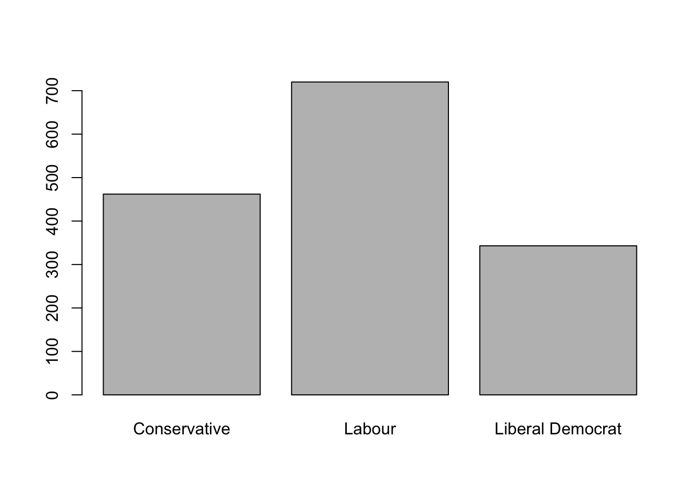

As we see, the majority of the people survey claimed they would vote to the Labor Party. Now it's time to see what type of person would one of these three candidates. 


## Factor typed variables

Our two factor variables are `gender` and `vote`, which represent the voter gender and favorite party. Now, if we look at the table below, we can see that most males and females would vote for the Labor Party. 


```r
table(BEPS$gender, BEPS$vote)
```

```r
##         
##          Conservative Labour Liberal Democrat
##   female          259    372              181
##   male            203    348              162
```

To have a better visualization, we plot a spineplot:

```r
spineplot(BEPS[,10] ~ BEPS[, 1], data=BEPS, main="Gender/vote ratio", xlab = "Candidate party", ylab = "Gender", col = c("pink", "skyblue"))
```

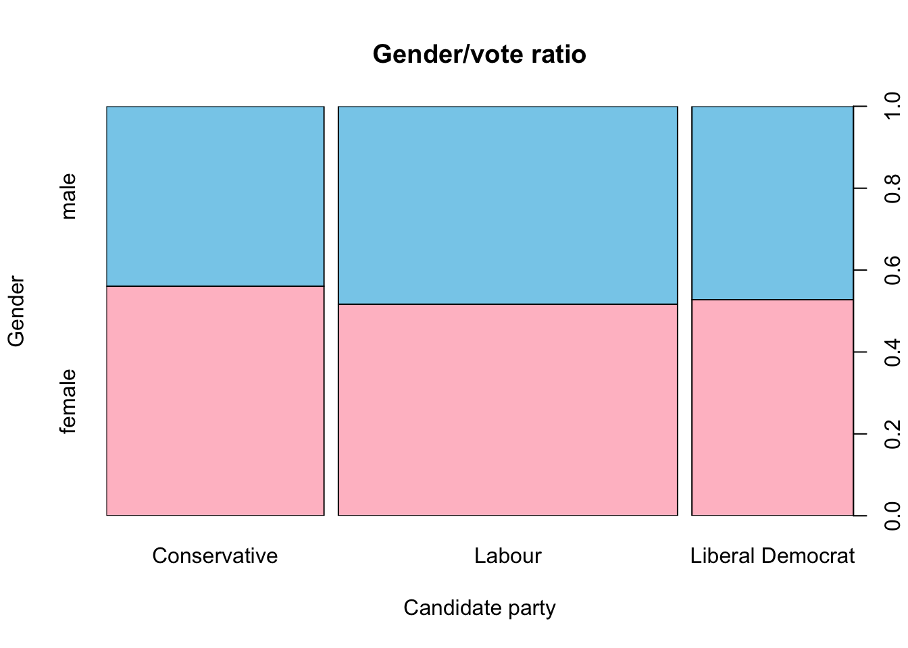


Focusing on people that would vote for conservatives, there are slightly more females and males voting for this party, but the difference between males and females is pretty weak. To check if there's any statistical difference, we will execute a `chiSquare`. Chi-Square test in Rstudio is a statistical method which used to determine if two categorical variables, are selected from the same population, have a significant correlation between them. 

```r
chisq.test(table(BEPS$gender, BEPS$vote))
```


The `p-value` is greater than `0.05`, which means differences are statistically insignificant and both factors are independent. 


## Numerical variables


Now we are going to explore the numerical predictor and analyze each of everyone of them.

#### Age

In the image below we can see that the majority of young people and people between 35 and 40 would vote for the Labour Party, while the elders would vote for the Conservative Party. The Liberal Democrat Party is not very popular though some people who are between 20 and 25, and people between 45 and 50 would for them. 


```r
spineplot(BEPS[,1] ~ BEPS[,2], data=BEPS, main = "Age/Vote Ratio", xlab = "Ages of People Surveyed", ylab = "Vote", col = c("red", "blue","green"))
```


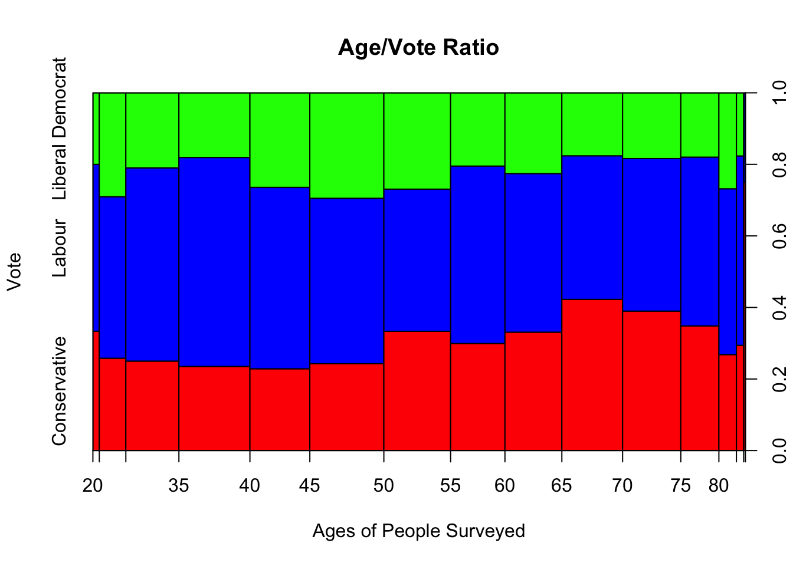


#### Knowledge on National Economy 

This variable shows how aware people are of national economic situation, where value 1 means a person knows nothing and 5 means a person is very aware of national economy. Well, the histogram below shows that majority of people aware of the nacional economic conditions and situation would vote for the Labour Party while the least they know about, they're more likely to vote for conservatives. 

```r
ggplot(BEPS) + aes(x=as.numeric(economic.cond.national), group=vote, fill=vote) + 
geom_bar(position = "stack") +
  geom_histogram(binwidth=0.25) +
coord_trans() +
scale_fill_manual(values = c("skyblue", "brown1", "orange")) + 
theme_classic()
```

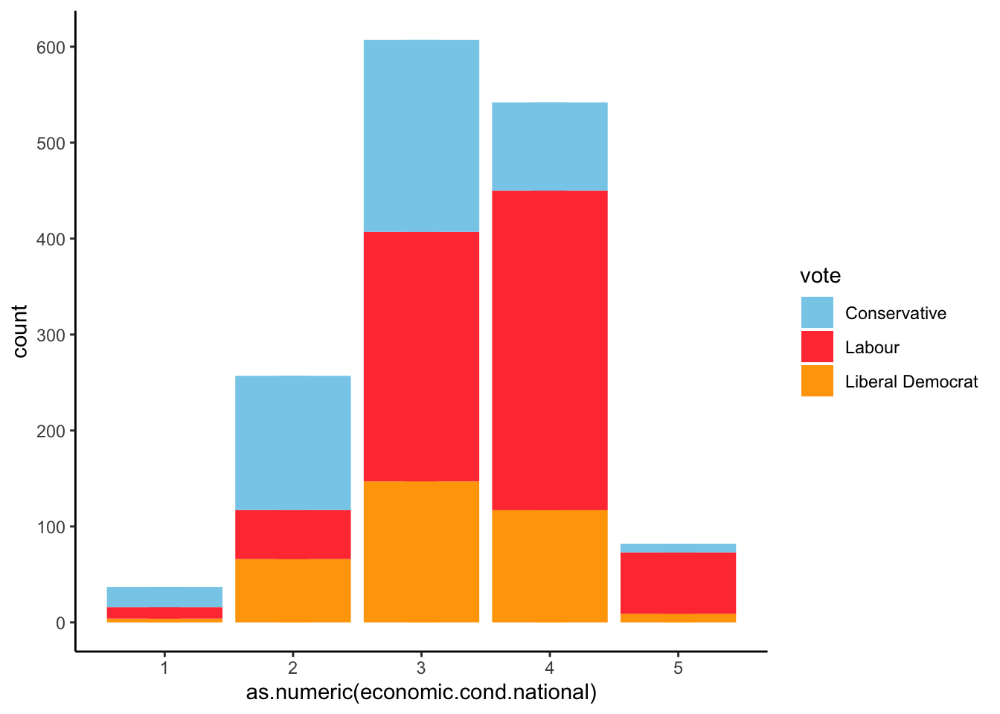


#### Knowledge on Domestic Economy 

Now we are going to evaluate people's knowledge on domestic economy.


```r
ggplot(BEPS) + aes(x=as.numeric(economic.cond.household), group=vote, fill=vote) + 
geom_bar(position = "stack") +
  geom_histogram(binwidth=0.25) +
coord_trans() +
scale_fill_manual(values = c("skyblue", "brown1", "orange")) + 
theme_classic()
```


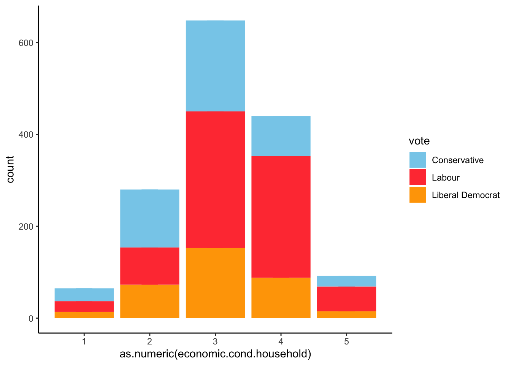

We obtain similar results to the ones we drew on National Economy. Basicly, people who are aware of national economy situation, are also aware of domestic economy. 


#### Political knowledge 

Now we'll look on people's political knowledge.


```r
ggplot(BEPS) + aes(x=as.numeric(political.knowledge), group=vote, fill=vote) + 
geom_bar(position = "stack") +
geom_histogram(binwidth=0.25) +
coord_trans() +
scale_fill_manual(values = c("skyblue", "brown1", "orange")) + 
theme_classic()
```

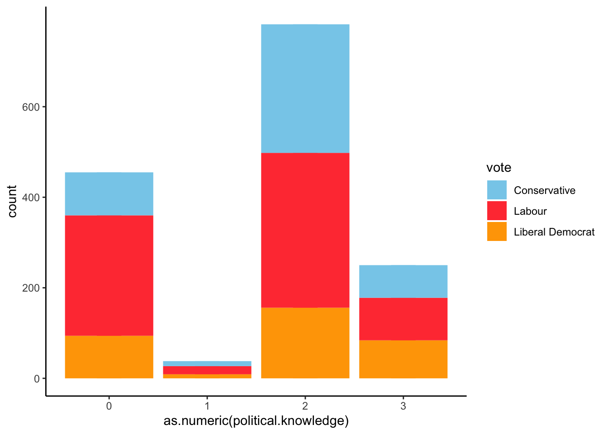


The results show us a funny thing. Most people who are aware of the economic situation would vote for Labour Party, but also people who have a low level of political knowledge do intend to vote for labor party. It would be interesting to study any correlation between people's economic awareness and their political knowledge. Meanwhile, as political knowledge grows, the vote intention is apparently more balanced.


#### Europe

Now let's see the level of euroscepticism voters have. 

```r
spineplot(BEPS[,1] ~ BEPS[,8], data=BEPS, main = "Political affinity and euroscepticism", 
          xlab = "Euroscepticism scale", ylab = "Vote", col = c("skyblue", "brown1", "orange"))
```

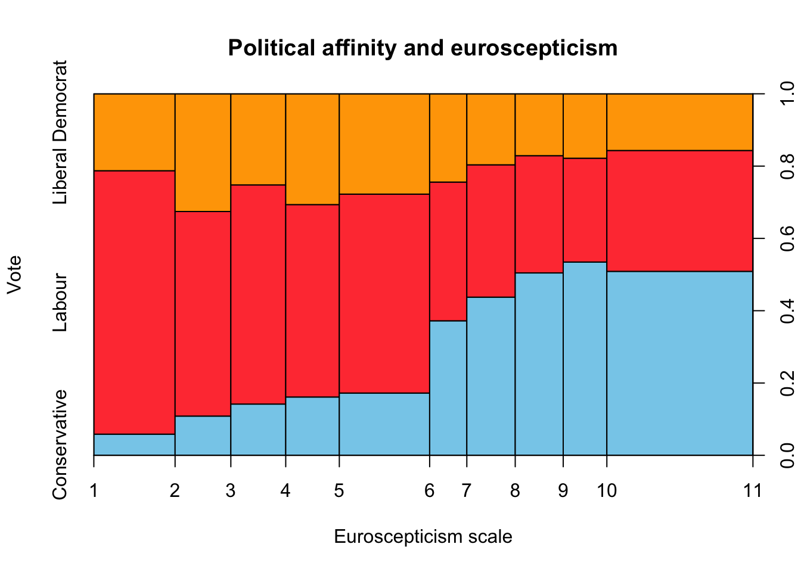

The results are clear. The more eurosceptic people are, the more like they are to vote for the Conservative Party while pro-europeans would vote for Labour Party. 


#### Blair

Let's focus on Blair Candidate. Blair was the leader of the Labour Party and candidate to Prime Minister in 2002. The `Blair` value shows the opinion people on Tony Blair, where value 1 represents the worst opinion and value 5 represents the best.


```r
ggplot(BEPS) + aes(x=as.numeric(Blair), group=vote, fill=vote) + 
geom_bar(position = "stack") +
  geom_histogram(binwidth=0.25) +
coord_trans() +
scale_fill_manual(values = c("skyblue", "brown1", "orange")) + 
theme_classic()
```

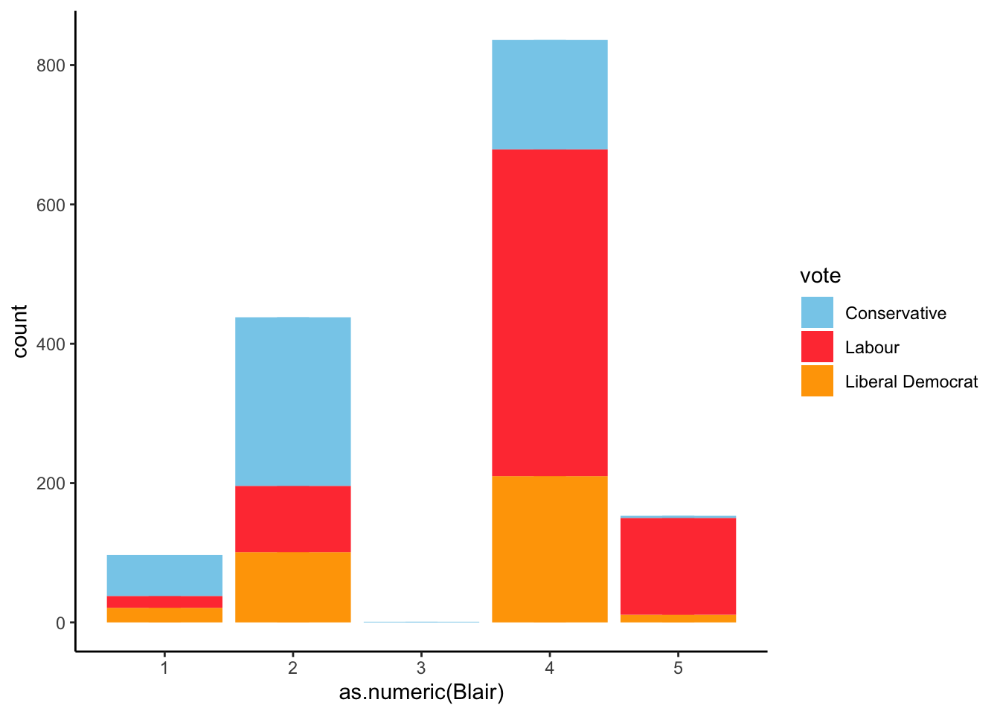


As expected, the better opinion people have on Blair, the more likely they are to vote for democrats. 


## Multivariable Analysis


From the  monovariable analysis we would draw some results such as age and euroscepticism may condition the vote. If a person is old and eurosceptic, that person may vote for Conservative. On the other side, if a person is young and aware of the economic situation, they would probably vote for Conservatives.  But we still can't properly know what variables are useless or have any correlation with another variables. It would be great if all variables had no correlation among each other. If so, it would be an obstacle for the training and accuracy error rate would rise. Therefore, it's necessary to calculate all correlation pairs, and if a correlation of *n* pairs of variables is above a certain threshold, then we would have to eliminate the one having the high absolute average value of correlation with the other variables.

If we have a look at the correlation table.

```r
cor(BEPS[,2:9])
```

```r
##                                  age economic.cond.national
## age                      1.000000000             0.01856654
## economic.cond.national   0.018566540             1.00000000
## economic.cond.household -0.041587365             0.34630331
## Blair                    0.030218061             0.32687826
## Hague                    0.034626448            -0.19976649
## Kennedy                  0.003568398             0.09729857
## Europe                   0.068879872            -0.20942875
## political.knowledge     -0.048489520            -0.02362441
##                         economic.cond.household       Blair       Hague
## age                                 -0.04158736  0.03021806  0.03462645
## economic.cond.national               0.34630331  0.32687826 -0.19976649
## economic.cond.household              1.00000000  0.21527305 -0.10195647
## Blair                                0.21527305  1.00000000 -0.24321022
## Hague                               -0.10195647 -0.24321022  1.00000000
## Kennedy                              0.04049185  0.14820463 -0.08025011
## Europe                              -0.11488459 -0.29616230  0.28734961
## political.knowledge                 -0.03781037 -0.02091692 -0.03035357
##                              Kennedy      Europe political.knowledge
## age                      0.003568398  0.06887987        -0.048489520
## economic.cond.national   0.097298566 -0.20942875        -0.023624414
## economic.cond.household  0.040491851 -0.11488459        -0.037810371
## Blair                    0.148204626 -0.29616230        -0.020916923
## Hague                   -0.080250113  0.28734961        -0.030353569
## Kennedy                  1.000000000 -0.10962279         0.001280386
## Europe                  -0.109622789  1.00000000        -0.152363727
## political.knowledge      0.001280386 -0.15236373         1.000000000
```

When a correlation value between two variables is close to zero, it means there's no correlation. When it is negative, it means those two variable are inversely correlated, as we can see, for instance ,in the table above with variable `Kennedy` and `political.knowledge`. 

We plot the correlation table:

```r
corrplot::corrplot(cor(BEPS[,2:9]))
```

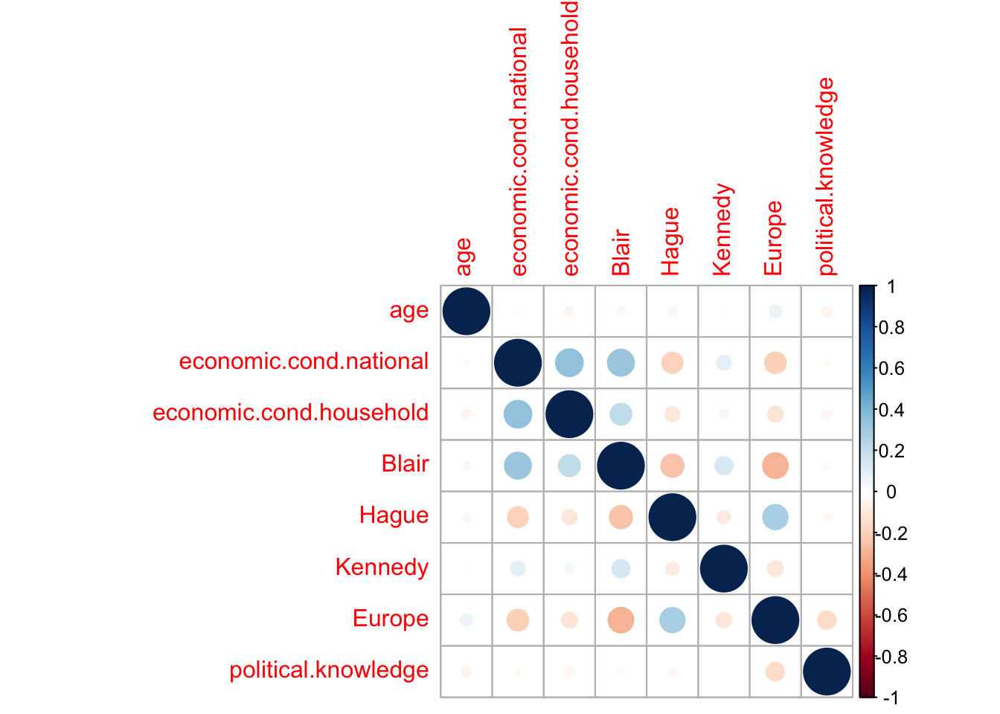


If we have a look at the variables `economic.cond.national`. `economic.cond.household` and `Blair` have a certain correlation. If we have a look at the three of them.


```r
par(mfrow=c(3,1))
dens<- density (BEPS$economic.cond.household,na.rm=T)
hist(BEPS$economic.cond.household, xlab="", main = "Percepción de la economía doméstica",
     ylim= c (0, max (dens $ y) * 1.2),probability=T)
lines(dens)

dens<- density (BEPS$economic.cond.national,na.rm=T)
hist(BEPS$economic.cond.national, xlab="", main = "Percepción de la economía nacional",
     ylim= c (0, max (dens $ y) * 1.1),probability=T)
lines(dens)

dens<- density (BEPS$economic.cond.national,na.rm=T)
hist(BEPS$Blair, xlab="", main = "Blair", ylim= c (0, max (dens$y)*1.1),probability=T)
lines(dens)

```

The charts show the density and values of the three variables are similar. `Blair` has the least correlation value with the rest of the other two variables, and thus we would remove the `economic.cond.national` and `economic.cond.household` variables.  


# Preprocess and Data Cleansing


In this section we clean the usesless data so we can avoid noise that could difficult the training. As we saw, the variables `economic.cond.national` and `economic.cond.household` are considerably correlated, so we will remove them from the dataset. We will also remove non numerical variables, such us gender.


```r
BEPS.data.all.Train$gender = NULL
BEPS.data.all.Train$economic.cond.national = NULL
BEPS.data.all.Train$economic.cond.household = NULL
```

We check there are no null values

```r
sum(is.na(BEPS.data.all.Train))
```
```r
## [1] 0
```

## Outliers

There might be extreme values, within the dataset, which coud be greater than 3/2 interquartile distance called outliers. To check if there are outliers, we plot a boxplot of all the variables. 


```r
boxplot(BEPS.data.all.Train, col=rainbow(4, s = 0.5))
```

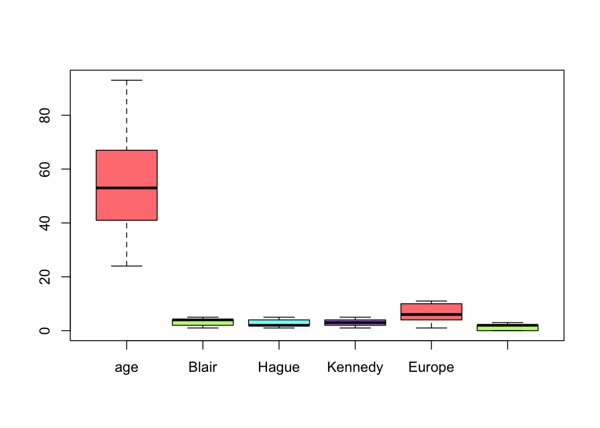


As we see, there's no evidence of outiliers and then it's not necessary to execute any outlier treatment. 


##  Removing unnecessary variables in the testing dataset

```r
BEPS.data.all.Test$economic.cond.national = NULL
BEPS.data.all.Test$economic.cond.household = NULL
```


# Predicting variables influence on vote

After treating our variables and removing the unnecessary ones, we neaded to know what were the ones which could influence on vote. Therefore, we'll execute a logistic regression to what coefficients are favourable to better predict a type of vote or another. 

## Logistic Regression

Our main target in this section is to observe the cofficient variable influence on vote. We will implement a logistic regression model because, unlike linear regression, this tecnique is used to predict binary coefficients. The function `glm()` creates a **generalized linear model**. Using the argument `family=binomial` Rstudio will execute a logistic regression. However, there's a problem. Logistic Regression is used only for binary results. We have three different values or *outputs* and, thus, we must execute three logistic regressions in which we compare each vote value with the rest. 

### Liberal Democrats vs Non-Liberal Democrats

To measure the predictors coefficients we have created a set called `liberals` which contains all the votes values contained in the `BEPS` dataset.

```r
liberals = as.character(BEPS.data.all.80$vote)
liberals[BEPS.data.all.80$vote != "Liberal Democrat"] = "Non-Liberal"
liberals <- as.factor(liberals)
```

We use the `contrasts()` to create a `dummy` version for the `liberals` values.

```r
contrasts(liberals)
```

```r
##                  Non-Liberal
## Liberal Democrat           0
## Non-Liberal                1
```

Having created dummy variables, if a coefficient was negative, it means that coefficent positively influences the liberal vote. 

Now we execute the logistic regression. 

```r
reg.log.lib=glm(liberals~., family=binomial(link = "logit"), data=BEPS.data.all.Train)
summary(reg.log.lib)
```

```r
## 
## Call:
## glm(formula = liberals ~ ., family = binomial(link = "logit"), 
##     data = BEPS.data.all.Train)
## 
## Deviance Residuals: 
##     Min       1Q   Median       3Q      Max  
## -2.4447   0.3803   0.5786   0.7445   1.3579  
## 
## Coefficients:
##                      Estimate Std. Error z value Pr(>|z|)    
## (Intercept)          0.946825   0.488301   1.939 0.052499 .  
## age                  0.006034   0.004581   1.317 0.187759    
## Blair                0.218434   0.065623   3.329 0.000873 ***
## Hague                0.240445   0.062766   3.831 0.000128 ***
## Kennedy             -0.472888   0.071689  -6.596 4.21e-11 ***
## Europe               0.050253   0.023360   2.151 0.031459 *  
## political.knowledge -0.113721   0.067508  -1.685 0.092071 .  
## ---
## Signif. codes:  0 '***' 0.001 '**' 0.01 '*' 0.05 '.' 0.1 ' ' 1
## 
## (Dispersion parameter for binomial family taken to be 1)
## 
##     Null deviance: 1302.7  on 1220  degrees of freedom
## Residual deviance: 1217.2  on 1214  degrees of freedom
## AIC: 1231.2
## 
## Number of Fisher Scoring iterations: 4
```


If we look only at the coefficients:

```r
coef(reg.log.lib)
```

```r
##         (Intercept)                 age               Blair               Hague 
##         0.946824626         0.006034487         0.218434222         0.240444549 
##             Kennedy              Europe political.knowledge 
##        -0.472887751         0.050253454        -0.113721415
```

Observations we can draw here are:

* Except the variable `age`, the rest of `p-values` are too small, which means results are good.
* The only negative values are the `Kennedy` and `political.knowledge` ones, which means, as opinion about Kennedy improves and political knowledge grow, the probability to vote for democrats rises. As the rest of coefficients values rise, the probability of voting for democrat decreases. 

### Conservatives vs Non-Conservatives

```r
conservatives = as.character(BEPS.data.all.80$vote)
conservatives[BEPS.data.all.80$vote != "Conservative"] = "Non-Conservative"
conservatives <- as.factor(conservatives)
```

We establish de `dummy` variables.

```r
contrasts(conservatives)
```

```r
##                  Non-Conservative
## Conservative                    0
## Non-Conservative                1
```

We execute our logistic model.

```r
reg.log.con=glm(conservatives~., family=binomial(link = "logit"), data=BEPS.data.all.Train)
summary(reg.log.con)
```

```r
## 
## Call:
## glm(formula = conservatives ~ ., family = binomial(link = "logit"), 
##     data = BEPS.data.all.Train)
## 
## Deviance Residuals: 
##     Min       1Q   Median       3Q      Max  
## -3.4201  -0.4520   0.2766   0.5581   2.7114  
## 
## Coefficients:
##                      Estimate Std. Error z value Pr(>|z|)    
## (Intercept)          3.424134   0.538248   6.362 2.00e-10 ***
## age                 -0.021748   0.005282  -4.118 3.83e-05 ***
## Blair                0.709863   0.074265   9.559  < 2e-16 ***
## Hague               -0.949398   0.077439 -12.260  < 2e-16 ***
## Kennedy              0.442898   0.079728   5.555 2.77e-08 ***
## Europe              -0.208703   0.027968  -7.462 8.50e-14 ***
## political.knowledge -0.418254   0.079582  -5.256 1.48e-07 ***
## ---
## Signif. codes:  0 '***' 0.001 '**' 0.01 '*' 0.05 '.' 0.1 ' ' 1
## 
## (Dispersion parameter for binomial family taken to be 1)
## 
##     Null deviance: 1497.95  on 1220  degrees of freedom
## Residual deviance:  904.33  on 1214  degrees of freedom
## AIC: 918.33
## 
## Number of Fisher Scoring iterations: 5
```

```r
coef(reg.log.con)
```

```r
##         (Intercept)                 age               Blair               Hague 
##          3.42413357         -0.02174811          0.70986324         -0.94939804 
##             Kennedy              Europe political.knowledge 
##          0.44289841         -0.20870335         -0.41825404
```

The observations we can draw are:

* The `Blair` and `Kennedy` have a negative impact on Conservative vote.
* The rest have a good influence on the conservative vote election. 
* `p-values` are small, which means results quality is good. 


### Laborists vs Non-Laborists


```r
laborists = as.character(BEPS.data.all.80$vote)
laborists[BEPS.data.all.80$vote != "Labour"] = "Non-Labour"
laborists <- as.factor(laborists)
contrasts(laborists)
```

```r
##            Non-Labour
## Labour              0
## Non-Labour          1
```

We execute our regression model. 

```r
reg.log.lab=glm(laborists~., family=binomial(link = "logit"), data=BEPS.data.all.Train)
summary(reg.log.lab)
```

```r
## 
## Call:
## glm(formula = laborists ~ ., family = binomial(link = "logit"), 
##     data = BEPS.data.all.Train)
## 
## Deviance Residuals: 
##     Min       1Q   Median       3Q      Max  
## -2.6518  -0.8709   0.2852   0.8346   2.2203  
## 
## Coefficients:
##                     Estimate Std. Error z value Pr(>|z|)    
## (Intercept)         -0.81640    0.45133  -1.809  0.07047 .  
## age                  0.01126    0.00436   2.582  0.00982 ** 
## Blair               -0.79496    0.06946 -11.445  < 2e-16 ***
## Hague                0.49550    0.05909   8.385  < 2e-16 ***
## Kennedy              0.09796    0.06500   1.507  0.13179    
## Europe               0.10750    0.02203   4.879 1.07e-06 ***
## political.knowledge  0.47209    0.06523   7.237 4.59e-13 ***
## ---
## Signif. codes:  0 '***' 0.001 '**' 0.01 '*' 0.05 '.' 0.1 ' ' 1
## 
## (Dispersion parameter for binomial family taken to be 1)
## 
##     Null deviance: 1688.8  on 1220  degrees of freedom
## Residual deviance: 1289.6  on 1214  degrees of freedom
## AIC: 1303.6
## 
## Number of Fisher Scoring iterations: 4
```

```r
coef(reg.log.lab)
```

```r
##         (Intercept)                 age               Blair               Hague 
##         -0.81640218          0.01125753         -0.79496110          0.49550234 
##             Kennedy              Europe political.knowledge 
##          0.09796456          0.10750146          0.47209111
```

The only predictor that could positively influence on Labour Vote was `Blair`. The rest, as they increase, they have a negative impact on Labour vote.  

### Conclusions 

After executing a logistic regression for each vote value, the general conclusion we can extract are the following:

* **Conservatives**: People who vote for conservatives are people who have a good opinion on `Hague` candidate, they are eurosceptic and have certain political knowledge.
* **Laborists**: They're more likely to be chosen by people who are young or have a good opinion on `Blair`.
* **Liberals**: They're more likely to be chosen by people who have a good opinion on `Kennedy`. 


# Machine Learning training models

Now we are going to use some Machine Learning models offered by `Caret` Library in RStudio. The three tecniques we will use are:

* **K-nearest neighbors**: This simple classification tecnique classifies an element based on the `k` neighbours previously classified. 
* **Support Vector Machine**: The Support Vector Machine algorithm is an autom'atic learning technique which consists on building a hyperplane in a high dimensionality space which separates the classes we have.
* **Random Forests**: It's a predictive algorithm which uses a *Bagging* technique that combines different trees, where each tree is created by observations and random variables. 


To validate our models, we are going to use a 10-Fold repeated cross-validation using the command `trainControl`.

```r
beps.trainCtrl <- trainControl(
  method = "repeatedcv",
  number = 5,
  repeats = 5,
  verboseIter = F,
)
```


## K-Nearest Neighbors (KNN)  Model

To build a propoer `KNN` model, we must apply a normalization and re-scale all the variables so that distances can be comparable. This process is called *Data standarization* and reason is because each variable has a different measure and it would be incorrect to use the same measures for all different type variables and could disturb the prediction results. 

```r
center.scale <- preProcess(BEPS.data.all.Train, method = c("scale", "center"))
BEPS.data.all.Train.scale <- predict(center.scale, BEPS.data.all.Train)
```

`BEPS.data.all.Train.scale` represents the normalized and scaled training set. 

If we have a look at KNN hyperparameters:

```r
modelLookup("knn")
```

```r
##   model parameter      label forReg forClass probModel
## 1   knn         k #Neighbors   TRUE     TRUE      TRUE
```

There's only one parameters which represents the number of nearest neighbours. 

```r
knn.grid <- expand.grid(k=c(40,60,80,100,150))
beps.knn.model <- train(BEPS.data.all.Train.scale, output.values, 
                         method="knn", trControl=beps.trainCtrl, tuneGrid=knn.grid)
beps.knn.model
``` 


```r
## k-Nearest Neighbors 
## 
## 1221 samples
##    6 predictor
##    3 classes: 'Conservative', 'Labour', 'Liberal Democrat' 
## 
## No pre-processing
## Resampling: Cross-Validated (5 fold, repeated 5 times) 
## Summary of sample sizes: 977, 977, 977, 976, 977, 977, ... 
## Resampling results across tuning parameters:
## 
##   k    Accuracy   Kappa    
##    40  0.6602844  0.4273170
##    60  0.6666664  0.4333840
##    80  0.6699411  0.4379850
##   100  0.6656822  0.4287847
##   150  0.6647019  0.4238622
## 
## Accuracy was used to select the optimal model using the largest value.
## The final value used for the model was k = 80.
```

If we focus on the best tune: 

```r
knn.k <- beps.knn.model$bestTune
knn.k$k
```

```r
## [1] 80
```

We see that the best number of neighbour is `80`.


## Support Vector Machine Model

SVM model, just like KNN, needs to manage normalized and re-scaled data.

If we look at its hyperparameters:

```r
modelLookup(model="svmRadial")
```

```r
##       model parameter label forReg forClass probModel
## 1 svmRadial     sigma Sigma   TRUE     TRUE      TRUE
## 2 svmRadial         C  Cost   TRUE     TRUE      TRUE
```

We create two vectors, one containing the sigma values and another containing the cost values

```r
svm.grid <- expand.grid(sigma = c(0.01, .015, 0.2), C = c(1.5, 1.75, 2.0, 2.25, 2.5, 3.0))
beps.svm.model <- train(BEPS.data.all.Train.scale, output.values, method = "svmRadial", 
                         tuneGrid = svm.grid, trControl = beps.trainCtrl)
svm.sigma <- beps.svm.model$bestTune$sigma
svm.C <- beps.svm.model$bestTune$C
beps.svm.model
```


```r
## Support Vector Machines with Radial Basis Function Kernel 
## 
## 1221 samples
##    6 predictor
##    3 classes: 'Conservative', 'Labour', 'Liberal Democrat' 
## 
## No pre-processing
## Resampling: Cross-Validated (5 fold, repeated 5 times) 
## Summary of sample sizes: 976, 977, 977, 977, 977, 977, ... 
## Resampling results across tuning parameters:
## 
##   sigma  C     Accuracy   Kappa    
##   0.010  1.50  0.6556882  0.4129616
##   0.010  1.75  0.6547066  0.4146220
##   0.010  2.00  0.6566731  0.4195232
##   0.010  2.25  0.6574935  0.4217315
##   0.010  2.50  0.6584764  0.4237643
##   0.010  3.00  0.6588023  0.4247705
##   0.015  1.50  0.6597859  0.4237972
##   0.015  1.75  0.6606029  0.4257890
##   0.015  2.00  0.6628966  0.4301824
##   0.015  2.25  0.6633844  0.4313219
##   0.015  2.50  0.6637129  0.4324327
##   0.015  3.00  0.6663352  0.4379994
##   0.200  1.50  0.6645427  0.4396544
##   0.200  1.75  0.6640495  0.4398449
##   0.200  2.00  0.6645413  0.4415782
##   0.200  2.25  0.6629033  0.4396853
##   0.200  2.50  0.6612666  0.4378542
##   0.200  3.00  0.6568464  0.4315759
## 
## Accuracy was used to select the optimal model using the largest value.
## The final values used for the model were sigma = 0.015 and C = 3.
```

As we see, the best hyperparameter values are `sigma=0.015` and `C=3`

## Random Forests Model

```r
modelLookup("rf")
```

```r
##   model parameter                         label forReg forClass probModel
## 1    rf      mtry #Randomly Selected Predictors   TRUE     TRUE      TRUE
```

The hyperparameter `mtry` represents the number of random variables marked as candidates for each branch. 

```r
rf.grid <- expand.grid(mtry=c(1,2,3,4))
beps.rf.model <- train(BEPS.data.all.Train, output.values, method="rf", tuneGrid=rf.grid, trControl=beps.trainCtrl, verbose=F)
beps.rf.model
```

```r
## Random Forest 
## 
## 1221 samples
##    6 predictor
##    3 classes: 'Conservative', 'Labour', 'Liberal Democrat' 
## 
## No pre-processing
## Resampling: Cross-Validated (5 fold, repeated 5 times) 
## Summary of sample sizes: 977, 977, 977, 977, 976, 977, ... 
## Resampling results across tuning parameters:
## 
##   mtry  Accuracy   Kappa    
##   1     0.6684664  0.4375337
##   2     0.6429080  0.4145047
##   3     0.6175289  0.3827721
##   4     0.6114694  0.3757272
## 
## Accuracy was used to select the optimal model using the largest value.
## The final value used for the model was mtry = 1.
```

If we have a look at the `mtry` influence, we see that the best `mtry` value is 1 

```r
plot(beps.rf.model, col = "blue")
```


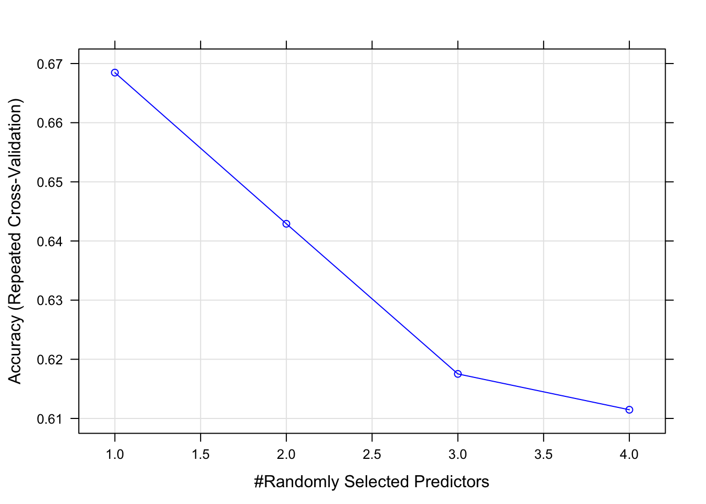


# Comparing models obtained

After training the chosen models, it's necessary to  validate and  make a comparison of each of them. First of all, we will train again the models but using only their best hyperparameters

```r
rf.grid <- expand.grid(mtry=c(1))
beps.rf.model <- train(BEPS.data.all.Train, output.values, method="rf", 
                        tuneGrid=rf.grid, trControl=beps.trainCtrl, verbose=F)

svm.grid <- expand.grid(sigma = svm.sigma, C = svm.C)
beps.svm.model <- train(BEPS.data.all.Train.scale, output.values, method = "svmRadial",
                         tuneGrid = svm.grid, trControl = beps.trainCtrl)

knn.grid <- expand.grid(k=c(knn.k$k))
beps.knn.model <- train(BEPS.data.all.Train.scale, output.values, method="knn", 
                        trControl=beps.trainCtrl, tuneGrid=knn.grid)

```

## Comparing models

After training the chosen models, it's necessary to  validate and  make a comparison of each of them. 

```r
set.seed(1234)
model.list <- list(
  SVM.MODEL=beps.svm.model,
  RF.MODEL=beps.rf.model,
  KNN.MODEL=beps.knn.model
)
beps.resamples <- resamples(model.list)
```


The function `resamples` groups the 30 permutes for each algorithm. The function `summary` helps us make a summary of  `Acuraccy` and  `Kappa` values.

```r
summary(beps.resamples)
```

```r
## 
## Call:
## summary.resamples(object = beps.resamples)
## 
## Models: SVM.MODEL, RF.MODEL, KNN.MODEL 
## Number of resamples: 25 
## 
## Accuracy 
##                Min.   1st Qu.    Median      Mean   3rd Qu.      Max. NA's
## SVM.MODEL 0.6065574 0.6530612 0.6680328 0.6660141 0.6775510 0.6926230    0
## RF.MODEL  0.6352459 0.6557377 0.6598361 0.6683098 0.6803279 0.7213115    0
## KNN.MODEL 0.6311475 0.6516393 0.6734694 0.6681499 0.6844262 0.7008197    0
## 
## Kappa 
##                Min.   1st Qu.    Median      Mean   3rd Qu.      Max. NA's
## SVM.MODEL 0.3505961 0.4227304 0.4441296 0.4377810 0.4593575 0.4887126    0
## RF.MODEL  0.3867789 0.4128510 0.4240682 0.4373245 0.4592224 0.5260647    0
## KNN.MODEL 0.3676026 0.4059577 0.4469628 0.4343370 0.4620780 0.4956251    0
```

```r
bwplot(beps.resamples)
```
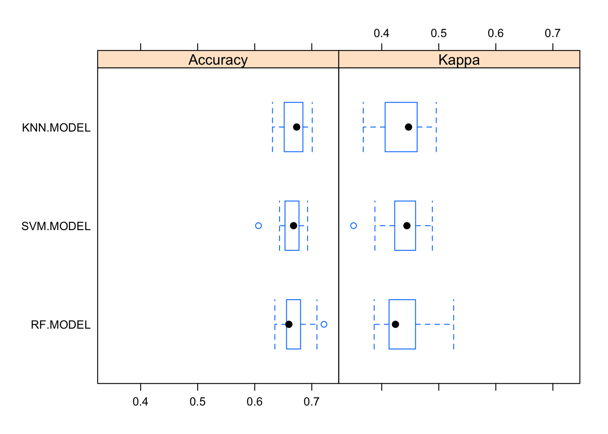


Apparently, we cant draw any conclusion of the optimal model among the three of them for our predictions due to the `Accuracy` and `Kappa` overlapping values and both variables have a similar behaviour. As for the `Kappa` variable, it is said that if its value is between `0.4` and `0.75`, then it's a good value and it can help us if the `Accuracy` variable can have problemas with unbalanced classes. 


# Testing and validation

As we saw the comparison table, we could tell all models have a similar average and median. Now, we are going to execute a prediction using the testing dataset  `BEPS.data.all.20`. 


```r
BEPS.data.all.20$vote = as.factor(BEPS.data.all.20$vote)
BEPS.data.all.test.scale <- predict(center.scale, BEPS.data.all.Test)
preds.rf <- predict(beps.rf.model, newdata = BEPS.data.all.Test)
preds.knn <- predict(beps.knn.model, newdata = BEPS.data.all.test.scale)
preds.svm <- predict(beps.svm.model, newdata = BEPS.data.all.test.scale)
```

After performing our predictions using the testing dataset, we proceed to observe the results. We use the `postResample()` function, which calculates the `MSE` and the `R-squared` and draws an `Accuracy` and `Kappa` estimate.  

```r
result.svm <- postResample(preds.svm, BEPS.data.all.20$vote)
result.knn <- postResample(preds.knn, BEPS.data.all.20$vote)
result.rf <-  postResample(preds.rf, BEPS.data.all.20$vote)
```


SVM:
```r
result.svm
```

```r
##  Accuracy     Kappa 
## 0.6480263 0.4155527
```

KNN:
```r
result.knn
```

```r
##  Accuracy     Kappa 
## 0.6546053 0.4216972
```

RF:
```r
result.rf
```

```r
##  Accuracy     Kappa 
## 0.6513158 0.4170345
```

The result of the testing doesn't seem very significant due to it's  mere informative data and it's not a vital value. We should repeat the same experiment several times to have an opinion and a significant response that could show clear differences between different models. Whatsmore, we've seen that in the previous section that comparison results overlap each other. However, **KNN** seems to show a slightly better accuracy result. If we have a look at confussion matrix using this model:

```r
caret::confusionMatrix(preds.svm, BEPS.data.all.20$vote)
```

```r
## Confusion Matrix and Statistics
## 
##                   Reference
## Prediction         Conservative Labour Liberal Democrat
##   Conservative               72     19               22
##   Labour                     19    118               39
##   Liberal Democrat            1      7                7
## 
## Overall Statistics
##                                           
##                Accuracy : 0.648           
##                  95% CI : (0.5915, 0.7017)
##     No Information Rate : 0.4737          
##     P-Value [Acc > NIR] : 7.054e-10       
##                                           
##                   Kappa : 0.4156          
##                                           
##  Mcnemar's Test P-Value : 5.288e-09       
## 
## Statistics by Class:
## 
##                      Class: Conservative Class: Labour Class: Liberal Democrat
## Sensitivity                       0.7826        0.8194                 0.10294
## Specificity                       0.8066        0.6375                 0.96610
## Pos Pred Value                    0.6372        0.6705                 0.46667
## Neg Pred Value                    0.8953        0.7969                 0.78893
## Prevalence                        0.3026        0.4737                 0.22368
## Detection Rate                    0.2368        0.3882                 0.02303
## Detection Prevalence              0.3717        0.5789                 0.04934
## Balanced Accuracy                 0.7946        0.7285                 0.53452
```


The model has a good predition of the Labour and conservative vote, but a has a bad prediction of the Liberal vote. Our dataset is very small and we may need more tecniques and exemplar to search for a good model. 

**Did you like the post? Did you find it interesting?** If you want to learn more about Data Science and Rstudio, please check this glorious book [R for Data Science](https://r4ds.had.co.nz/), it's one of the greatest books to read if you want to explore more about Data Science and Machine Learning using R. Thanks for reading this post, I hope you find it interesting. 


