# Data Science Exercise: Predition Models with Python


In this post we are going to do a data science exercise, with python, which consists in the data exploration and models comparison to predict whether a person is earning more than 50.000$ a year. 
We will use a `.csv` dataset in which every row correponds to an adult and the columns correspond to their attributes. Our main goal is to determine if a person, based on some of the personal information, is likely to be have a good income or not.
You can click on this [link](http://localhost:8080/adult-income/) to try the deployed model we created in this post and interact a little bit. 

# Adult Income Prediction and Data Exploration


### Requirements

The main requirements we need to do this exercise are:

* Install [Python3](https://www.python.org/downloads/)
* Install [Jupyter Notebook](https://jupyter.org/install) because our exercise will be done in a python notebook. If you don't want to install `Jupyter`, I recommend signin up in [Kaggle](https://www.kaggle.com/) and create a notebook there. 
* Install the following packages:
  * [`pandas`](https://pandas.pydata.org/) 
  * [`numpy`](https://numpy.org/)
  * [`sklearn`](https://scikit-learn.org/stable/)
  * [`matplotlib`](https://matplotlib.org/)
  * [`scipy`](https://www.scipy.org/)
  * [`seaborn`](https://seaborn.pydata.org/)

Download the dataset we will need to do our exercise by clicking [here](https://github.com/moradisten/personal-ml-notebooks/tree/master/datasets/AdultIncome)


If you already have `Python3` and `Jupyter`, open a console and create a notebook.
```bash
$ jupyter notebook
```

Once you create your notebook, import the libraries we are going to use. 

```python
import numpy as np # linear algebra
import pandas as pd # data processing, CSV file I/O (e.g. pd.read_csv)
from sklearn.preprocessing import LabelEncoder
import datetime
import matplotlib.pyplot as plt
import seaborn as sns
import urllib
import os
```


We upload our dataset (Write the path were your dataset is located).


```python
adult_income = pd.read_csv("./datasets/AdultIncome/adult.csv")
```

Alright. So far, so good. Let's see how many features we have:

```python
for column in adult_income.columns:
    print(column)
```


```python
age
workclass
fnlwgt
education
education.num
marital.status
occupation
relationship
race
sex
capital.gain
capital.loss
hours.per.week
native.country
income

```

If you execute this statement below, you'll see the first five rows of the dataset:
```python
adult_income.head()
```

At first sight, the table seems to have null values. The `education.num` and `education` fields are the same, one is categorical and the other is numerical. Let's have a statistical look at the numerical values.


```python
adult_income.describe()
```


As we see the statistics above, we can notice There might be some outliers in all numerical values. Just look at the capital gain and loss, see how the difference between the maximum value and the mean value is high.


### What do we want to predict?

Our main goal is to predict if a person, given some certain features, has a high salary or not (A salary is considered high if it's above 50,000$ per year). This is contained in the `income` target.

### Exploring null values

We saw some values with interrogation signs (`?`) meaning those are null values but to make things easier, we'll replace that sign by numpy null values. 

```python
adult_income = adult_income.replace('?', np.NaN)
```
Alright, let's see how many null values we have in our dataset by typing this. 

```python
adult_income.isna().sum()
```

    age                  0
    workclass         1836
    fnlwgt               0
    education            0
    education.num        0
    marital.status       0
    occupation        1843
    relationship         0
    race                 0
    sex                  0
    capital.gain         0
    capital.loss         0
    hours.per.week       0
    native.country     583
    income               0
    dtype: int64


As we observe, `workclass`, `occupation` and `native.country` have null values. To make thing simple, we will replace these null values by other values instead of erasing the whole row containing a null value.

#### workclass

The `workclass` feature is categorical. So we'll replace the null values setting the label `Unknown`.


```python
adult_income['workclass'] = adult_income['workclass'].replace(np.NaN, 'Unknown')
adult_income['workclass'].isna().sum()
```


    0


```python
adult_income[adult_income['workclass'] == 'Unknown']['workclass'].count()
```


    1836


#### occupation

The `occupation` feature is categorical. So we'll replace the null values setting the label `Other`.


```python
adult_income['occupation'] = adult_income['occupation'].replace(np.NaN, 'Other')
adult_income[adult_income['occupation'] == 'Other']['occupation'].count()
```


    1843


#### Native Country

The `native.country` feature is categorical. So we'll also replace the null values setting the label `Other`.


```python
adult_income['native.country'] = adult_income['native.country'].replace(np.NaN, 'Other')
adult_income[adult_income['native.country'] == 'Other']['native.country'].count()
```


    583


Now there are no null values


```python
adult_income.isna().sum()
```


    age               0
    workclass         0
    fnlwgt            0
    education         0
    education.num     0
    marital.status    0
    occupation        0
    relationship      0
    race              0
    sex               0
    capital.gain      0
    capital.loss      0
    hours.per.week    0
    native.country    0
    income            0
    dtype: int64


### Auxiliar functions

Before analyzing and exploring our dataset, We will create a auxiliar function to plot charts with certain parameters. Just copy this function and paste it into you notebook. 


```python
from matplotlib.ticker import FuncFormatter


def plot_features_income(data, column, type_names, size=(20, 10)):
    fig, ax = plt.subplots(figsize=size)
    barWidth = 0.25
    bars1 = list()
    bars2 = list()
    for col in type_names:
        dt = data[data[column] == col]
        count_up = dt[dt['income'] == '>50K']['income'].count()
        count_down = dt[dt['income'] == '<=50K']['income'].count()
        bars1.append(count_up)
        bars2.append(count_down)
    
    r1 = np.arange(len(bars1))
    r2 = [x + barWidth for x in r1] 
    
    rects1 = plt.bar(r1, bars1, color='gold', width=barWidth, edgecolor='white', label='More than 50K $')
    rects2 = plt.bar(r2, bars2, color='tomato', width=barWidth, edgecolor='white', label='Less or Equal than 50K $')
    
    plt.xlabel(column, fontweight='bold')
    plt.ylabel('Income per number of people', fontweight='bold')
    plt.xticks([r + barWidth for r in range(len(bars1))], type_names, rotation=30)
    plt.minorticks_on()
    plt.grid(b=True, which='minor', color='#999999', linestyle='-', alpha=0.4)
    
    heights_1 = list()
    for rect in rects1:
        height = rect.get_height()
        heights_1.append(height)
        
    heights_2 = list()
    for rect in rects2:
        height = rect.get_height()
        heights_2.append(height)
    
    count = 0
    for rect in rects1:
        h1 = heights_1[count]
        h2 = heights_2[count]
        ptg = (h1 / (h1 + h2)) * 100
        ax.text(rect.get_x() + rect.get_width()/2., 0.99*h1,
            '%d' % int(ptg) + "%", ha='center')
        count = count + 1
    
    count = 0
    for rect in rects2:
        h1 = heights_1[count]
        h2 = heights_2[count]
        ptg = (h2 / (h1 + h2)) * 100
        ax.text(rect.get_x() + rect.get_width()/2., h2,
            '%d' % int(ptg) + "%", ha='center', va='bottom')
        count = count + 1    
        
    
    plt.tight_layout()
    plt.legend()
    plt.show()
    
```

# Data Exploration

Now we are going to explore each feature to see if we can draw any relevant information that could help us discover if there are any correlation between the income and these feature.

```python
adult_income.dtypes
```


    age                int64
    workclass         object
    fnlwgt             int64
    education         object
    education.num      int64
    marital.status    object
    occupation        object
    relationship      object
    race              object
    sex               object
    capital.gain       int64
    capital.loss       int64
    hours.per.week     int64
    native.country    object
    income            object
    dtype: object


## Categorical features

We will first analyze our categorical features, that is, the features that are not numerical (`int64`).

### workclass

The `workclass` feature represents the kind of profession a person has. Let's see the relation between this feature and the `income` feature. First of all, let's see the values we can find in this feature.


```python
workclass_types = adult_income.workclass.unique()
```

Now let's plot this feature using a **pieplot** to see the proportion of every kind of work class in our dataset.

```python
workclass_types
```


    array(['Unknown', 'Private', 'State-gov', 'Federal-gov',
           'Self-emp-not-inc', 'Self-emp-inc', 'Local-gov', 'Without-pay',
           'Never-worked'], dtype=object)


```python
plt.figure(figsize=(8, 8))
adult_income['workclass'].value_counts().plot.pie(autopct='%1.1f%%')
```
    
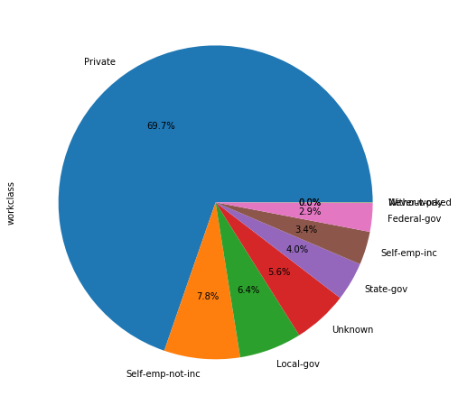
    

We see that **60%** of people registered in the census work in the private sector. The rest is distribuited among between self-employement and public sector. We have a **5.6%** of jobs that are unknown. Now we we'll have a look at people earning more thatn 50,000$ depending on workclass.


```python

plot_features_income(data=adult_income, column='workclass', type_names=workclass_types)
```


    
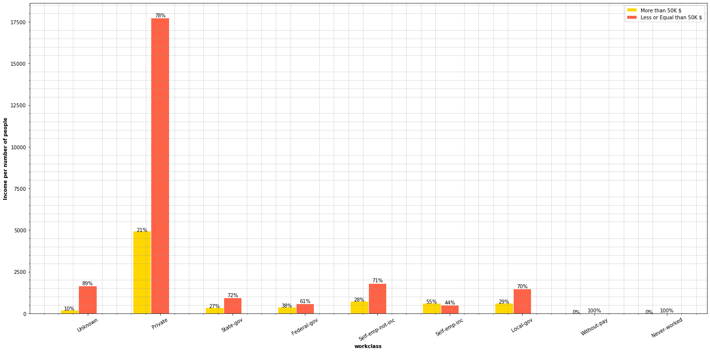


For every workclass, except self-employement, there are more people earning below 50,000$ than people earning above that amount. 

Private sector holds most of the jobs, having the majority of them a salary below 50,000$. Now, let's have a closer look at high paid and non-high paid jobs.


```python
f,ax=plt.subplots(1,2,figsize=(18,8))
adult_income[adult_income['income'] == '>50K']['workclass'].value_counts().plot.pie(autopct='%1.1f%%', ax=ax[0])
ax[0].set_title(' More Than 50K $ per year according to workclass')
ax[0].set_ylabel('')
adult_income[adult_income['income'] == '<=50K']['workclass'].value_counts().plot.pie(autopct='%1.1f%%', ax=ax[1])
ax[1].set_title('Less or equal Than 50K $ per year according to workclass')
ax[1].set_ylabel('')
```


    
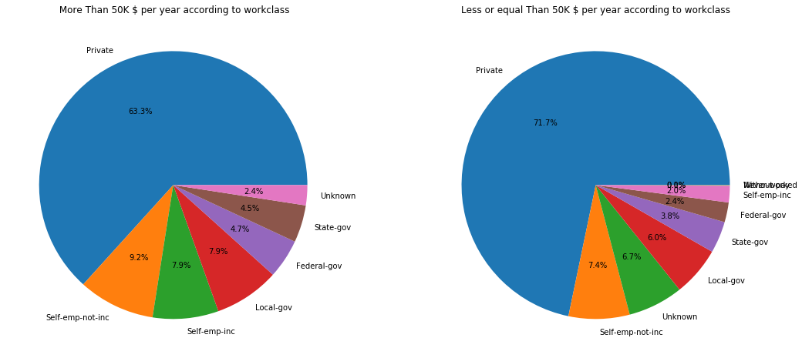
    


The observations in the **high salary chart** we draw is:
* 63.3% of high paid jobs can be found in the private sector.
* 17.1% are self employed jobs.
* 2.4% are Unknown jobs.
* The rest are Goverment or civil servant jobs.

The observations in the **low salary chart** we draw is:
* Most of the salaries under 50,000$ are in the private sector.
* The rest of percentages are similar to the ones in the high salary sector.

### Education

Let's have a look at the education people have in this dataset. As we did above with the work class, we will use a pieplot to see the distribution. 


```python
plt.figure(figsize=(10, 10))
adult_income['education'].value_counts().plot.pie(autopct='%1.1f%%')
```


    
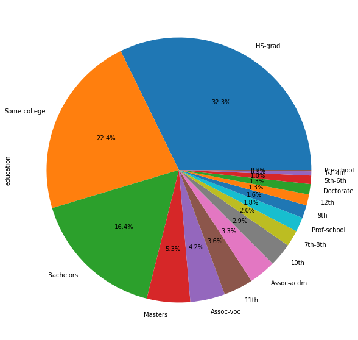
    


We see that people's education scale in the census is very distributed.


```python
plt.figure(figsize=(20, 10))
education_types = adult_income.education.unique()
plot_features_income(data=adult_income, column='education', type_names=education_types)
```


    
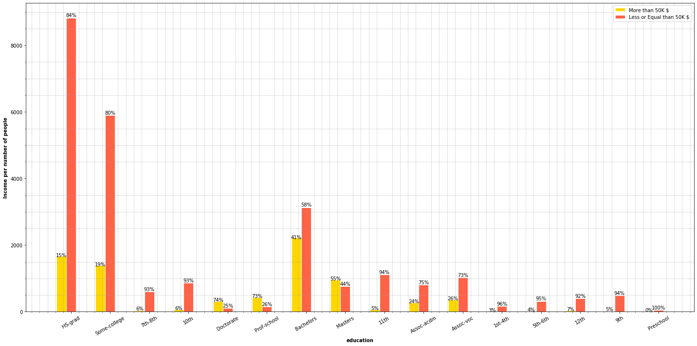
    


The charts plot some expectable information. We can see that most people who are school professors and most people holding a Master degree or a PhD earn more than 50,000\$ per year. It's interesting that the 41% of people owning a bachelor's degree tend to earn more than 50,000$ a year. The observations we can draw here is that people who went to college and have professional degree tend to earn more than 50,000\$ per year. 

Now, if we look at the charts below, among people earning more than 50,000\$ grouped by education we can see that half of the people have, at least, a college degree or are high school graduates (HS-grad). On the other hand, the other pie chart presents a similar distribuition but, as we saw in the previous charts, we can see that people earning a Master degree or a PhD tend to earn more than 50,000\$.


```python
f,ax=plt.subplots(1,2,figsize=(18,8))
adult_income[adult_income['income'] == '>50K']['education'].value_counts().plot.pie(autopct='%1.1f%%', ax=ax[0])
ax[0].set_title('More Than 50K $ per year according to education')
ax[0].set_ylabel('')
adult_income[adult_income['income'] == '<=50K']['education'].value_counts().plot.pie(autopct='%1.1f%%', ax=ax[1])
ax[1].set_title('Less or equal Than 50K $ per year according to education')
ax[1].set_ylabel('')
```


    
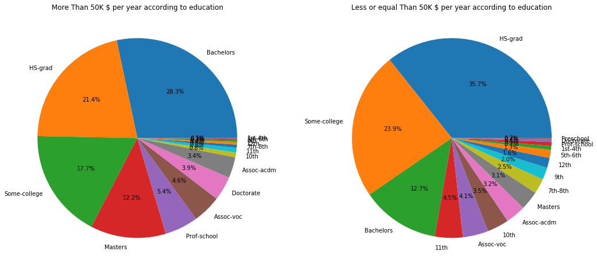
    


### Marital status

Let's see if marital status can have any correlation or impact on the income a person earns. 

```python
plt.figure(figsize=(10, 10))
adult_income['marital.status'].value_counts().plot.pie(autopct='%1.1f%%')

```


    
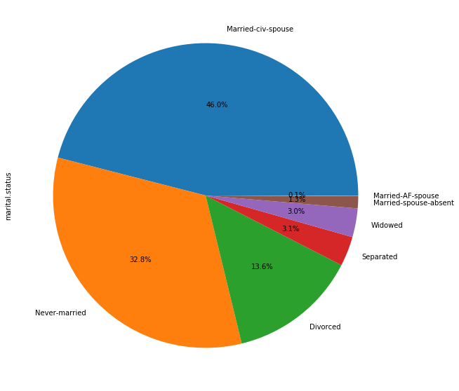
    


The 46% of the people in the census are married, the 32% is single and the 13.6% is divorced.


```python
plt.figure(figsize=(20, 10))
marital_types = adult_income['marital.status'].unique()
plot_features_income(data=adult_income, column='marital.status', type_names=marital_types)
```


    
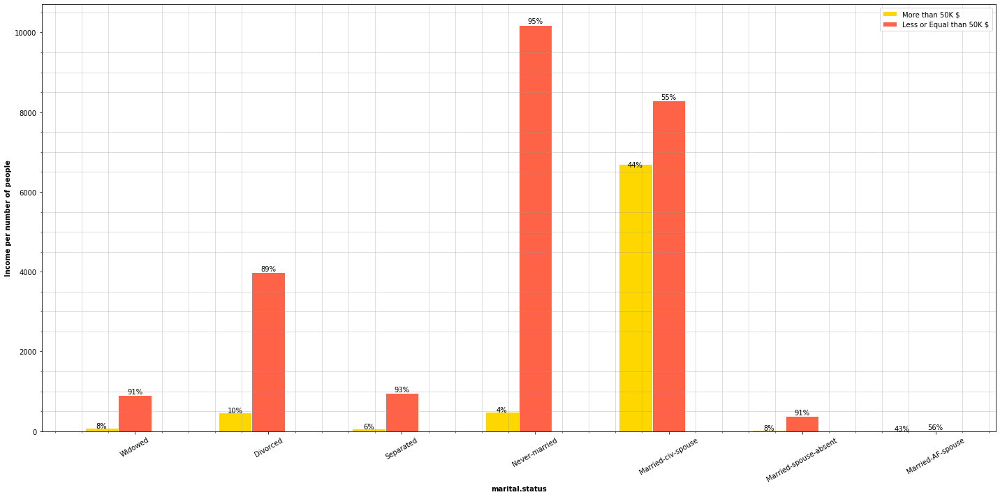
    


This is a very telling chart. As we can see, almost half of people who are married earn more than 50,000\$, most people who are separated, divorced or single earn less than 50,000\$. Now let's separate the groups by people who earn more than 50,000\$ and less than 50,000\$.


```python
f,ax=plt.subplots(1,2,figsize=(18,8))
adult_income[adult_income['income'] == '>50K']['marital.status'].value_counts().plot.pie(autopct='%1.1f%%', ax=ax[0])
ax[0].set_title('More Than 50K $ per year according to marital status')
ax[0].set_ylabel('')
adult_income[adult_income['income'] == '<=50K']['marital.status'].value_counts().plot.pie(autopct='%1.1f%%', ax=ax[1])
ax[1].set_title('Less or equal Than 50K $ per year according to marital status')
ax[1].set_ylabel('')

```
    
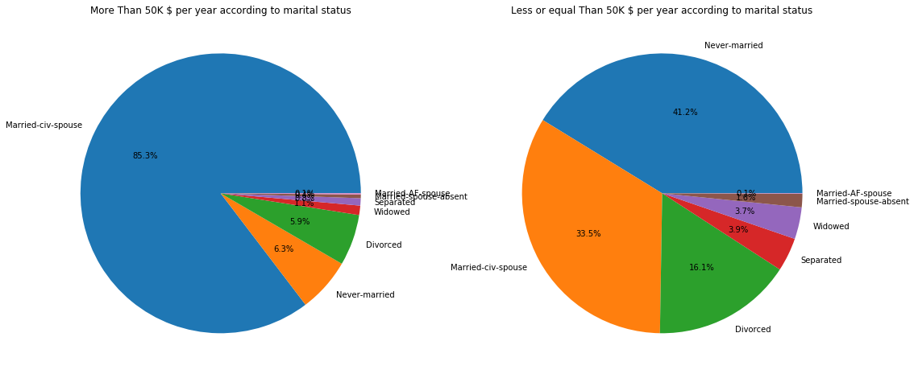
    


Most people earning more than 50,000\$ are married in a 85%, while they only represent a 33.5% of people earning less than 50,000\$. A very interesing fact is that people who earn less than 50,000\$ are either single or divorced, in other words, don't have partner.

### occupation

We are taking a look at what kind of jobs have influence on salaries.


```python
plt.figure(figsize=(8, 8))
adult_income['occupation'].value_counts().plot.pie(autopct='%1.1f%%')
```


    
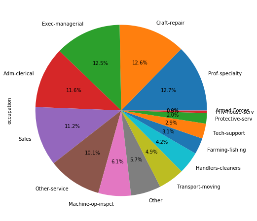
    

The occupation is pretty distributed in this dataset among the people who are registered in this dataste. Let's see the incomes. 


```python
plt.figure(figsize=(20, 10))
occupation_types = adult_income['occupation'].unique()
plot_features_income(data=adult_income, column='occupation', type_names=occupation_types)
```


    
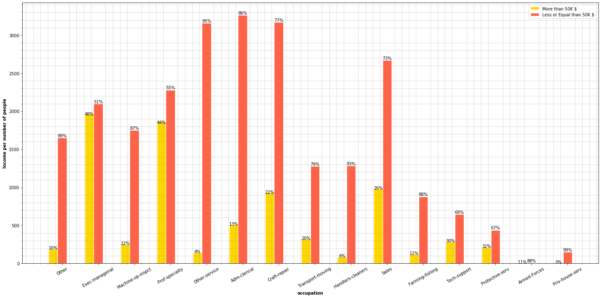
    


```python
f,ax=plt.subplots(1,2,figsize=(18,8))
adult_income[adult_income['income'] == '>50K']['occupation'].value_counts().plot.pie(autopct='%1.1f%%', ax=ax[0])
ax[0].set_title('More Than 50K $ per year according to occupation fields')
ax[0].set_ylabel('')
adult_income[adult_income['income'] == '<=50K']['occupation'].value_counts().plot.pie(autopct='%1.1f%%', ax=ax[1])
ax[1].set_title('Less or equal Than 50K $ per year according to occupation fields')
ax[1].set_ylabel('')
```
    
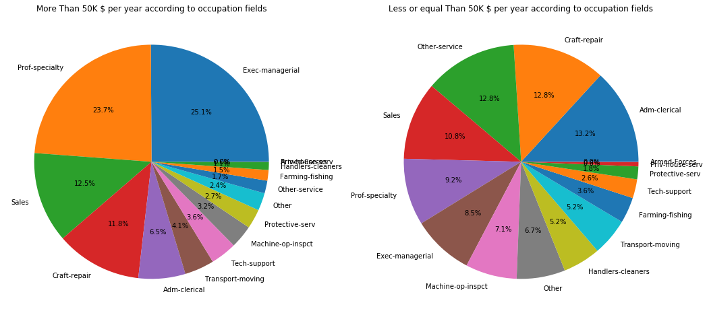
    


We can see that most well paid jobs are related to Executive Managers, specialized proffesors, techology engineers and protection services. The majority of the people having these jobs earn more than 50,000\$ a year. 

### Relationship


```python
plt.figure(figsize=(8, 8))
adult_income['relationship'].value_counts().plot.pie(autopct='%1.1f%%')
plt.ylabel('')
```


    
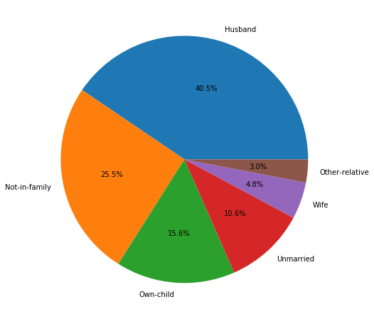
    


```python
plt.figure(figsize=(20, 10))
relationships_types = adult_income['relationship'].unique()
plot_features_income(data=adult_income, column='relationship', type_names=relationships_types)
```

    
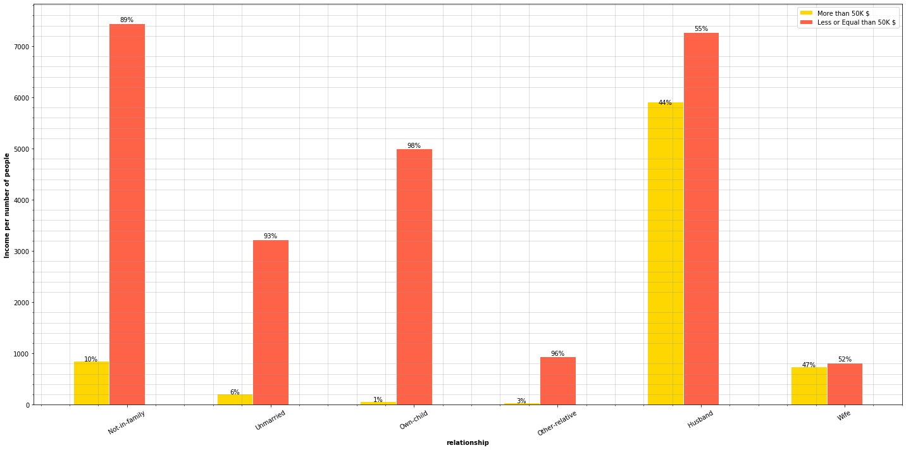
    


An interesting fact is that 44% of people earning more than 50,000\$ are married men, but it's even more interesting that the percentage of married women earning 50,000\$ is slightly higher. Let's divide the information by groups of people who earn more and less than 50,000\$.


```python
f,ax=plt.subplots(1,2,figsize=(18,8))
adult_income[adult_income['income'] == '>50K']['relationship'].value_counts().plot.pie(autopct='%1.1f%%', ax=ax[0])
ax[0].set_title('More Than 50K $ per year according to relationship status')
ax[0].set_ylabel('')
adult_income[adult_income['income'] == '<=50K']['relationship'].value_counts().plot.pie(autopct='%1.1f%%', ax=ax[1])
ax[1].set_title('Less or equal Than 50K $ per year according to relationship status')
ax[1].set_ylabel('')
```

    
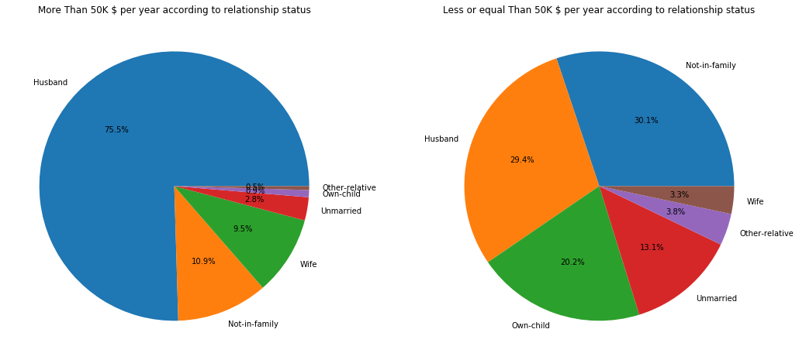
    


The pie charts show that, in general, most of people earning more than 50,000$ are married men. On the other pie charts the information is much more distribuited.  

### Race


```python
plt.figure(figsize=(8, 8))
adult_income['race'].value_counts().plot.pie(autopct='%1.1f%%')
plt.ylabel('')
```


    
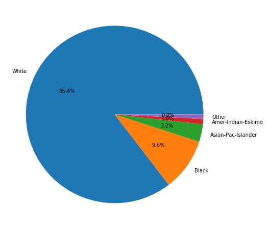
    

```python
plt.figure(figsize=(20, 10))
race_types = adult_income['race'].unique()
plot_features_income(data=adult_income, column='race', type_names=race_types)
```

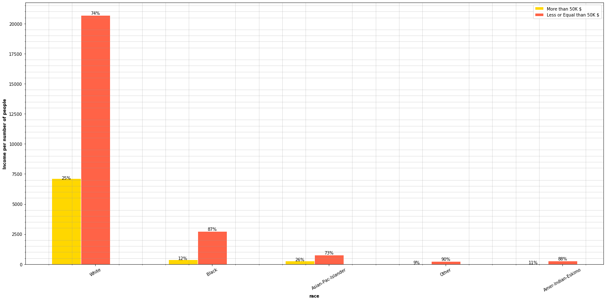
    


```python
f,ax=plt.subplots(1,2,figsize=(18,8))
adult_income[adult_income['income'] == '>50K']['race'].value_counts().plot.pie(autopct='%1.1f%%', ax=ax[0])
ax[0].set_title('More Than 50K $ per year according to race')
ax[0].set_ylabel('')
adult_income[adult_income['income'] == '<=50K']['race'].value_counts().plot.pie(autopct='%1.1f%%', ax=ax[1])
ax[1].set_title('Less or equal Than 50K $ per year according to race')
ax[1].set_ylabel('')
```
    
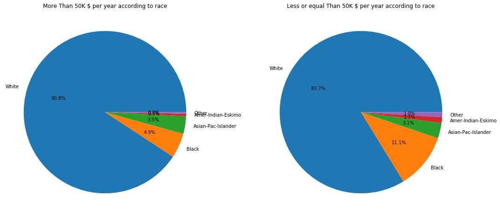
    


Statistically, there are more asians and whites earning more than 50,000$ than other races. Actually, according to the data we are managing, 90% of people earning are white when 

### Sex

Let's see how gender can affect income.

```python
plt.figure(figsize=(18, 8))
sns.countplot(adult_income['sex'], order = ['Male', 'Female'])
```


    
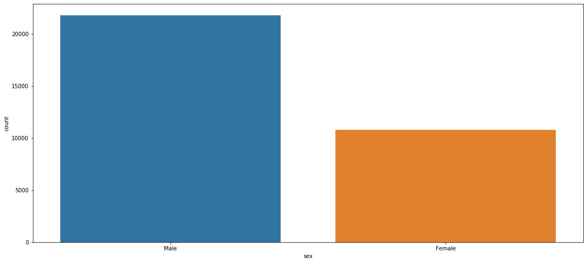
    


The census registers more men than women. 


```python
plt.figure(figsize=(20, 10))
race_types = adult_income['sex'].unique()
plot_features_income(data=adult_income, column='sex', type_names=race_types)
```


    
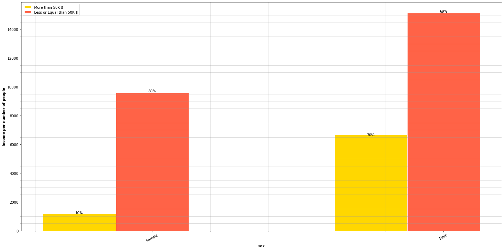
    


The chart show that 30% of men earn more than 50,000\$ while only 10% of women surpass that amount. In other words, there are 200% more men than women earning above 50,000\$.

### Native Country


```python
plt.figure(figsize=(20, 10))
country_types = adult_income['native.country'].unique()
plot_features_income(data=adult_income, column='native.country', type_names=country_types)
```
    
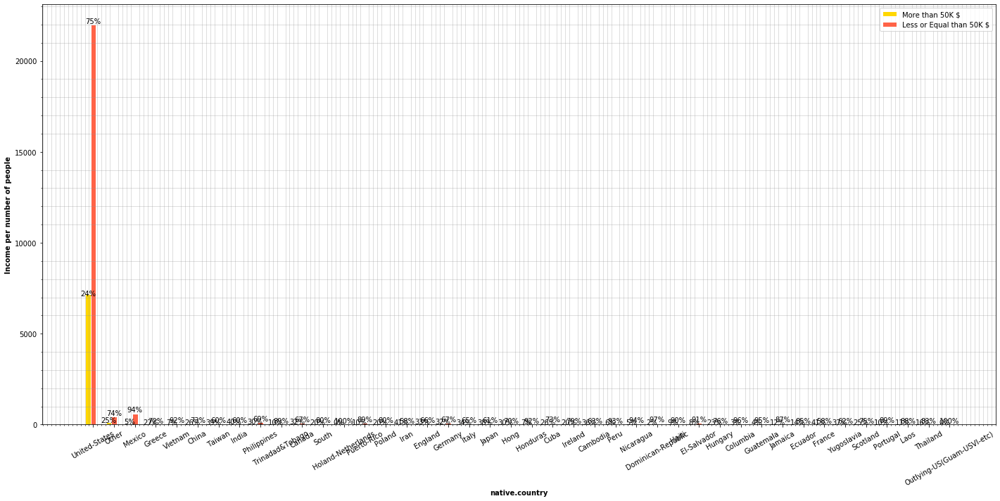
    

```python
plt.figure(figsize=(20, 10))
country_types = ['Mexico', 'Philippines', 'Germany', 'El-Salvador']
plot_features_income(data=adult_income, column='native.country', type_names=country_types)
```
    
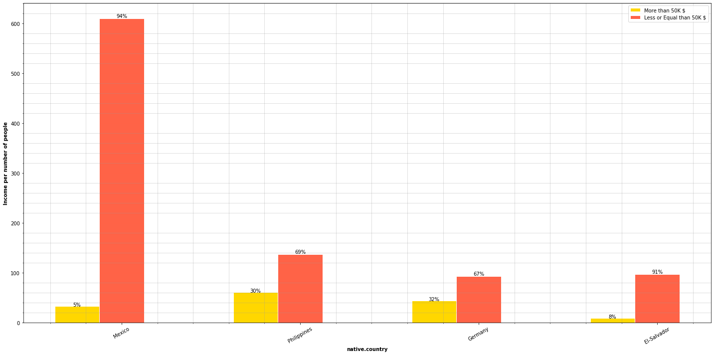
    


```python
f,ax=plt.subplots(1,2,figsize=(18,8))
adult_income[adult_income['income'] == '>50K']['native.country'].value_counts().plot.pie(autopct='', ax=ax[0])
ax[0].set_title('More Than 50K $ per year according to nationality')
ax[0].set_ylabel('')
adult_income[adult_income['income'] == '<=50K']['native.country'].value_counts().plot.pie(autopct='', ax=ax[1])
ax[1].set_title('Less or equal Than 50K $ per year according to nationality')
ax[1].set_ylabel('')
```

    
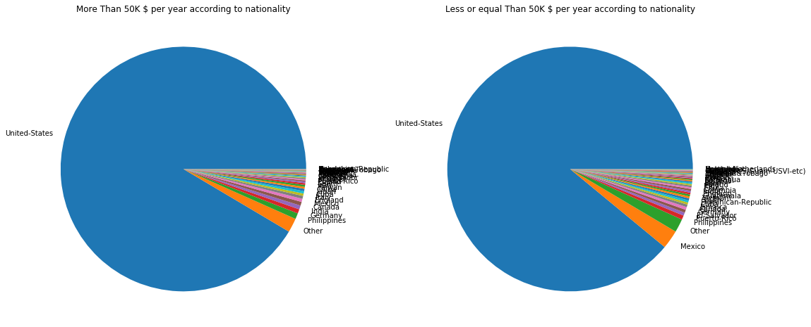
    
This really tells nothing, actually. Most of the people earning more than 50,000\$ come from the US. 

## Numerical Analysis

### Age

Now we'll take a lot at the age distribuition of the census. 


```python
plt.figure(figsize=(20,10))
plt.grid()
sns.distplot(adult_income['age'])
```


    
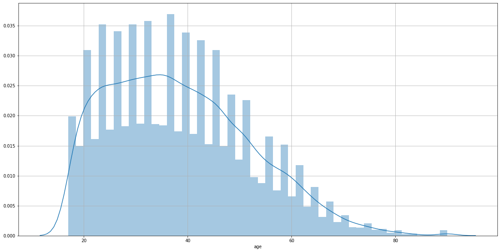
    


The age distribuition collected in the census is concentrated among from 20 y/o to the 50 y/o interval. 


```python
plt.figure(figsize=(20, 10))
plt.xticks(rotation=45)
sns.countplot(adult_income['age'], hue=adult_income['income'], palette=['dodgerblue', 'gold'])
```

    
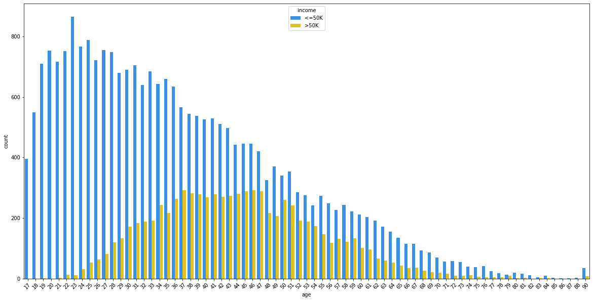
    


This is very a interesting plot. Most of young people don't earn more than 50,000\$ a yeat but as age grows, the percentages tend to balance. However, it seems that the gap tends to grow again as people turn over 50 years old. 

### Hours per week


```python
plt.figure(figsize=(20,10))
plt.grid()
sns.distplot(adult_income['hours.per.week'])
```

    
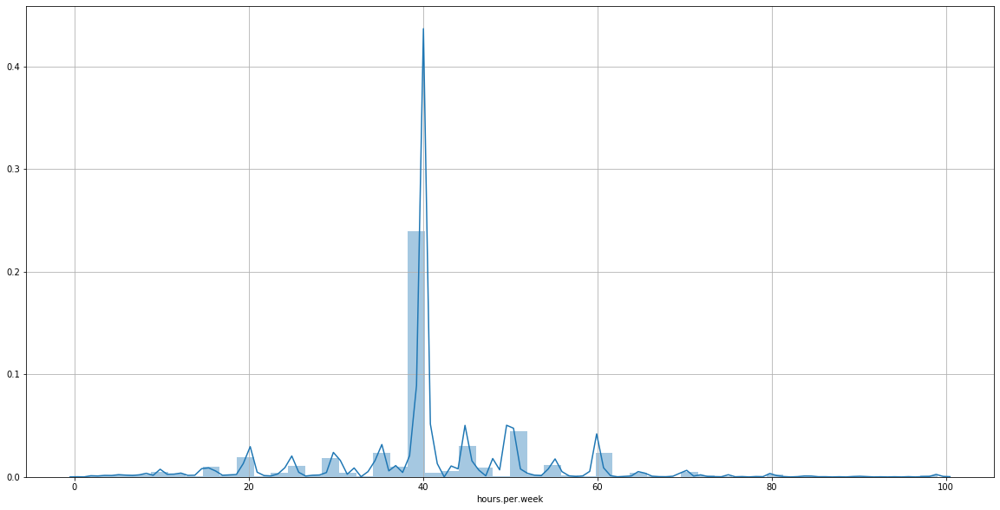
    


The plot shows that most people in the census work 40 hours per week. Now, we'd like to know the distribution of hours per week of the people earning more than 50,000\$. 

```python
plt.figure(figsize=(20,10))
plt.grid()
sns.distplot(adult_income[adult_income['income']=='>50K']['hours.per.week'])
```

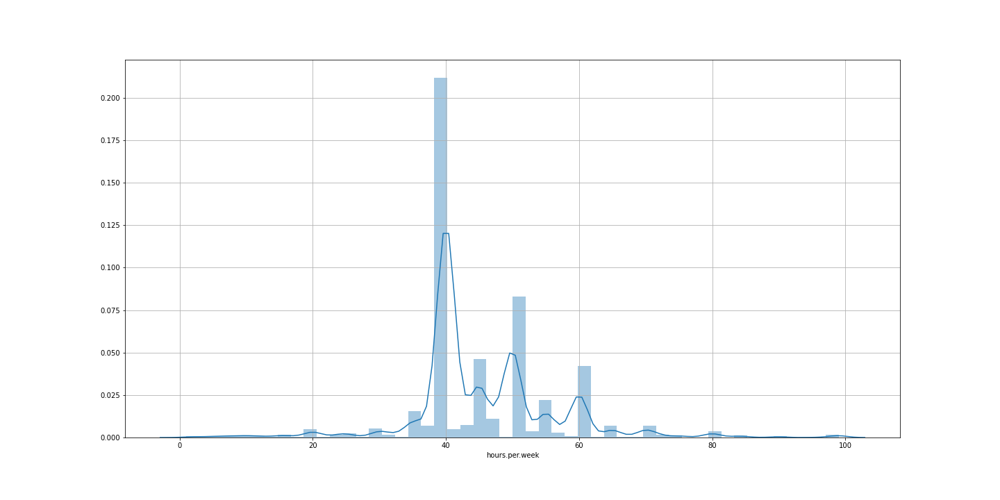
    

Normally, people who earn more than 50,000\$ per year have a 40 hours/week rutine. There are also a lot working for 45, 50 and 60 hours/week. 

## Multivariable analysis

After analysing each variable, we will apply a multivariable analysis combining several variables and correlations.

### correlations


```python
numerical_dt = list(adult_income.select_dtypes(include=['float64', 'int64']).columns)
```


```python
numerical_dt
```


    ['age',
     'fnlwgt',
     'education.num',
     'capital.gain',
     'capital.loss',
     'hours.per.week']


```python
numerical_dt = np.asarray(numerical_dt)
```


```python
numerical_dt
```


    array(['age', 'fnlwgt', 'education.num', 'capital.gain', 'capital.loss',
           'hours.per.week'], dtype='<U14')


```python
num_dt = adult_income.loc[:, numerical_dt]
```

```python
num_dt = num_dt.drop(columns='education.num')
```

```python
fig, ax = plt.subplots(figsize=(20,10))
sns.heatmap(num_dt.corr(method='pearson'), annot=True, fmt='.4f', 
            cmap=plt.get_cmap('coolwarm'), cbar=False, ax=ax)
ax.set_yticklabels(ax.get_yticklabels(), rotation="horizontal")
plt.savefig('./correlations.png', bbox_inches='tight', pad_inches=0.0)
```
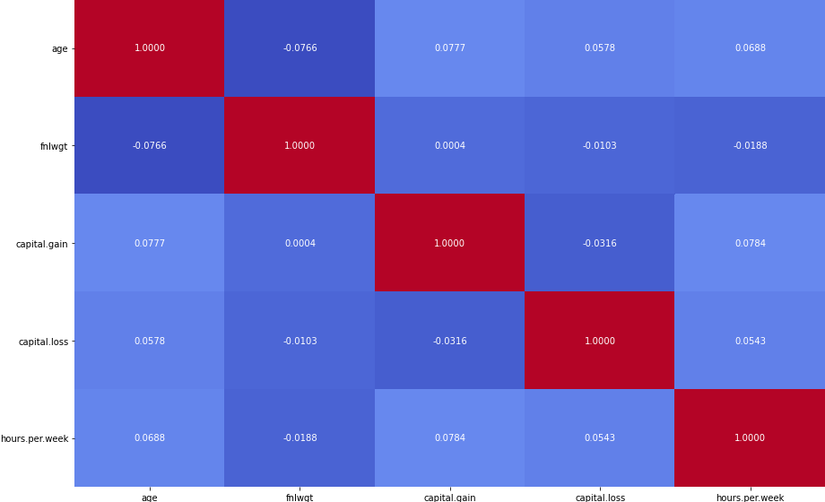
    


The heatmap shows no evident high correlation cases among the numerical variables.

## Analysis based on gender and age

After analyzing each of every feature we realized men to earn more than women, so we decided execute a better analysis on this field, so that we can draw some useful informations.

### Gender and workclass

We're going to have a look at the relations between gender and workclass and occupations, and what kind of jobs women mostly occupy in the census. 


```python
fig, axs = plt.subplots(1, 2, figsize=(20, 10))
plt.figure(figsize=(20, 10))
sns.countplot(adult_income['workclass'], hue=adult_income['sex'], ax=axs[1], palette=['pink', 'dodgerblue'], order=adult_income[adult_income['sex'] == 'Female']['workclass'].value_counts().index)
sns.countplot(adult_income['occupation'], hue=adult_income['sex'], ax=axs[0], palette=['pink', 'dodgerblue'], order=adult_income[adult_income['sex'] == 'Female']['occupation'].value_counts().index)
plt.setp(axs[0].xaxis.get_majorticklabels(), rotation=45)
plt.setp(axs[1].xaxis.get_majorticklabels(), rotation=45)
plt.show()
```


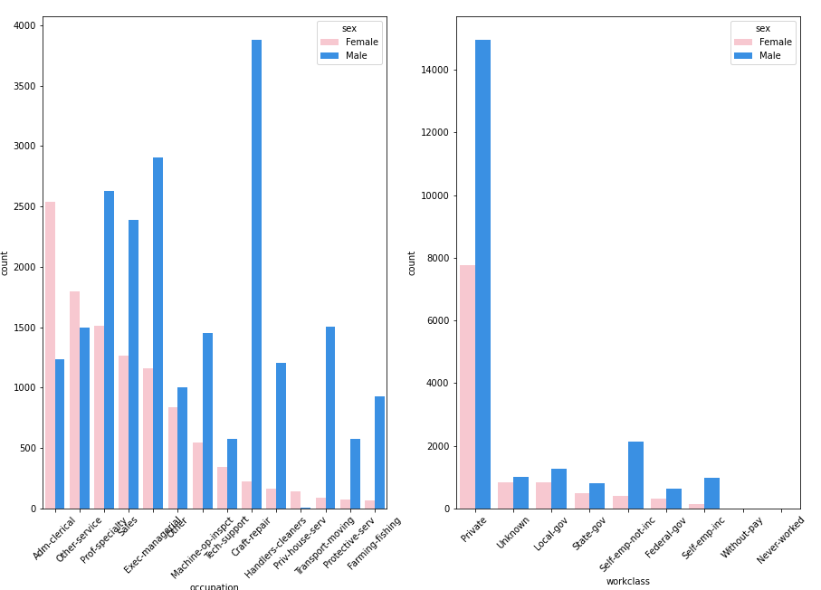
    

Most women occupy the jobs related to clerical administration, cleaning services and other services, but jobs related to professor speciality, business and sales, engineering, technology, transport, protection service and primary sector are mostly occupied by men. It's also interesting to see that most gender gap in private sector and self employement is bigger than in other sectors.

### Gender, Hours per week and Income

Let's see if there's any relationship between hours per week and income divided by gender. 


```python
fig, ax = plt.subplots(1, 2, figsize=(25, 8))
plt.xticks(rotation=45)
sns.violinplot(adult_income['sex'], adult_income['hours.per.week'], hue=adult_income['income'], palette=['gold', 'dodgerblue'], ax=ax[0])
sns.stripplot(adult_income['sex'], adult_income['hours.per.week'], hue=adult_income['income'], palette=['skyblue', 'tomato'], ax=ax[1])
ax[0].grid(True)
ax[1].grid(True)
```

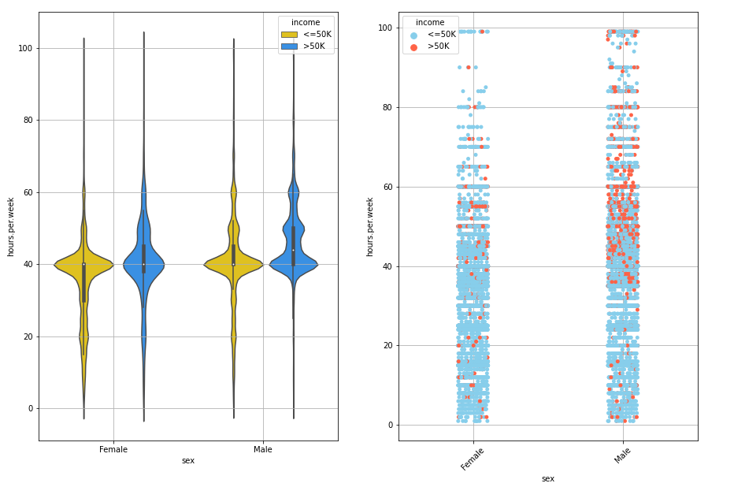

The charts show that men work for more  hours than women. The left chart shows that, regardless of the income, there are more women working for less hours than men and the men chart is more distribuited wheh it is above 40 hours per week. The right chart shows that men working for more hours tend to earn more than 50,000\$. We can see a concentration of red dots among the 40 and 60 hours/week interval. On the other hand, this concentration doesn't appear on women side. Even though the hours per week gap between men and women is not so big, it's clear that there's no correlation between hours per week and income when it comes to women. 

### Age, gender and Hours per week


```python
fig, ax = plt.subplots(1, 2, figsize=(30, 8))
plt.xticks(rotation=45)
sns.lineplot(adult_income['age'], adult_income['hours.per.week'], hue=adult_income['income'], palette=['tomato', 'dodgerblue'], ax=ax[0])
sns.lineplot(adult_income['age'], adult_income['hours.per.week'], hue=adult_income['sex'], palette=['tomato', 'dodgerblue'], ax=ax[1])
ax[0].grid(True)
ax[0].title.set_text("Age and Hours per week divided by Income")
ax[1].grid(True)
ax[0].title.set_text("Age and Hours per week divided by Gender")
```

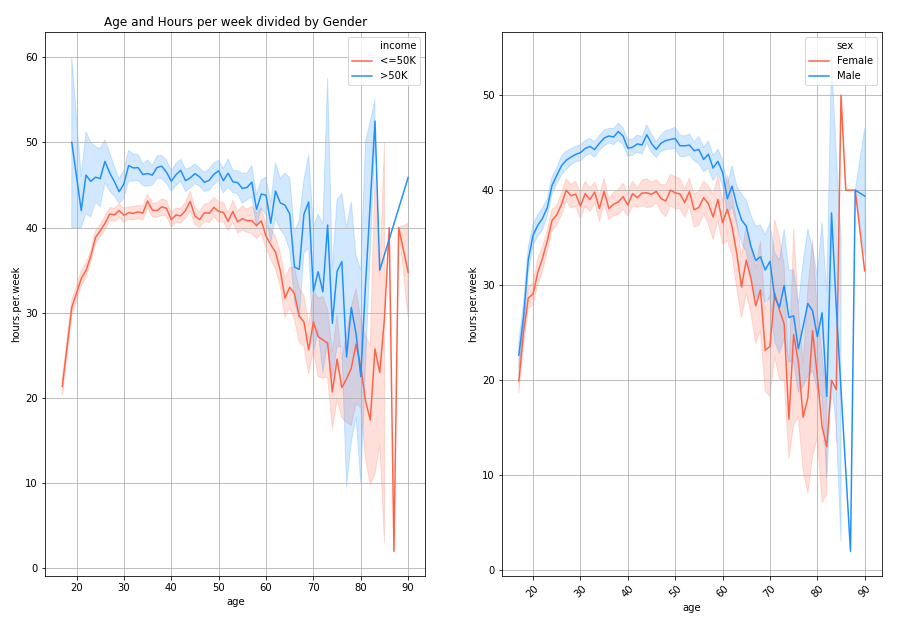

We see a very interesting trend in chart above. Let's take a look at the left chart first. As the age grows, there are more people earning more than 50,000\$ but work for more hours. In both cases, as age reaches the 60 year old, people tend to work for less hours but the number of people earning more than 50K increases. What's funny is that people who earn a lot start working for more hours when as they start turning 80.

The chart on the right shows very similar line paths. Men tend work for more hours than women, but as they get closer the standard retirement age, men and women work for the similar number of hours. What's very bizare, is that women who are 80 and 90 are the one working for more hours than the rest of ages. 

## Final observations and Conclusion after the Data Exploration

We analyzed and explored all the features of the dataset and their particularities, we want to summerise all the interesting facts we discovered and could help us predict whether a person earns more or less than 50,000\$. The interesting observations we drew are:
* **Workclas and occupations**
    * The 55% of self employed people work are self-employed
    * The 63.3% of the total people in the census earning more than 50,000\$ work in the private sector and the 71% of the total people in the census earning under 50,000\$ work in the private sector too. 
    * If we only focus on the private sector, the 26% of the people earn more than 50,000$\year.
    * Jobs in which people earn above 50,000\$ are executive managers, protection services, college professors, engineering and jobs related to technology who are mostly occupied by men.


* **Education**
    * It's interesting that the 73% of the Professors, 74% of PhDs, the 55% of people owning a Master Degree and the 40% of Bachelors bachelors earn above 50,000 $.
    * We this information we can conclude that owning at least a college degree will increase your probabilities to earn 50,000 $/year.
    
    
* **Gender, Marital Status and relationship**
    * The 85% of total people in the census earning more than 50,000\$ are married.
    * The 44% of people who are married earn more than 50,000\$.
    * The 44% of husbands earen more than 50,000\$.
    * The 47% of Wifes earn more than 50,000\$.
    * According to this info, being maried increases the probability of earning above 50,000\$.
    
    
* **Other interesting information**
    * The salary is directly related to age. The older people get, the more the surpass the 50,000\$ line.
    * Men work for more hours than women in all ages but as they both get closer to the 60's they tend to work for similiar amount of hours per week.
    * People earning more than 50,000\$ per year tend to work for more hours too.
    * Men working for more than 40 hours per week tend to earn above 50,000\$ but women don't follow this trend and there's no correlation between hours per week and income when it comes to females. 

##### Conclusions

With the information above we've seen, we could say that a person who's likely to earn above 50.000$/year is a person who:
  * Is male whose age is between 30 or over.
  * Married
  * Whose job is related to bussines, engineering, college profesor, protection services, technical or IT field.
  * Holds a master degree or a Phd.
  * Works for more than 40 hours per week.
  * Is American, Asian or European.


## Data Cleaning and Formatting

Now that we've performed out data exploration and have drawn some assumptions, it's time to clean the data, format it and erase those rows and columns who are useless or could noise during our learning process. 


```python
adult_income_prep = adult_income.copy()
```

### Outliers anomaly

Outliers can be very harmful for our learning models and can cause noise that can create distorsions in our predictions. We'll create an auxiliar function to erase the outliers in each numerical feature.


```python
def treat_outliers(data, column, upper=False, lower=False):
    Q1=adult_income_prep[column].quantile(0.25)
    Q3=adult_income_prep[column].quantile(0.75)
    IQR=Q3-Q1
    print(Q1)
    print(Q3)
    print(IQR)
    U_threshold = Q3+1.5*IQR
    #print(L_threshold, U_threshold)
    if upper: 
        adult_income_prep[column] = adult_income_prep[adult_income_prep[column] < U_threshold]
    if lower:
        adult_income_prep[column] = adult_income_prep[adult_income_prep[column] >= U_threshold]

```

#### Checking outliers in the age feature


```python
plt.figure(figsize=(20,10))
sns.boxplot(data=adult_income_prep, x=adult_income_prep['age'])
plt.grid()
```


    
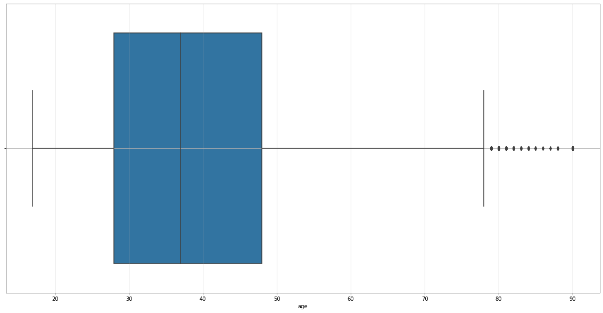
    


We found outliers in our chart, so we'll erase them.


```python
treat_outliers(data=adult_income_prep, column='age', upper=True)
```

    28.0
    48.0
    20.0


```python
plt.figure(figsize=(20,10))
sns.boxplot(data=adult_income_prep, x=adult_income_prep['age'])
plt.grid()
```


    
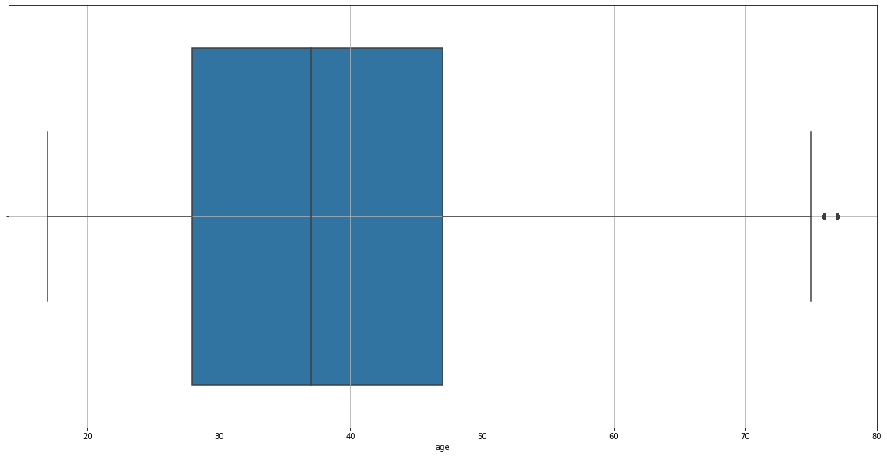
    


```python
treat_outliers(data=adult_income_prep, column='age', upper=True)
```

    28.0
    47.0
    19.0


Let's check out now


```python
plt.figure(figsize=(20,10))
sns.boxplot(data=adult_income_prep, x=adult_income_prep['age'])
plt.grid()
```


    
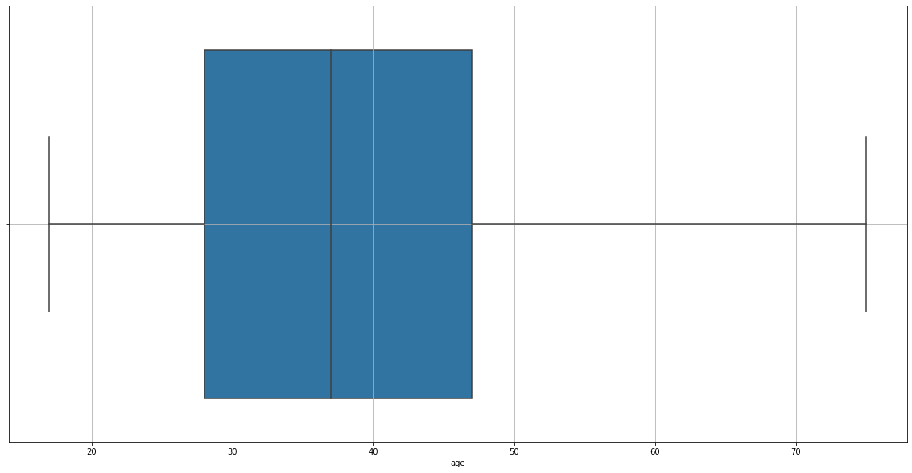
    


There are still to rows which age column contains an outlier.


```python
treat_outliers(data=adult_income_prep, column='age', upper=True)
```

    28.0
    47.0
    19.0


```python
plt.figure(figsize=(20,10))
sns.boxplot(data=adult_income_prep, x=adult_income_prep['age'])
plt.grid()
```


    

    


Now it's OK.


```python

```

#### Removing outliers of final Weight 


```python
plt.figure(figsize=(20,10))
sns.boxplot(data=adult_income_prep, x=adult_income_prep['fnlwgt'])
plt.grid()
```


    
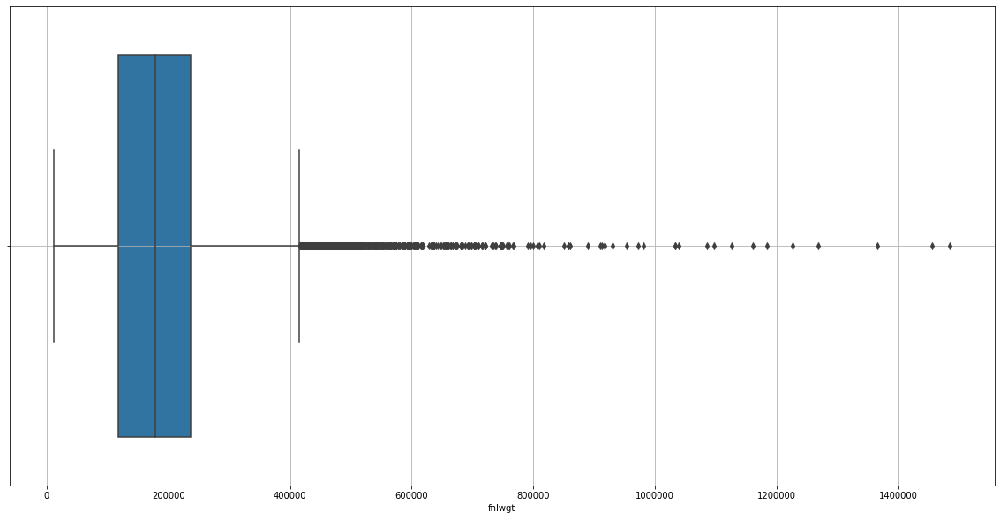
    


```python
treat_outliers(data=adult_income_prep, column='fnlwgt', upper=True)

```

    117827.0
    237051.0
    119224.0


```python
plt.figure(figsize=(10,8))
sns.boxplot(data=adult_income_prep, x=adult_income_prep['fnlwgt'])
plt.grid()
```


    
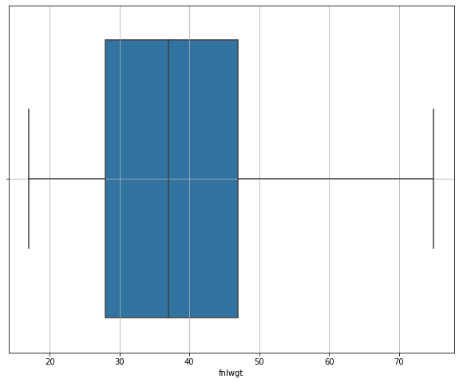
    


#### Checking outliers in Capital Gain and Loss


```python
plt.figure(figsize=(20,10))
sns.boxplot(data=adult_income_prep, x=adult_income_prep['capital.gain'])
plt.grid()
```


    
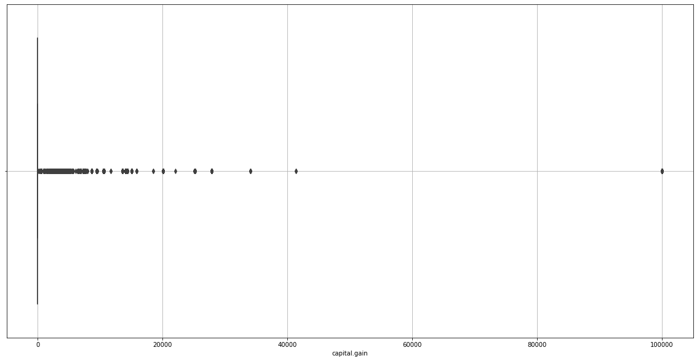
    


```python
plt.figure(figsize=(20,10))
sns.boxplot(data=adult_income_prep, x=adult_income_prep['capital.loss'])
plt.grid()
```


    
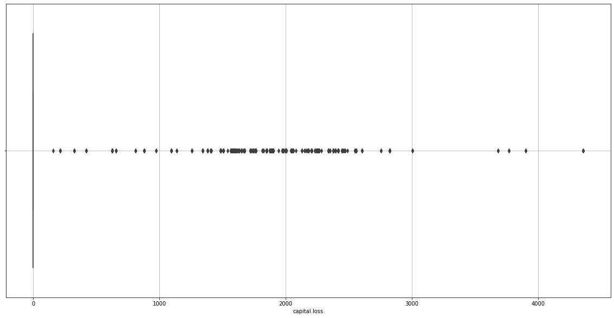
    


We realize `capital.gain` and `capital.loss` will disturb our learning process as they don't give any useful information either.


```python
adult_income_prep = adult_income_prep.drop(columns=['capital.gain', 'capital.loss'])
```


```python

```

#### Checking outliers of Hours per week


```python
plt.figure(figsize=(20,10))
sns.boxplot(data=adult_income_prep, x=adult_income_prep['hours.per.week'])
plt.grid()
```


    
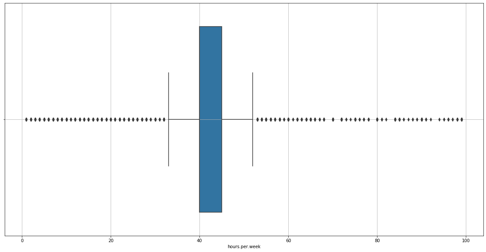
    


There are outliers, we must remove them.


```python
treat_outliers(data=adult_income_prep, column='hours.per.week', upper=True, lower=True)
```

    40.0
    45.0
    5.0


```python
plt.figure(figsize=(20,10))
sns.boxplot(data=adult_income_prep, x=adult_income_prep['hours.per.week'])
plt.grid()
```


    
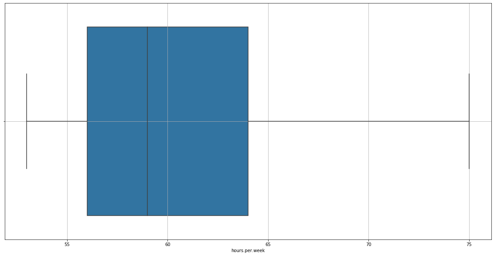
    


Now it's alright. Let's see how our dataset is now.


```python
adult_income_prep.head()
```

We found new null values in the `age` and `fnlwgt` column. We have to fill it the median value.


```python
from sklearn.impute import SimpleImputer
imputer = SimpleImputer(strategy="median")
```


```python
adult_income_num = adult_income_prep[['age', 'fnlwgt', 'hours.per.week']]
```


```python
adult_income_num.head()
```


```python
imputer.fit(adult_income_num)
```


    SimpleImputer(add_indicator=False, copy=True, fill_value=None,
                  missing_values=nan, strategy='median', verbose=0)


```python
imputer.statistics_
```


    array([37., 37., 59.])


```python
X = imputer.transform(adult_income_num)
```


```python
X
```


    array([[37., 37., 59.],
           [37., 37., 59.],
           [66., 66., 66.],
           ...,
           [40., 40., 59.],
           [58., 58., 58.],
           [22., 22., 59.]])


```python
adult_tr = pd.DataFrame(X, columns=adult_income_num.columns)
```


```python
adult_tr
```


```python
adult_income_prep['age'] = adult_tr['age']
adult_income_prep['fnlwgt'] = adult_tr['fnlwgt']
adult_income_prep['hours.per.week'] = adult_tr['hours.per.week']
```

Alright, no null values now. Now let's change the income values by 1 and 0.


```python
adult_income_prep['income'] = adult_income_prep['income'].replace('<=50K', 0)
adult_income_prep['income'] = adult_income_prep['income'].replace('>50K', 1)
```

We'll erase the `education` feature because it's the same as `education.num`.


```python
adult_income_prep = adult_income_prep.drop(columns='education')
```

#### Category Encoding

During our learning process, we can use non-numerical values, so it's better to encode our non-numerical features.


```python
adult_income_prep.workclass = adult_income_prep.workclass.astype('category').cat.codes
adult_income_prep['marital.status'] = adult_income_prep['marital.status'].astype('category').cat.codes
adult_income_prep['occupation'] = adult_income_prep['occupation'].astype('category').cat.codes
adult_income_prep['relationship'] = adult_income_prep['relationship'].astype('category').cat.codes
adult_income_prep['race'] = adult_income_prep['race'].astype('category').cat.codes
adult_income_prep['sex'] = adult_income_prep['sex'].astype('category').cat.codes
adult_income_prep['native.country'] = adult_income_prep['native.country'].astype('category').cat.codes
```
Now our dataset is ready for training. If you want to have a quick look at the dataset, you can type this:

```python
adult_income_prep.head()
```


# Training and Comparing models


```python
np.random.seed(1234)
```

We prepare out dataset and divide it into subsets.


```python
y = adult_income_prep['income']
X_prepared = adult_income_prep.drop(columns='income')

```

We import the `sklearn` library we need to partition the dataset into training and testing subsets.


```python
from sklearn.model_selection import train_test_split
train_X, val_X, train_y, val_y = train_test_split(X_prepared, y, random_state = 0)
```

We will use a crossvalidation to search for the best hyperparameters.


```python
from sklearn.model_selection import cross_val_score
```

We'll have to dictionaries containing the Mean Absolute Error and the accuracy value of each algorithm.


```python
MAE = dict()
Acc = dict()
```

## Traditional ML Techniques: Logistic regression

We will perform a crossvalidated logistic regression to our dataset. From the Logistic Regression we will extract the coeficients/features who have a better or a worse influence on the prediction.


```python
from sklearn.linear_model import LogisticRegression
```


```python
log_model = LogisticRegression()
```


```python
score = cross_val_score(log_model, X_prepared, y, scoring="neg_mean_absolute_error", cv=10)
```

```python
print("MAE score mean:\n", np.abs(score).mean())
```

    MAE score mean:
     0.1939743749806691


```python
from sklearn.model_selection import GridSearchCV
```


```python
param_grid = [
    {'C': [0.001,0.01,0.1,1,10,100]},
]
grid_search = GridSearchCV(log_model, param_grid, cv=5, scoring='neg_mean_squared_error')
grid_search.fit(train_X, train_y)
```

    GridSearchCV(cv=5, error_score=nan,
                 estimator=LogisticRegression(C=1.0, class_weight=None, dual=False,
                                              fit_intercept=True,
                                              intercept_scaling=1, l1_ratio=None,
                                              max_iter=100, multi_class='auto',
                                              n_jobs=None, penalty='l2',
                                              random_state=None, solver='lbfgs',
                                              tol=0.0001, verbose=0,
                                              warm_start=False),
                 iid='deprecated', n_jobs=None,
                 param_grid=[{'C': [0.001, 0.01, 0.1, 1, 10, 100]}],
                 pre_dispatch='2*n_jobs', refit=True, return_train_score=False,
                 scoring='neg_mean_squared_error', verbose=0)


```python
grid_search.best_params_
```


    {'C': 100}


```python
log_model = LogisticRegression(C=100, random_state=0)
```


```python
log_model.fit(train_X, train_y)
```
    LogisticRegression(C=100, class_weight=None, dual=False, fit_intercept=True,
                       intercept_scaling=1, l1_ratio=None, max_iter=100,
                       multi_class='auto', n_jobs=None, penalty='l2',
                       random_state=0, solver='lbfgs', tol=0.0001, verbose=0,
                       warm_start=False)


```python
val_predictions = log_model.predict(val_X)
```


```python
columns = adult_income_prep.drop(columns='income').columns
coefs = log_model.coef_[0]
print("Features - Coefs")
for index in range(len(coefs)):
    print(columns[index], ":", coefs[index])
    
```

    Features - Coefs
    age : 0.0591988304177485
    workclass : -0.09002223884698841
    fnlwgt : -0.014278177489885961
    education.num : 0.37357447044203884
    marital.status : -0.21856029678303646
    occupation : -7.447641781696112e-05
    relationship : -0.14266599757140028
    race : 0.13047846851261513
    sex : 1.0391318172666453
    hours.per.week : -0.12302044432859731
    native.country : 0.001667892121472329


It's pretty interesting to see what the logistic regression reveals.
* Education, relationship, gender and race are the features which most positively have an impact on income
* The hours per week and the final weight have a negative impact on income

Now, let's calculate the mean absolute error (MAE).


```python
from sklearn.metrics import mean_absolute_error
lm_mae = mean_absolute_error(val_y, val_predictions)
```


```python
from sklearn.metrics import accuracy_score
```


```python
lm_acc = accuracy_score(val_y, val_predictions)
MAE['lm'] = lm_mae
Acc['lm'] = lm_acc
```


```python
print("The mae is", lm_mae)
```

    The mae is 0.19395651639847686


```python
print("The accuracy is", lm_acc * 100, "%")
```

    The accuracy is 80.60 %


## Modern ML techniques

We've performed a training and testing process using a traditional ML technique which was the Logistic Regression. Now, we'll use some modern classifers which are:
* Random Forests
* K Nearest Neighbours
* Gradient Boosting Machine
* Naive Bayes

For all of them we'll perform a crossvaliation to detect the best hyperparameters. 

### Random Forests


```python
from sklearn.ensemble import RandomForestClassifier
```


```python
param_grid = [
    {'n_estimators': [3, 10, 30], 'max_features': [2, 4, 6, 8]},
    {'bootstrap': [False], 'n_estimators': [3, 10], 'max_features': [2, 3, 4]}
]

forest_model = RandomForestClassifier()
grid_search = GridSearchCV(forest_model, param_grid, cv=5, scoring='neg_mean_squared_error')
grid_search.fit(train_X, train_y)
```


    GridSearchCV(cv=5, error_score=nan,
                 estimator=RandomForestClassifier(bootstrap=True, ccp_alpha=0.0,
                                                  class_weight=None,
                                                  criterion='gini', max_depth=None,
                                                  max_features='auto',
                                                  max_leaf_nodes=None,
                                                  max_samples=None,
                                                  min_impurity_decrease=0.0,
                                                  min_impurity_split=None,
                                                  min_samples_leaf=1,
                                                  min_samples_split=2,
                                                  min_weight_fraction_leaf=0.0,
                                                  n_estimators=100, n_jobs=None,
                                                  oob_score=False,
                                                  random_state=None, verbose=0,
                                                  warm_start=False),
                 iid='deprecated', n_jobs=None,
                 param_grid=[{'max_features': [2, 4, 6, 8],
                              'n_estimators': [3, 10, 30]},
                             {'bootstrap': [False], 'max_features': [2, 3, 4],
                              'n_estimators': [3, 10]}],
                 pre_dispatch='2*n_jobs', refit=True, return_train_score=False,
                 scoring='neg_mean_squared_error', verbose=0)


```python
grid_search.best_params_
```


    {'max_features': 2, 'n_estimators': 30}


```python
rf_model = RandomForestClassifier(max_features=2, n_estimators=30, random_state=0)
```


```python
rf_model.fit(train_X, train_y)
```


    RandomForestClassifier(bootstrap=True, ccp_alpha=0.0, class_weight=None,
                           criterion='gini', max_depth=None, max_features=2,
                           max_leaf_nodes=None, max_samples=None,
                           min_impurity_decrease=0.0, min_impurity_split=None,
                           min_samples_leaf=1, min_samples_split=2,
                           min_weight_fraction_leaf=0.0, n_estimators=30,
                           n_jobs=None, oob_score=False, random_state=0, verbose=0,
                           warm_start=False)


```python
val_predictions = rf_model.predict(val_X)
```


```python
rf_mae = mean_absolute_error(val_y, val_predictions)
```


```python
rf_mae
```


    0.18634074438029727


```python
rf_acc = accuracy_score(val_y, val_predictions)
```


```python
rf_acc
```


    0.8136592556197028


```python
MAE['rf'] = rf_mae
Acc['rf'] = rf_acc
```

### Gradient Boosting Machine


```python
from sklearn.ensemble import GradientBoostingClassifier
```


```python
gbm_model = GradientBoostingClassifier(learning_rate=0.1, n_estimators=60, max_features='sqrt', subsample=0.8, random_state=0)

param_grid = {'max_depth':range(5,16,2), 'min_samples_split':range(200,1001,200)}

grid_search = GridSearchCV(gbm_model, param_grid, cv=5, scoring='neg_mean_squared_error')
grid_search.fit(train_X, train_y)
```


    GridSearchCV(cv=5, error_score=nan,
                 estimator=GradientBoostingClassifier(ccp_alpha=0.0,
                                                      criterion='friedman_mse',
                                                      init=None, learning_rate=0.1,
                                                      loss='deviance', max_depth=3,
                                                      max_features='sqrt',
                                                      max_leaf_nodes=None,
                                                      min_impurity_decrease=0.0,
                                                      min_impurity_split=None,
                                                      min_samples_leaf=1,
                                                      min_samples_split=2,
                                                      min_weight_fraction_leaf=0.0,
                                                      n_estimators=60,
                                                      n_iter_no_change=None,
                                                      presort='deprecated',
                                                      random_state=0, subsample=0.8,
                                                      tol=0.0001,
                                                      validation_fraction=0.1,
                                                      verbose=0, warm_start=False),
                 iid='deprecated', n_jobs=None,
                 param_grid={'max_depth': range(5, 16, 2),
                             'min_samples_split': range(200, 1001, 200)},
                 pre_dispatch='2*n_jobs', refit=True, return_train_score=False,
                 scoring='neg_mean_squared_error', verbose=0)


```python
grid_search.best_params_
```


    {'max_depth': 7, 'min_samples_split': 800}


```python
gbm_model = GradientBoostingClassifier(max_depth=7, min_samples_split=800, random_state=0)
```


```python
gbm_mae = mean_absolute_error(val_y, val_predictions)
```


```python
gbm_mae
```


    0.18634074438029727


```python
gbm_acc = accuracy_score(val_y, val_predictions)
```


```python
gbm_acc
```


    0.8136592556197028


```python
MAE['gbm'] = gbm_mae
Acc['gbm'] = gbm_acc
```

### K-Nearest Neighbours


```python
from sklearn.neighbors import KNeighborsClassifier as KNN
```


```python
KNN
```


    sklearn.neighbors._classification.KNeighborsClassifier


```python
knn_model = KNN()

param_grid = {'n_neighbors':range(5,10,1)}

grid_search = GridSearchCV(knn_model, param_grid, cv=5, scoring='neg_mean_squared_error')

grid_search.fit(train_X, train_y)
```


    GridSearchCV(cv=5, error_score=nan,
                 estimator=KNeighborsClassifier(algorithm='auto', leaf_size=30,
                                                metric='minkowski',
                                                metric_params=None, n_jobs=None,
                                                n_neighbors=5, p=2,
                                                weights='uniform'),
                 iid='deprecated', n_jobs=None,
                 param_grid={'n_neighbors': range(5, 10)}, pre_dispatch='2*n_jobs',
                 refit=True, return_train_score=False,
                 scoring='neg_mean_squared_error', verbose=0)


```python
knn_params = grid_search.best_params_
knn_params
```


    {'n_neighbors': 8}


```python
knn_model = KNN(n_neighbors=8)
```


```python
knn_model.fit(train_X, train_y)
```


    KNeighborsClassifier(algorithm='auto', leaf_size=30, metric='minkowski',
                         metric_params=None, n_jobs=None, n_neighbors=8, p=2,
                         weights='uniform')


```python
val_predictions = knn_model.predict(val_X)
```


```python
knn_mae = mean_absolute_error(val_y, val_predictions)
```


```python
knn_mae
```


    0.18769192973836138


```python
knn_acc = accuracy_score(val_y, val_predictions)
```


```python
knn_acc
```


    0.8123080702616386


### Naive Bayes


```python
from sklearn.naive_bayes import GaussianNB
```


```python
GNB = GaussianNB()
GNB.fit(train_X, train_y)
```


    GaussianNB(priors=None, var_smoothing=1e-09)


```python
val_predictions = GNB.predict(val_X)
GNB_mae = mean_absolute_error(val_y, val_predictions)
GNB_mae
```


    0.22012037833190026


```python
GNB_acc = accuracy_score(val_y, val_predictions)
GNB_acc
```


    0.7798796216680998


```{python}
MAE['gnb'] = GNB_mae
Acc['gnb'] = GNB_acc

MAE['knn'] = knn_mae
Acc['knn'] = knn_acc
```

### Plotting comparison results

```python
f,ax=plt.subplots(1,2,figsize=(18,8))
ax[0].plot(list(MAE.keys()), list(MAE.values()))
ax[0].set_title("Mean Absolute Error")
ax[0].grid()
ax[1].bar(list(Acc.keys()), list(Acc.values()))
ax[1].set_title("Accuracy score")
```


    
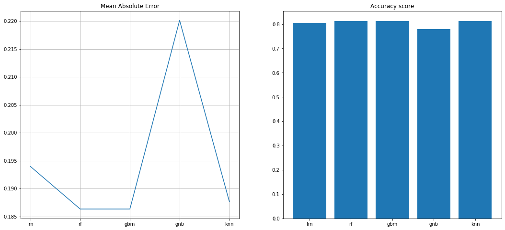
    


Apparently the Random Forest Classifier is the best compared to the rest due the time Gradient Boosting needs to perform the training and testing with a 81.36% accuracy. 

If you want to try this model, you can click in this [link](/adult-income/) where you can interact a little bit with the deployed model. 

**Did you like this exercise? Do you want to find new datasets to train your skill as a data scientist or a machin learning engineer?** I highly recommend [Kaggle](https://www.kaggle.com/) where you can find a lot of datasets, create your own notebooks, participate in paid challenges (Sweet money, oh yeah) and, of course, see other highly professional data scientists notebooks and how they solve machine learning problems. Thanks for visiting this post and see you around ;)